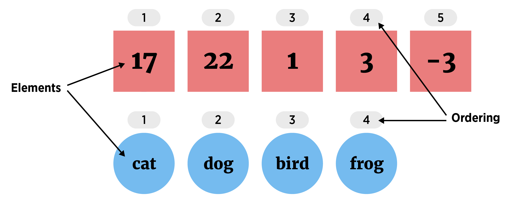
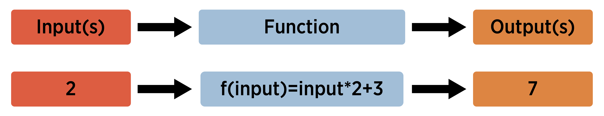
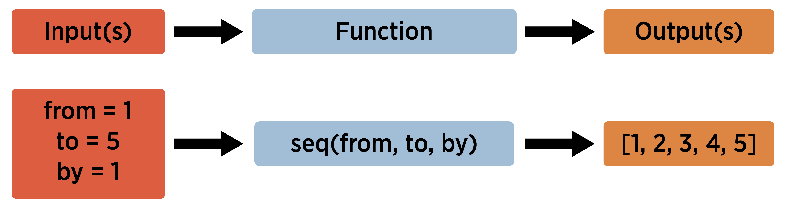
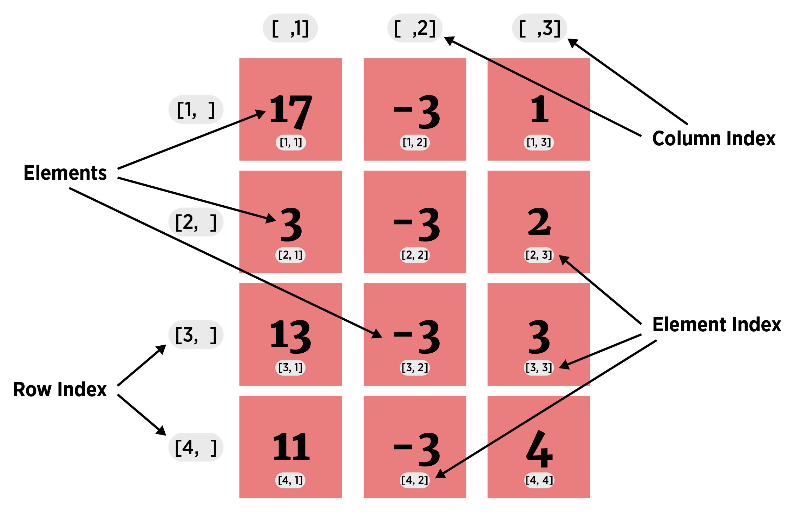
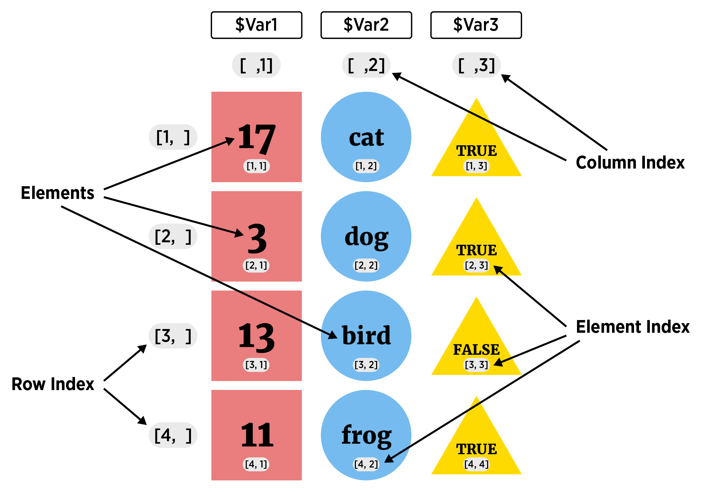
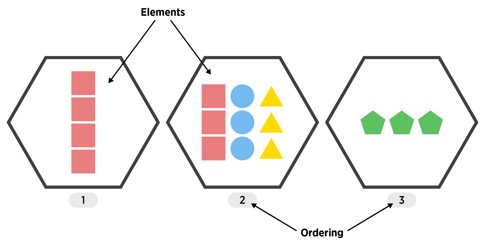

```{r,echo=FALSE,message=FALSE, warning = FALSE}
library(tidyverse)
options(dplyr.print_min = 5)
knitr::opts_chunk$set(echo = TRUE, eval = TRUE, message = FALSE, warning = FALSE)
```

## Course Schedule  

**Daily agenda:**   

- 9:30-10:40 Session  
- 15-minute break  
- 10:55-12:05 Session  
- 12:05-1:20 Lunch  
- 1:20-2:30 Session  
- 15-minute break  
- 2:45-3:55 Session  
- 3:55–4:00 Q&A and Feedback  

## What is this course about?

Basic use of R for reading, manipulating, and plotting data!


## What is this course about?

Basic use of R for reading, manipulating, and plotting data!

<div style = "float: left;border:1px solid black;">
<a href = "https://www4.stat.ncsu.edu/~online/datasets/chemical.txt">
```{r step1a, fig.align = 'left', out.width = '205px', out.height = "249px", echo = FALSE}
knitr::include_graphics("img/rawData.png")
```
</a>
</div>

## What is this course about?

Basic use of R for reading, manipulating, and plotting data!

<div style = "float: left;border:1px solid black;">
<a href = "https://www4.stat.ncsu.edu/~online/datasets/chemical.txt">
```{r step2a, fig.align = 'left', out.width = '205px', out.height = "249px", echo = FALSE}
knitr::include_graphics("img/rawData.png")
```
</a>
</div>
<div style = "float: left;">
```{r arrow2a, fig.align = 'left', out.width = '30px', out.height = "249px", echo = FALSE}
knitr::include_graphics("img/arrow.png")
```
</div>
<div style = "float: left;border:1px solid black;">
<a href = "https://www4.stat.ncsu.edu/~online/datasets/readChemData.r">
```{r step2b, fig.align = 'left', out.width = '205px', out.height = "249px", echo = FALSE}
knitr::include_graphics("img/ImportR.png")
```
</a>
</div>


## What is this course about?

Basic use of R for reading, manipulating, and plotting data!

<div style = "float: left;border:1px solid black;">
<a href = "https://www4.stat.ncsu.edu/~online/datasets/chemical.txt">
```{r step3a, fig.align = 'left', out.width = '205px', out.height = "249px", echo = FALSE}
knitr::include_graphics("img/rawData.png")
```
</a>
</div>
<div style = "float: left;">
```{r arrow3a, fig.align = 'left', out.width = '30px', out.height = "249px", echo = FALSE}
knitr::include_graphics("img/arrow.png")
```
</div>
<div style = "float: left;border:1px solid black;">
<a href = "https://www4.stat.ncsu.edu/~online/datasets/readChemData.r">
```{r step3b, fig.align = 'left', out.width = '205px', out.height = "249px", echo = FALSE}
knitr::include_graphics("img/ImportR.png")
```
</a>
</div>
<div style = "float: left;">
<a href = "https://www4.stat.ncsu.edu/~online/datasets/summChemData.r">
```{r arrow3b, fig.align = 'left', out.width = '30px', out.height = "249px", echo = FALSE}
knitr::include_graphics("img/arrow.png")
```
</a>
</div>
<div style = "float: left;border:1px solid black;">
<a href = "https://www4.stat.ncsu.edu/~online/datasets/summChemData.r">
```{r step3c, fig.align = 'left', out.width = '205px', out.height = "249px", echo = FALSE}
knitr::include_graphics("img/SummarizeR.png")
```
</a>
</div>


## What is this course about?

Basic use of R for reading, manipulating, and plotting data!

<div style = "float: left;border:1px solid black;">
<a href = "https://www4.stat.ncsu.edu/~online/datasets/chemical.txt">
```{r step4a, fig.align = 'left', out.width = '205px', out.height = "249px", echo = FALSE}
knitr::include_graphics("img/rawData.png")
```
</a>
</div>
<div style = "float: left;">
```{r arrow4a, fig.align = 'left', out.width = '30px', out.height = "249px", echo = FALSE}
knitr::include_graphics("img/arrow.png")
```
</div>
<div style = "float: left;border:1px solid black;">
<a href = "https://www4.stat.ncsu.edu/~online/datasets/readChemData.r">
```{r step4b, fig.align = 'left', out.width = '205px', out.height = "249px", echo = FALSE}
knitr::include_graphics("img/ImportR.png")
```
</a>
</div>
<div style = "float: left;">
```{r arrow4b, fig.align = 'left', out.width = '30px', out.height = "249px", echo = FALSE}
knitr::include_graphics("img/arrow.png")
```
</div>
<div style = "float: left;border:1px solid black;">
<a href = "https://www4.stat.ncsu.edu/~online/datasets/summChemData.r">
```{r step4c, fig.align = 'left', out.width = '205px', out.height = "249px", echo = FALSE}
knitr::include_graphics("img/SummarizeR.png")
```
</a>
</div>
<div style = "float: left;">
```{r arrow4c, fig.align = 'left', out.width = '30px', out.height = "249px", echo = FALSE}
knitr::include_graphics("img/arrow.png")
```
</div>
<div style = "float: left;border:1px dashed black;">
```{r step4d, fig.align = 'left', out.width = '205px', out.height = "249px", echo = FALSE}
knitr::include_graphics("img/AnalysisR.png")
```
</div>


## Where do we start?  

**Roughly Day 1**  

- Install R/R studio  
- R Studio Interface
- Classes and Objects    
- Attributes and Basic Data Object Manipulation    
- Reading in Data/Writing Out Data    

**Roughly Day 2**  

- Logical Statements and Subsetting/Manipulating Data
- Numerical and Graphical Summaries    
- Basic Analyses  
<!-- We will do some of the basic numerical/graphical summary stuff along the way during day 1.-->


## Installing R  

- Check out the course [website](http://www4.stat.ncsu.edu/~post/DataScienceR/index.html)    

- Info on installing R and R studio [available here](http://www4.stat.ncsu.edu/~post/DataScienceR/Install.html)

- Let's take a few minutes and make sure everyone has these installed and working properly!

If installed, open RStudio, go to 'console' and type `install.packages("tidyverse")`


## Why learn R?

> - It's free, open source, available on all major platforms. <!--As a result, if you do your analysis in R, anyone can easily replicate it.--> 

> - Tons of packages for modeling, visualization, data manipulation, etc.  

> - Access to the newest methods.  

> - Great community support (stackoverflow, R-help mailing list, etc.)  

> - Can *easily* create pdfs, slides, reports, html files, and interactive apps.  


## Drawbacks of Using R  

> - Code style differs greatly! <!--Packages and code written by many different people with different styles.  Kind of have to learn as you go.  Newer wave of packages 'cleaning up' R quite a bit.  They use the same syntax (or similar).-->  

> - Confusing!  Often many ways to do the same thing <!--Each way correct, but picking the easiest to use or the one that is most compatible with what you are doing can be difficult-->

> - New code not necessarily verified <!--Users writing code for their latest method may have written something incorrectly.-->  

> - Updates can mess up 'legacy' code


## RStudio IDE 

In RStudio, four main 'areas'   

- Console (& Terminal)  

- Scripting and Viewing Window  
    
- Plots/Help (& Files/Packages)  

- Environment (& Connections/Git)  
    

## Console  

- Type code directly into the **console** for evaluation  

<div  style = "float: left; width = 45%;">
```{r calc2, echo=TRUE}
#simple math operations
# <-- is a comment - code not evaluated
3 + 7
10 * exp(3) #exp is exponential function
log(pi^2) #log is natural log by default
```
</div>

<div  style = "float: right; width = 45%;">
```{r basic, echo = TRUE, out.width = "400px", fig.align='center'}
mean(cars$speed)
hist(cars$speed)
```
</div>
<!--Output of each of these is actually a vector of length 1!-->

## Scripting and Viewing Window 

- Usually want to keep code for later use!  

> - Write code in a 'script' and save script (or use markdown - covered later)

> - From script can send code to console via: 
    <ul>
      <li> "Run" button (runs current line)  </li>
      <li> CTRL+Enter (PC) or Command+Enter (MAC)  </li>
      <li> Highlight section and do above</li>
    </ul>

## Scripting and Viewing Window  

- Go to file --> New File --> R Script  

- Type `View(cars)` (note capital `V`)  

- Type `plot(cars)`  

- Submit to console using button or hot key  


## Plots/Help 

+ Created plots stored in `Plots` tab  

    - Cycle through past plots  
    - Easily save  
 
> + `Help` tab to learn about R functions  
    - Type `help(hist)` in the console

## Environment   

- Store **data/info/function/etc.** in R objects  

- Create an R object via `<-` (recommended) or `=`  

```{r save,echo=TRUE}
#save for later
avg <- (5 + 7 + 6) / 3
#call avg object
avg
#strings (text) can be saved as well
words <- c("Hello there!", "How are you?")
words
```


## Environment   

- Look at all current objects with `ls()`

```{r ls, echo = TRUE}
ls()
```

- `rm()` to remove  

```{r rm, echo = TRUE}
rm(avg)
ls()
```


## Environment   

- Built-in objects exist like `letters` and `cars`  

```{r builtin, echo = TRUE}
letters
head(cars, n = 3)
```

- `data()` shows available built-in datasets


## RStudio IDE 

Four main 'areas'   

- Console (& Terminal)  

- Scripting and Viewing Window  
    
- Plots/Help (& Files/Packages)  

- Environment (& Connections/Git)  
    

## RStudio IDE 

To rearrange panes

```{r panes, out.width = "700px",echo=FALSE, fig.align = "center"}
knitr::include_graphics("img/panes.png")
```


## RStudio IDE 

Other useful global options:  

- Appearance  

    + font size  
    + theme  
    
- Code  
 
    + editing --> soft-wrap  
    + display --> show whitespace


## R Objects and Classes  

- R has strong **O**bject **O**riented **P**rogramming (OOP) tools  

- Object: data structure with attributes (class)  

- Method: procedures (functions) act on object based on attributes  


## R Objects and Classes  

- R has strong **O**bject **O**riented **P**rogramming (OOP) tools  

- Object: data structure with attributes (class)  

- Method: procedures (functions) act on object based on attributes  

- R functions like `print()` or `plot()` act differently depending on object class 

<div style = "float: left; width = 45%;">
```{r str1, echo = TRUE}
class(cars)
```
</div>
<div style = "float: left; width = 10%;">
&nbsp;&nbsp;&nbsp;&nbsp;&nbsp;&nbsp;&nbsp;&nbsp;&nbsp;&nbsp;&nbsp;
</div>
<div style = "float: left; width = 45%;">
```{r str2, echo = TRUE}
class(exp)
```
</div>


## R Objects and Classes  

- R has strong **O**bject **O**riented **P**rogramming (OOP) tools  

- Object: data structure with attributes (often a 'class')  

- Method: procedures (often 'functions') act on object based on attributes  

- R functions like `print()` or `plot()` act differently depending on object class 

<div style = "float: left; width = 45%;">
```{r plot1, echo = TRUE, fig.align = 'center', out.width = '350px'}
plot(cars)
```
</div>
<div style = "float: left; width = 10%;">
&nbsp;&nbsp;&nbsp;&nbsp;&nbsp;&nbsp;&nbsp;&nbsp;&nbsp;&nbsp;&nbsp;&nbsp;&nbsp;&nbsp;&nbsp;&nbsp;&nbsp;&nbsp;&nbsp;&nbsp;&nbsp;&nbsp;

</div>
<div style = "float: left; width = 45%;">
```{r plot2, echo = TRUE, fig.align = 'center', out.width = '350px'}
plot(exp)
```
</div>


## R Objects and Classes  

- Create an R object via `<-` (recommended) or `=`  

    + allocates memory to object  
    
    + object attributes usually depend on how you created it!  
    
```{r create, echo = TRUE}
vec <- c(1, 4, 10)
class(vec)

fit <- lm(dist ~ speed, data = cars)
class(fit)
```


## Investigating Objects  

Many functions to help understand an R Object  

 - `class()`  
 
 - describes the `class` attribute of an R object  
 
```{r obj2, echo = TRUE}
class(cars)
```


## Investigating Objects  

Many functions to help understand an R Object  

 - `typeof()`  
 
 - determines the (R internal) type or storage mode of any object  
 
```{r obj3, echo = TRUE}
typeof(cars)
```
 
## Investigating Objects  

Many functions to help understand an R Object  

 - `str()`  
 
 - compactly displays the internal structure of an R object  
 
```{r obj1, echo = TRUE}
str(cars)
```


## Recap & What's next?!  

Create an R Object with `<-`  

Many functions to help understand an R Object  

 - `class()`  
 - `typeof()`
 - `str()`  

## Recap & What's next?!  

Create an R Object with `<-`  

Many functions to help understand an R Object  

 - `class()`  
 - `typeof()`
 - `str()`  

Common data structures  

1. Atomic Vector (1d)  
2. Matrix (2d)  
3. Array (nd) (not covered)  
4. Data Frame (2d)  
5. List (1d)  


## Vector   

1. Atomic Vector (1D group of elements with an ordering)   

```{r vectorVis, echo = FALSE, fig.align='center', out.width = '650px'}

```

- Elements must be same 'type'  

    + numeric (integer or double), character, or logical
    

## Vector   

1. Atomic Vector (1D group of elements with an ordering)   
  - Create with `c()` function ('combine')  
```{r vecs}
#vectors (1 dimensional) objects
x <- c(17, 22, 1, 3, -3)
y <- c("cat", "dog", "bird", "frog")
x
y
```

## Vector   

- Many 'functions' output a numeric vector

- Function concept: 

```{r functionVis1, echo = FALSE, out.width = "800px", fig.align= 'center'}

```


## Vector   

- Many 'functions' output a numeric vector

- Ex: `seq()` 

    + Inputs = from, to, by (among others)  

    + Output = a sequence of numbers

```{r functionVis2, echo = FALSE, out.width = "800px", fig.align= 'center'}

```


## Vector   

`seq(from = 1, to = 1, by = ((to - from)/(length.out - 1)),`
`    length.out = NULL, along.with = NULL, ...)`

```{r seq1}
v <- seq(from = 1, to = 5, by = 1)
v
```


## Vector   

`seq(from = 1, to = 1, by = ((to - from)/(length.out - 1)),`
`    length.out = NULL, along.with = NULL, ...)`

```{r seq2}
v <- seq(from = 1, to = 5, by = 1)
v
str(v)
```

- `num` says it is numeric  

- `[1:5]` implies one dimensional with elements 1, 2, 3, 4, 5


## Vector    

Shorthand `seq()` with `:`  

```{r seq3}
1:20 
```


## Vector    

Shorthand `seq()` with `:`  

- R generally does elementwise math

```{r seq5}
1:20/20
1:20 + 1
```


## Help Files  

- Functions are ubiquitous in R!  

 - To find out about a function's arguments use `help()`  

 - Understanding the syntax in the help files is key!

> - Ex: Can create randomly generated values in any interval:
    <ul>
      <li> `help(runif)` </li>
    </ul>

<!--R functions can have arguments, some have defaults - others do not-->


## Vector   

1. Atomic Vector (1D group of elements with an ordering)   

- Vectors useful to know about  

- Not usually useful for a dataset 

- Often consider as 'building blocks' for other data types


## Matrix   

<ol start="2">
  <li> Matrix (2D data structure) </li>
</ol>
- (think) columns are vectors of the same **type and length**  
  
```{r matrixVis, echo = FALSE, out.width = "500px", fig.align= 'center'}

```

## Matrix   

<ol start="2">
  <li> Matrix (2D data structure)</li>
</ol>
- (think) columns are vectors of the same **type and length**

<div style = "float: left; width = 45%;">
```{r popvec,echo=TRUE}
#populate vectors
x <- c(17, 3, 13, 11)
y <- rep(-3, times = 4)
z <- 1:4
```
</div>
<div style = "float: left; width = 5%;">
&nbsp;&nbsp;&nbsp;&nbsp;&nbsp;&nbsp;&nbsp;&nbsp;&nbsp;
</div>

## Matrix   

<ol start="2">
  <li> Matrix (2D data structure) </li>
</ol>
- (think) columns are vectors of the same **type and length**

<div style = "float: left; width = 45%;">
```{r popvec2,echo=TRUE}
#populate vectors
x <- c(17, 3, 13, 11)
y <- rep(-3, times = 4)
z <- 1:4
```
</div>
<div style = "float: left; width = 5%;">
&nbsp;&nbsp;&nbsp;&nbsp;&nbsp;&nbsp;&nbsp;&nbsp;&nbsp;
</div>
<div style = "float: left; width = 45%;">
```{r checktype, echo = TRUE}
#check 'type'
is.numeric(x)
is.numeric(y)
is.numeric(z)
```
</div>


## Matrix   

<ol start="2">
  <li> Matrix (2D data structure) </li>
</ol>
- (think) columns are vectors of the same **type and length**

<div style = "float: left; width = 45%;">
```{r popvec3,echo=TRUE}
#populate vectors
x <- c(17, 3, 13, 11)
y <- rep(-3, times = 4)
z <- 1:4
```
</div>
<div style = "float: left; width = 5%;">
&nbsp;&nbsp;&nbsp;&nbsp;&nbsp;&nbsp;&nbsp;&nbsp;&nbsp;
</div>
<div style = "float: left; width = 25%;">
```{r checktype2, echo = TRUE}
#check 'type'
is.numeric(x)
is.numeric(y)
is.numeric(z)
```
</div>
<div style = "float: left; width = 5%;">
&nbsp;&nbsp;&nbsp;&nbsp;&nbsp;&nbsp;&nbsp;&nbsp;&nbsp;
</div>
<div style = "float: left; width = 20%;">
```{r checklength, echo = TRUE}
#check 'length'
length(x)
length(y)
length(z)
```
</div>

## Matrix   

<ol start="2">
  <li> Matrix (2D data structure) </li>
</ol> 
- (think) columns are vectors of the same **type and length**

- Create with `matrix()` function (see help)

## Matrix   

<ol start="2">
  <li> Matrix (2D data structure) </li>
</ol> 
- (think) columns are vectors of the same **type and length**

- Create with `matrix()` function (see help)

```{r mat1,echo=TRUE}
#populate vectors
x <- c(17, 3, 13, 11)
y <- rep(-3, times = 4)
z <- 1:4
#combine in a matrix
matrix(c(x, y, z), ncol = 3)
```
<!--Can have as many columns and/or rows as needed-->


## Matrix   

<ol start="2">
  <li> Matrix (2D data structure) </li>
</ol>  
- (think) columns are vectors of the same **type and length**

- Create with `matrix()` function

<div style = "float: left; width = 45%;">
```{r mat2,echo=TRUE}
x <- c("Hi", "There", "Friend", "!")
y <- c("a", "b", "c", "d")
z <- c("One", "Two", "Three", "Four")
is.character(x)
```
</div>
<div style = "float: left; width = 5%;">
&nbsp;&nbsp;&nbsp;&nbsp;&nbsp;&nbsp;&nbsp;&nbsp;&nbsp;
</div>
<div style = "float: left; width = 45%;">
```{r mat3, echo = TRUE}
matrix(c(x, y, z), nrow = 6)
```
</div>


## Matrix   

<ol start="2">
  <li> Matrix (2D data structure) </li>
</ol>  
- (think) columns are vectors of the same **type and length**

- Useful for some data but often some numeric and some character variables:

```{r dataset, out.width = "600px",echo=FALSE, fig.align='center'}
knitr::include_graphics("img/dataset.png")
```


## Data Frame    

<ol start="4">
  <li> Data Frame (2D data structure) </li>
</ol>  
- collection (list) of *vectors* of the same **length**  

```{r dfVis, echo = FALSE, out.width = "500px", fig.align= 'center'}

```


## Data Frame    

<ol start="4">
  <li> Data Frame (2D data structure) </li>
</ol>  
- collection (list) of *vectors* of the same **length**  

- Create with `data.frame()` function  

```{r df1,echo=TRUE}
x <- c("a", "b", "c", "d", "e", "f")
y <- c(1, 3, 4, -1, 5, 6)
z <- 10:15
data.frame(x, y, z)
```
<!--Like a more flexible matrix-->


## Data Frame    

<ol start="4">
  <li> Data Frame (2D data structure) </li>
</ol> 
- collection (list) of *vectors* of the same **length**  

- Create with `data.frame()` function

```{r df2,echo=TRUE,eval=TRUE}
data.frame(char = x, data1 = y, data2 = z)
```
- char, data1, and data2 become the variable names for the data frame
<!--Valid Name:  A syntactically valid name consists of letters, numbers and the dot or underline characters and starts with a letter or the dot not followed by a number. Names such as ".2way" are not valid and neither are the reserved words. "n1" is valid.

Reserved words: if else repeat while function for in next break TRUE FALSE NULL Inf NaN NA NA_integer_ NA_real_ NA_complex_ NA_character_

see ?make.names for more details-->


## Data Frame    

<ol start="4">
  <li> Data Frame (2D data structure) </li>
</ol> 
- collection (list) of *vectors* of the same **length**

- Create with `data.frame()` function

- Perfect for most data sets!  

- Most functions that read 2D data store it as a data frame  


## List

<ol start="5">
  <li> List (1D group of objects with ordering) </li>
</ol> 
- a vector that can have differing elements  

```{r listVis, echo = FALSE, out.width = "600px", fig.align= 'center'}

```


## List

<ol start="5">
  <li> List (1D group of objects with ordering) </li>
</ol> 
- a vector that can have differing elements

- Create with `list()`

```{r list1,echo=TRUE}
list(1:3, rnorm(2), c("!", "?"))
```


## List

<ol start="5">
  <li> List (1D group of objects with ordering) </li>
</ol> 

- Add names to the list elements

```{r list2,echo=TRUE}
list(seq = 1:3, normVals = rnorm(2), punctuation = c("!", "?"))
```


## List

<ol start="5">
  <li> List (1D group of objects with ordering) </li>
</ol> 
- a vector that can have differing elements

- Create with `list()`

- More flexible than a Data Frame!

- Useful for more complex types of data  


## Recap!


Dimension | Homogeneous   | Heterogeneous
--------- | ------------- | -------------
1d        | Atomic Vector | List
2d        | Matrix        | Data Frame

&nbsp;\n

- For most data analysis you'll use data frames!  

- Next up:  How do we access/change parts of our objects?  


## Activity 

- [**Objects and Common Classes Activity** instructions](http://www4.stat.ncsu.edu/~post/DataScienceR/ObjCCActivity.html) available on web  

- We'll send you to breakout rooms   

- One TA or instructor in each room to help out

- Feel free to ask questions about anything you didn't understand as well!   


## Basic Data Manipulation  
- **How do we access different parts of our object?  **


## Basic Data Manipulation  
- **How do we access different parts of our object?  **

- For data may want    
    + One element  
    + Certain columns  
    + Certain rows  

 
## Basic Data Manipulation  
**Atomic Vectors** (1D)  

- Return elements using square brackets `[]`   

```{r indexVec}
letters #built-in vector
```
<div style="float: left; width: 45%;">
```{r}
letters[1] #R starts counting at 1!
```
</div>
<div style = "float:left; width = 5%">
&nbsp;&nbsp;&nbsp;&nbsp;&nbsp;&nbsp;&nbsp;
</div>
<div style = "float:left; width = 45%">
```{r}
letters[26]
```
</div>

## Basic Data Manipulation  
**Atomic Vectors** (1D)  

- Can 'feed' in a vector of indices to return  

```{r indexVec2}
letters[1:4]
letters[c(5, 10, 15, 20, 25)]
x <- c(1, 2, 5); letters[x]
```


## Basic Data Manipulation  
**Atomic Vectors** (1D)  

- Return elements using square brackets `[]`  

- Can 'feed' in a vector of indices to return  

- Use negative indices to return without  

```{r indexVec3}
letters[-(1:4)]
x <- c(1, 2, 5); letters[-x]
```

<!-- note we aren't overwriting anything!-->


## Basic Data Manipulation  
**Matrices** (2D)  

- Use square brackets with a comma `[ , ]`

- Notice default row and column names!  

```{r matindex}
mat <- matrix(c(1:4, 20:17), ncol = 2)
mat
```

## Basic Data Manipulation  
**Matrices** (2D)  

- Use square brackets with a comma `[ , ]`

<div style="float: left; width: 45%;">
```{r matindex2}
mat
mat[c(2, 4), ]
```
</div>
<div style="float: right; width: 45%;">
```{r matindex3}
mat[, 1]
mat[2, ]
mat[2, 1]
```
</div>
<!--Note that R simplifies the result where possible.  That is, returns an atomic vector if you have only 1 dimension and a matrix if two.  Also, if you only give a single value in the [] then R uses the count of the value in the matrix.  Counts go down columns first.-->


## Basic Data Manipulation  
**Matrices** (2D)   

- Can give columns names

- `help(matrix)` can show us how!  

<!--Checkout the dimnames argument and see how to specify the names using a list.  Particularly that we don't want to give rownames so we can give a NULL (a special value in R that is used for undefined values- here giving no specification of row names).  ?Null for more info.  Then we just give a character vector for the column names-->

## Basic Data Manipulation  
**Matrices** (2D)  

- Can use columns names to subset

<div style="float: left; width: 60%;">
```{r matindex4,eval=FALSE}
mat <- matrix(c(1:4, 20:17), ncol = 2,
        ###<b>  
          dimnames = list(NULL,
                c("First", "Second"))
        ###</b>
        )
mat
```
```{r matindex5,echo=FALSE}
mat<-matrix(c(1:4,20:17),ncol=2,
            dimnames=list(NULL,
              c("First","Second")))
mat
```
</div>
<div style="float: right; width: 35%;">
```{r matindex6}
mat[, "First"]
```
</div>
<!--Can also give a character vector of column names if you'd like-->

<!-- ## Basic Data Manipulation -->
<!-- **Matrices**   -->

<!-- - Alternatively, we can assign the dimnames after creation -->
<!-- ```{r} -->
<!-- mat <- matrix(c(1:4, 20:17), ncol = 2) -->
<!-- ### <b> -->
<!-- dimnames(mat) <- list(NULL, c("First", "Second")) -->
<!-- ### </b> -->
<!-- mat -->
<!-- ``` -->
<!-- - dimnames a *special attribute* with its own function! -->

## Basic Data Manipulation  
**Matrices** (2D)  

- Use square brackets with a comma `[ , ]`

- Can use columns names to subset

- Negative still removes but won't work with column name  

```{r matindex7, error = TRUE}
mat[-c(1,3), -"First"]
```

```{r matindex8, error = TRUE}
mat[-c(1,3), "First"]
```


## Basic Data Manipulation  
**Data Frames** (2D)  

- Consider 'built-in' `iris` data frame

```{r irisstr}
str(iris)
```


## Basic Data Manipulation  
**Data Frames** (2D)  

- Data Frame is 2D similar to a matrix - access similarly!

- Use square brackets with a comma `[ , ]`

```{r dfindex}
iris[1:4, 2:4]
```


## Basic Data Manipulation  
**Data Frames** (2D)  

- Data Frame is 2D similar to a matrix - access similarly!

- Use square brackets with a comma `[ , ]`

```{r dfindex1b}
iris[1, ]
```
<!--Notice iris[1,] returns a data frame not a vector.  iris[,1] returns a vector.  This is due to that attributes associated with the columns but having none with the rows.  [  is actually a function call in R (everything is really) and the default argument on [ is drop=TRUE telling R to coerce whatever is left to the lowest possible dimension.  The attributes on the columns keep R from coercing to 1d.   iris[,1,drop=FALSE] returns a data frame with one column.  (Think of [,] as simplifying by default and [,,drop=F] as preserving.)--> 


## Basic Data Manipulation  
**Data Frames** (2D)  

- Can use columns names to subset  

```{r dfindex2}
iris[ , c("Sepal.Length", "Species")]
```


## Basic Data Manipulation  
**Data Frames** (2D)  

- Dollar sign allows easy access to a single column!  

```{r dfindex3}
iris$Sepal.Length
```


## Basic Data Manipulation  
**Data Frames** (2D)  

- Dollar sign allows easy access to a single column!  

- Most used method for accessing a single variable  

- RStudio fills in options.  
    + Type `iris$`  
    + If no choices - hit tab
    + Hit tab again to choose  


## Basic Data Manipulation  
**Data Frames** (2D)  

- Data Frame is 2D similar to a matrix - access similarly!

- Use square brackets with a comma `[ , ]`

- Can use columns names to subset  

- Dollar sign allows easy access to a single column!  


## Basic Data Manipulation  
**Lists** (1D)  

- Use single square brackets `[ ]` for multiple list elements  

```{r listindex1}
x <- list("HI", c(10:20), 1)
x
```


## Basic Data Manipulation  
**Lists** (1D)  

- Use single square brackets `[ ]` for multiple list elements  

```{r listindex1b}
x <- list("HI", c(10:20), 1)
x[2:3]
```


## Basic Data Manipulation  
**Lists** (1D)  

- Use double square brackets `[[ ]]` (or `[ ]`) for single list element

<div style="float: left; width:40%;">
```{r listindex2}
x <- list("HI", c(10:20), 1)
x[1]
x[[1]]
```
</div>
<div style="float: right; width:50%;">
```{r listindex3}
x[[2]]
x[[2]][4:5]
```
</div>
<!--Can use single square brackets to access a list as well but [] can only return a single value and so it returns a list.  That is x[1] returns a list of the vector "Hi".  x[2] returns a list containing the vector 10:20 and x[1:2] returns a list with two components corresponding to "Hi" and 10:20.  x[[1:2]] returns an error because it is trying to access the elements of the list 1:2 which isn't a valid way to access the list elements so it doens't work. -->


## Basic Data Manipulation  
**Lists** (1D)  

- If named list elements, can use $  

```{r listindex4}
x <- list("HI", c(10:20), 1)
str(x)
x <- list(First = "Hi", Second = c(10:20), Third = 1)
x$Second
```

## Basic Data Manipulation  
**Lists & Data Frames**  

- Connection:  Data Frame = *List* of equal length vectors 
```{r dflist}
str(x)
str(iris)
```
<!--Note that iris[2] will give you back the second column but returns a list of that column that retains its attributes. That is, you get back a data frame with that column.  (Think of [] as preserving structure and [[]] as simplifying structure if possible.)-->

## Basic Data Manipulation  
**Lists & Data Frames**   

- Connection:  Data Frame = *List* of equal length vectors 

```{r dflist2}
typeof(x)
typeof(iris)
```


## Basic Data Manipulation  
**Lists & Data Frames**  

- Connection:  Data Frame = *List* of equal length vectors 

```{r listindex5}
iris[[2]]
```


## Partial Matching 
**Lists & Data Frames**  

With `[[` or `$` partial matching can be used  

```{r}
iris$Sp
```


## Partial Matching 
**Lists & Data Frames**  

With `[[` or `$` partial matching can be used  

```{r}
iris[["Petal.Len", exact = FALSE]]
```


## Basic Data Manipulation  
**Lists** (1D)  

- Use single square brackets `[ ]` for multple list elements  

- Use double square brackets `[[ ]]` (or `[ ]`) for single list element

- If named list elements, can use $  


## Recap!

Dimension | Homogeneous   | Heterogeneous
--------- | ------------- | -------------
1d        | Atomic Vector | List
2d        | Matrix        | Data Frame

<br> 

Basic access via
    <ul>
        <li> Atomic vectors - `x[ ]`</li>
        <li> Matrices - `x[ , ]`</li>  
        <li> Data Frames - `x[ , ]` or `x$name`</li>  
        <li> Lists - `x[ ]`, `x[[ ]]`, or `x$name`</li>
    </ul>
    
    
## Activity 
- [**Attributes and Basic Data Manipulation Activity** instructions](http://www4.stat.ncsu.edu/~post/DataScienceR/AttrDataManipActivity.html) available on web  

- We'll send you to breakout rooms   

- One TA or instructor in each room to help out

- Feel free to ask questions about anything you didn't understand as well!   

