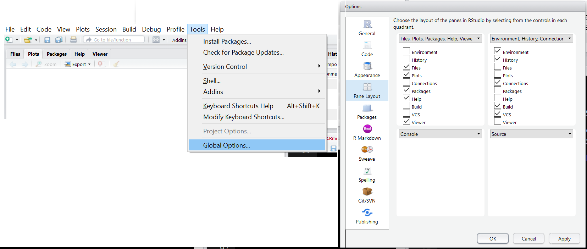

```{r,echo=FALSE,message=FALSE, warning = FALSE}
library(tidyverse)
options(dplyr.print_min = 5)
```

## Course Schedule  

**Daily agenda:**   

- 9:30-10:40 Session  
- 10-minute break  
- 10:50-12:00 Session  
- 12:00-1:15 Lunch  
- 1:15-2:25 Session  
- 10-minute break  
- 2:35-3:45 Session  
- 3:45 – 4:00 Q&A and Feedback  


## What do we want to be able to do?

- Read in data  

- Manipulate data  

- Plot data  

- Summarize data  

- Analyze data  


## Where do we start?  

**Day 1**  

- Install R/R studio  
- R Studio Interface
- Classes and Objects    
- Attributes and Basic Data Object Manipulation    
- Reading in Data/Writing Out Data    
- Logical Statements and Subsetting/Manipulating Data     

**Day 2**  

- Logical Statements and Subsetting/Manipulating Data?
- Numerical and Graphical Summaries    
- Basic Analyses  
<!-- We will do some of the basic numerical/graphical summary stuff along the way during day 1.-->


## Installing R  

- Check out the course [website](http://www4.stat.ncsu.edu/~post/DataScienceR/index.html)    

- Info on installing R and R studio [available here](http://www4.stat.ncsu.edu/~post/DataScienceR/Install.html)

- Let's take a few minutes and make sure everyone has these installed and working properly!

If installed, go to console and type `install.packages("tidyverse")`


## Why learn R?

> - It's free, open source, available on all major platforms. <!--As a result, if you do your analysis in R, anyone can easily replicate it.--> 

> - Tons of packages for modeling, visualization, data manipulation, etc.  

> - Access to the newest methods.  

> - Great community support (stackoverflow, R-help mailing list, etc.)  

> - Vibrant community readily sharing (rbloggers for instance)  

> - Can *easily* create pdfs, slides, reports, html files, and interactive apps.  


## Drawbacks of Using R  

> - Somewhat slow generally (although ways to speed it up) <!--C, Fortran, C++ connections - BLAS libraries, etc. Microsoft R does all this for you.  If really intensive computations, R is often used to profile code then written in a faster language-->  

> - Code style differs greatly! <!--Packages and code written by many different people with different styles.  Kind of have to learn as you go.  Newer wave of packages 'cleaning up' R quite a bit.  They use the same syntax (or similar).-->  

> - New code not necessarily verified <!--Users writing code for their latest method may have written something incorrectly.-->  

> - Confusing!  Often many ways to do the same thing <!--Each way correct, but picking the easiest to use or the one that is most compatible with what you are doing can be difficult-->


## R Studio Interface

- Four main 'areas' we'll use  
    + Scripting and Viewing Area  
    + Environment/History  
    + Plots/Packages/Help  
    + Console
    

## R Studio Interface  

To rearrange panes

```{r, out.width = "700px",echo=FALSE}

```

- Global options --> Appearance allows font/background changes  
- Global options --> Code allows for soft-wrap of script files


## Basic Use of R

- You can type directly into the console to evaluate code  
- R is the fanciest calculator you could ever want!

```{r, echo=TRUE}
#simple math operations (# is a comment, not evaluated)
3 + 7
10 * exp(3) #exp is exponential function
log(pi^2) #log is natural log by default
```
<!--Output of each of these is actually a vector of length 1!-->

## Basic Use of R  

- Usually want to keep code for later use  

> - Write code in a 'script'  

> - Save code script  

> - Send lines of code to console via: 
    <ul>
      <li> "Run" button (runs current line)  </li>
      <li> CTRL+Enter (PC) or Command+Enter (MAC)  </li>
      <li> Highlight section and do above</li>
    </ul>

## Basic Use of R  

- Go to file --> New File --> R Script  

- Type `hist(cars$dist)`  

- Submit to console using button or hot key  

> - Have a script open as we go so you can try things!

> - Save script using file --> Save  

> - Note:  All R code from slides available on web!  
<!--Open a R script, type in the previous lines and use hotkeys to submit to console.  Add in header/why you want it in there.-->


## R Objects  

R has strong **O**bject **O**riented **P**rogramming (OOP) tools  

> - Object: data structure with attributes  

> - Methods exist to act on an object type  

> - R functions like `print()` or `plot()` act differently depending on object type 

```{r}
str(cars)
```


## Methods  

```{r}
str(iris)
```


## Methods  

```{r}
plot(iris)
```


## R Objects  

> - Store **data/info/function/etc.** in R objects  

```{r,echo=TRUE}
#save for later
avg <- (5 + 7 + 6) / 3
#call avg object
avg
#strings (text) can be saved as well
words = "Hello there!"
words
```

<!--look at global environment window.  Note that R is case sensitive
The operators <- and = assign into the environment in which they are evaluated. The operator <- can be used anywhere, whereas the operator = is only allowed at the top level (e.g., in the complete expression typed at the command prompt) or as one of the subexpressions in a braced list of expressions. 
-->


## Objects and Common Classes   

- You have data...  

- Five major data structures used  

     1. Atomic Vector (1d)  
     2. Matrix (2d)  
     3. Array (nd) (we'll skip)  
     4. Data Frame (2d)  
     5. List (1d)  


## Objects and Common Classes    

1. Atomic Vector (a set of elements with an ordering) 
  - `c()` function "combines" values together
  
## Objects and Common Classes    

1. Atomic Vector (a set of elements with an ordering) 
  - `c()` function "combines" values together
```{r,echo=TRUE}
#vectors (1 dimensional) objects
#all elements of the same 'type'
x <- c(1, 3, 10, -20, sqrt(2))
y <- c("cat", "dog", "bird", "floor")
x
y
```

## Objects and Common Classes    

- Many 'functions' output a numeric vector
```{r,echo=TRUE,}
1:20 / 20
seq(from = 1, to = 10, by = 2)
runif(4, min = 0, max = 1)
```
<!--seq and runif are functions. To use functions you call their name followed by parentheses.-->

##Help Files  

- Functions are ubiquitous in R!  

> - To find out about a function's arguments use `help()`  

> - Understanding the help files is key to using code!

> - <ul>
      <li> `help(seq)`  </li>
      <li> `help(runif)` </li>
    </ul>

<!--R functions can have arguments, some have defaults - others do not-->

## Objects and Common Classes    

1. Atomic Vector (a set of elements with an ordering)   

- Vectors useful to know about  

- Not usually useful for your data  

- Often 'building blocks' for other data types


## Objects and Common Classes    

<ol start="2">
  <li> Matrix
</ol>
-  collection of vectors of the same **type and length**
```{r,echo=TRUE}
#populate vectors
x <- rep(0.2, times = 6)
y <- c(1, 3, 4, -1, 5, 6)
```

## Objects and Common Classes    

<ol start="2">
  <li> Matrix
</ol>
-  collection of vectors of the same **type and length**
```{r,echo=TRUE}
#populate vectors
x <- rep(0.2, times = 6)
y <- c(1, 3, 4, -1, 5, 6)

#check 'type'
is.numeric(x)
is.numeric(y)
```

## Objects and Common Classes    

<ol start="2">
  <li> Matrix
</ol> 
-  collection of vectors of the same **type and length**
```{r,echo=TRUE}
#populate vectors
x <- rep(0.2, times = 6)
y <- c(1, 3, 4, -1, 5, 6)

#check 'length'
length(x)
length(y)
```

## Objects and Common Classes    

<ol start="2">
  <li> Matrix
</ol> 
-  collection of vectors of the same **type and length**
```{r,echo=TRUE}
#populate vectors
x <- rep(0.2, times = 6)
y <- c(1, 3, 4, -1, 5, 6)
#combine in a matrix (check help(matrix))
matrix(c(x, y), ncol = 2)
```
<!--Can have as many columns and/or rows as needed-->

## Objects and Common Classes    

<ol start="2">
  <li> Matrix
</ol> 
-  collection of vectors of the same **type and length**
```{r,echo=TRUE}
#populate vectors
x <- rep(0.2, times = 6)
y <- c(1, 3, 4, -1, 5, 6)
#combine in a matrix (check help(matrix))
matrix(c(x, y), nrow = 2, byrow = TRUE)
```
<!--Can have as many columns and/or rows as needed-->


## Objects and Common Classes    

<ol start="2">
  <li> Matrix
</ol>  
-  collection of vectors of the same **type and length**
```{r,echo=TRUE}
x <- c("Hi", "There", "!"); y <- c("a", "b", "c"); z <- c("One", "Two", "Three")
is.character(x)
matrix(c(x, y, z), nrow = 3)
```
<!--If asked, semi-colon can be used to put more than one piece of code on the same line-->


## Objects and Common Classes    

<ol start="2">
  <li> Matrix
</ol>  
-  collection of vectors of the same **type and length**

- Useful for some data  

- Often some variables with numbers, some with text  

```{r, out.width = "600px",echo=FALSE}
knitr::include_graphics("img/dataset.png")
```


## Objects and Common Classes  

<ol start="4">
  <li> Data Frame
</ol> 
- collection (list) of vectors of the same **length**
```{r,echo=TRUE}
x <- c("a", "b", "c", "d", "e", "f")
y <- c(1, 3, 4, -1, 5, 6)
z <- 10:15
data.frame(x, y, z)
```
<!--Like a more flexible matrix-->

## Objects and Common Classes  

<ol start="4">
  <li> Data Frame
</ol> 
- collection (list) of vectors of the same **length**
```{r,echo=TRUE,eval=FALSE}
x <- c("a", "b", "c", "d", "e", "f")
y <- c(1, 3, 4, -1, 5, 6)
z <- 10:15
data.frame(char = x, data1 = y, data2 = z)
```
- char, data1, and data2 become the variable names for the data frame
<!--Valid Name:  A syntactically valid name consists of letters, numbers and the dot or underline characters and starts with a letter or the dot not followed by a number. Names such as ".2way" are not valid and neither are the reserved words. "n1" is valid.

Reserved words: if else repeat while function for in next break TRUE FALSE NULL Inf NaN NA NA_integer_ NA_real_ NA_complex_ NA_character_

see ?make.names for more details-->


## Objects and Common Classes  

<ol start="4">
  <li> Data Frame
</ol> 
- collection (list) of vectors of the same **length**

- Perfect for most data sets!  

- Most functions that read data in store it as a data frame  


## Objects and Common Classes    

<ol start="5">
  <li> List
</ol> 
- a vector that can have differing elements
```{r,echo=TRUE}
list("Hi", 1:3, rnorm(2), c("!", "?"))
```
<!--Still an ordered set of objects-->

## Objects and Common Classes    

<ol start="5">
  <li> List
</ol> 
- a vector that can have differing elements

- More flexible than a Data Frame!

- Useful for more complex types of data  

<!--Perfect for use when you have data with a lot of information/variables-->

## Recap!

Review:  

Dimension | Homogeneous   | Heterogeneous
--------- | ------------- | -------------
1d        | Atomic Vector | List
2d        | Matrix        | Data Frame

&nbsp;\n

- For most data analysis you'll use data frames!  

- Next up:  How do we access/change parts of our objects?  


## Activity 

- [**Objects and Common Classes Activity** instructions](http://www4.stat.ncsu.edu/~post/DataScienceR/ObjCCActivity.html) available on web  

- Work in small groups  

- Ask questions!  TAs and I will float about the room  

- Feel free to ask questions about anything you didn't understand as well!   


## Attributes and Basic Data Manipulation

- Want to know how to handle complex data sets 
- R has many 'built-in' data sets  
```{r, eval=FALSE}
iris
```


## Attributes and Basic Data Manipulation

- **What kind of object is iris?**


## Attributes and Basic Data Manipulation

- **What kind of object is iris?**

- `str()` function can tell us (structure)
```{r}
str(iris)
```


## Attributes and Basic Data Manipulation
- **What characteristics does iris have?**


## Attributes and Basic Data Manipulation
- **What characteristics does iris have?**
- `attributes()` function can tell us metadata  
    + Metadata = information about the data set  
    + Returns a named list

```{r, eval=F}
attributes(iris)
```


## Attributes and Basic Data Manipulation
```{r, echo=F}
attributes(iris)
```


## Basic Data Manipulation  
- **How do we access different parts of our object?  **


## Basic Data Manipulation  
- **How do we access different parts of our object?  **
- For data may want    
    + Data value  
    + Just a column
    + Multiple columns
    + Just a row  
    + Multiple rows  
    + Access to values of an attribute  


## Basic Data Manipulation  
**Atomic Vectors**  

- Access elements of a vector using square brackets 
```{r}
letters #built in vector
letters[10]
```

## Basic Data Manipulation  
**Atomic Vectors**  

- Can 'feed' R a vector of values to choose
```{r}
letters[1:4]
letters[c(5, 10, 15, 20, 25)]
x <- c(1, 2, 5); letters[x]
```

## Basic Data Manipulation  
**Matrices**  

- Access elements of a matrix using square brackets with a comma in between 
- Notice the default row names and column names!
```{r}
mat <- matrix(c(1:4, 20:17), ncol = 2)
mat
```

## Basic Data Manipulation  
**Matrices**  

- Access elements using square brackets with a comma 

<div style="float: left; width: 45%;">
```{r}
mat[2, 2]
mat[ , 1]
mat[2, ]
```
</div>
<div style="float: right; width: 45%;">
```{r}
mat[2:4, 1]
mat[c(2, 4), ]
```
</div>
<!--Note that R simplifies the result where possible.  That is, returns an atomic vector if you have only 1 dimension and a matrix if two.  Also, if you only give a single value in the [] then R uses the count of the value in the matrix.  Counts go down columns first.-->


## Basic Data Manipulation  
**Matrices**    

- Can give columns names and use them for access  

- `help(matrix)` can show us how!  

<!--Checkout the dimnames argument and see how to specify the names using a list.  Particularly that we don't want to give rownames so we can give a NULL (a special value in R that is used for undefined values- here giving no specification of row names).  ?Null for more info.  Then we just give a character vector for the column names-->

## Basic Data Manipulation  
**Matrices**  

- Can give columns names and use them for access

<div style="float: left; width: 60%;">
```{r,eval=FALSE}
mat <- matrix(c(1:4, 20:17), ncol = 2,
        ###<b>  
          dimnames = list(NULL,
                c("First", "Second"))
        ###</b>
        )
mat
```
```{r,echo=FALSE}
mat<-matrix(c(1:4,20:17),ncol=2,
            dimnames=list(NULL,
              c("First","Second")))
mat
```
</div>
<div style="float: right; width: 35%;">
```{r}
mat[, "First"]
```
</div>
<!--Can also give a character vector of column names if you'd like-->

<!-- ## Basic Data Manipulation -->
<!-- **Matrices**   -->

<!-- - Alternatively, we can assign the dimnames after creation -->
<!-- ```{r} -->
<!-- mat <- matrix(c(1:4, 20:17), ncol = 2) -->
<!-- ### <b> -->
<!-- dimnames(mat) <- list(NULL, c("First", "Second")) -->
<!-- ### </b> -->
<!-- mat -->
<!-- ``` -->
<!-- - dimnames a *special attribute* with its own function! -->


## Basic Data Manipulation  
**Matrices**  

- What about the structure and attributes of matrices?

<div style="float: left; width:58%;">
```{r}
str(mat)
```
</div>
<div style="float: right; width: 35%;">
```{r}
attributes(mat)
```
</div>
<!-- dim is a useful attribute!-->


## Basic Data Manipulation  
**Data Frames**  

- 'Built in' `iris` data frame
```{r}
str(iris)
```

## Basic Data Manipulation  
**Data Frames**  

- Can access just like a matrix
```{r}
iris[1:4, 2:4]
iris[1, ]
```
<!--Notice iris[1,] returns a data frame not a vector.  iris[,1] returns a vector.  This is due to that attributes associated with the columns but having none with the rows.  [  is actually a function call in R (everything is really) and the default argument on [ is drop=TRUE telling R to coerce whatever is left to the lowest possible dimension.  The attributes on the columns keep R from coercing to 1d.   iris[,1,drop=FALSE] returns a data frame with one column.  (Think of [,] as simplifying by default and [,,drop=F] as preserving.)--> 


## Basic Data Manipulation  
**Data Frames**  

- Can use variable names
```{r}
iris[ , c("Sepal.Length", "Species")]
```


## Basic Data Manipulation  
**Data Frames**  

- Dollar sign allows access to columns! (Returns a vector.)
```{r}
iris$Sepal.Length
```

## Basic Data Manipulation  
**Data Frames**  

- Dollar sign allows access to columns! (Returns a vector.)

- Most used method for accessing a data frame  

- RStudio fills in options.  
    + Type `iris$`  
    + If no choices - hit tab
    + Hit tab again to choose  


## Basic Data Manipulation  
**Lists**  

- Use double square brackets to get at list elements
```{r}
x <- list("HI", c(10:20), 1)
x
```


## Basic Data Manipulation  
**Lists**  

- Use double square brackets to get at list elements

<div style="float: left; width:40%;">
```{r}
x <- list("HI", c(10:20), 1)
x[[1]]
x[[3]]
```
</div>
<div style="float: right; width:50%;">
```{r}
x[[2]]
x[[2]][4:5]
```
</div>
<!--Can use single square brackets to access a list as well but [] can only return a single value and so it returns a list.  That is x[1] returns a list of the vector "Hi".  x[2] returns a list containing the vector 10:20 and x[1:2] returns a list with two components corresponding to "Hi" and 10:20.  x[[1:2]] returns an error because it is trying to access the elements of the list 1:2 which isn't a valid way to access the list elements so it doens't work. -->


## Basic Data Manipulation  
**Lists**  

- If named list elements, can use $
```{r}
x <- list("HI", c(10:20), 1)
str(x)
x <- list(First="Hi", Second=c(10:20), Third=1)
x$Second
```

## Basic Data Manipulation  
**Data Frames**  

- Connection:  Data Frame = List of equal length vectors 
```{r}
str(iris)
iris[[2]]
```
<!--Note that iris[2] will give you back the second column but returns a list of that column that retains its attributes. That is, you get back a data frame with that column.  (Think of [] as preserving structure and [[]] as simplifying structure if possible.)-->

## Accessing Attributes  

- Often want to change or modify attributes

```{r}
str(attributes(iris))
```

- a list!

## Accessing Attributes  

- Often want to change or modify attributes

```{r}
attributes(iris)$names
attributes(iris)$names[1] <- "Sepal_Length"
attributes(iris)$names
```

## Attributes and Basic Data Manipulation
- Often want to change or modify attributes  

- Most commonly modified attributes have 'helper' functions

```{r}
names(iris)
names(iris)[2] <- "Sepal_Width"
names(iris)
```


## Partial Matching 

With `[[` or `$` partial matching can be used  

```{r}
iris$Sp
```


## Partial Matching 

With `[[` or `$` partial matching can be used  

```{r}
iris[["Petal.Len", exact = FALSE]]
```


## Recap!
 - Attributes and Structure important to understand  
    <ul>
      <li> `attributes()`</li>
      <li> `str()`</li>  
    </ul>  

> - Accessing common data structures  
    <ul>
        <li> Atomic vectors - `x[ ]`</li>
        <li> Matrices - `x[ , ]`</li>  
        <li> Data Frames - `x[ , ]` or `x$name`</li>  
        <li> Lists - `x[[ ]]` or `x$name`</li>
    </ul>
    
    
## Activity 
- [**Attributes and Basic Data Manipulation Activity** instructions](http://www4.stat.ncsu.edu/~post/DataScienceR/AttrDataManipActivity.html) available on web  

- Work in small groups  

- Ask questions!  TAs and I will float about the room  

- Feel free to ask questions about anything you didn't understand as well!   


