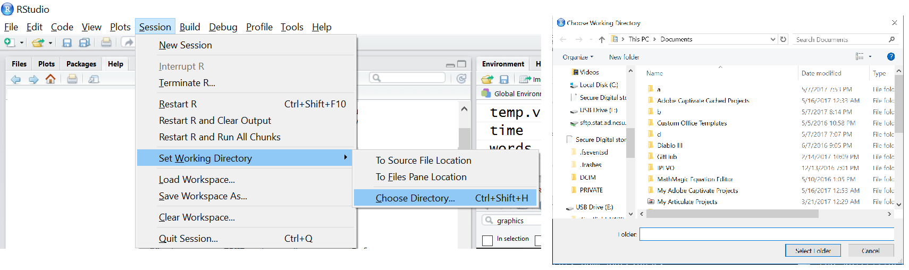

```{r,echo=FALSE,warning=FALSE,message=FALSE}
options(dplyr.print_min = 5)
options(tibble.print_min = 5)
library(tidyverse)
library(haven)
```

## What do we want to be able to do?

- **Read in data**  

- **Manipulate data**  

- Plot data  

- Summarize data  

- Analyze data  
<!--Don't want to get lost in the details.  What are our goals? what is the point of this?-->


## Schedule    

**Day 1**  

- Install R/R studio  
- R Studio Interface
- Classes and Objects    
- Attributes and Basic Data Object Manipulation    
- **Reading in Data/Writing Out Data**    
- **Logical Statements and Subsetting/Manipulating Data**  

<!--Next we'll take up getting data into R from external sources.  Then we'll really dive into manipulating it, creating new variables, subsetting by different conditions.  These will all help us to summarize the data nicely and make some beautiful plots.-->

## Reading in Data/Writing Out Data  
**Data comes in many formats**  

> - 'Delimited' data: Character (such as [','](https://github.com/jbpost2/DataScienceR/blob/master/datasets/scores.csv) , ['>'](https://github.com/jbpost2/DataScienceR/blob/master/datasets/umps2012.txt), or [' ']) separated data  

> - [Fixed field](https://github.com/jbpost2/DataScienceR/blob/master/datasets/cigarettes.txt) data  

> - [Excel](https://github.com/jbpost2/DataScienceR/blob/master/datasets/censusEd.xlsx?raw=true) data  

> - From other statistical software, Ex: [SPSS formatted](https://github.com/jbpost2/DataScienceR/blob/master/datasets/bodyFat.sav) data or [SAS data sets](https://github.com/jbpost2/DataScienceR/blob/master/datasets/smoke2003.sas7bdat)   

> - From a database  

> - From an Application Programming Interface (API)
  
> - Many ways to read in the data... How to choose?  


## Reading in Data/Writing Out Data

 - Possible methods to read data  
    <ul>
      <li> Base R (what comes installed)</li>  
      <li> Use an R 'package'</li>
    </ul>
    
> - R package  
    <ul>
      <li> Collection of functions in one place</li>  
      <li> Packages exist to do almost anything</li>  
      <li> [List of CRAN](https://cran.r-project.org/web/packages/available_packages_by_name.html) approved packages on R's website</li>  
      <li> Plenty of other packages on places like GitHub</li>
    </ul>
<!--Many packages do the same thing.  Some just do it better than others.  Often hard to pick the best one.-->    


## Reading in Data/Writing Out Data

- First time using a package  
    + Must install package (download)  
    + Can use code or menus
```{r,eval=FALSE}
install.packages("readr")
#can do multiple packages at once
install.packages(c("readr", "readxl", "haven", "DBI", "httr"))
```

## Reading in Data/Writing Out Data

- First time using a package  
    + Must install package (download)  
    + Can use code or menus

```{r, out.width = "800px",echo=FALSE}
knitr::include_graphics("img/packages.png")
```

<!--Can also install them from local sources and stuff like that but that isn't usually required unless you are behind a firewall of some kind that keeps R from accessing the internet.-->
    

## Reading in Data/Writing Out Data

- Once 'installed' on computer, never need to install again (unless you update R)  

- **Each session** read the package in using `library()` or `require()`

```{r}
library("readr")
require("haven")
```

## Reading in Data/Writing Out Data

- Difference - if no package  
     + `library()` throws an error
     + `require()` returns FALSE

```{r,error=TRUE,warning=TRUE}
library("notAPackage")
require("notAPackage")
```
<!--require is often used when you write functions that load in packages.  Rather than throwing an error you'd like to just return a warning to the user so they can go and download the package.

Of course, there are ways to load packages by default into your r workspace.  Go to your .Rprofile.site file (usually in C:\Program Files\R\R-***\etc\) and add in options(defaultPackages=c(getOption("defaultPackages"),
       "mypackage1","mypackage2", ... [etc.]))-->


## Reading in Data/Writing Out Data
- Many packages to read in data  

> - How to choose?  
     <ul>
       <li> Want 'fast' code</li>  
       <li> Want 'easy' syntax</li>  
       <li> Good default settings on functions</li>  
     </ul> 
     
> - Base R has reasonable defaults and syntax but functions are slow  

> - "[TidyVerse](http://tidyverse.org/)" - collection of R packages that share common philosophies and are designed to work together!  
    <ul>
       <li>Very efficient code</li>
    </ul>


## Reading in Data/Writing Out Data
**Reading in a comma separated value (.csv) file**

- Let's install the `tidyverse` package  

```{r, eval=FALSE}
install.packages("tidyverse")
```


## Reading in Data/Writing Out Data
**Reading in a comma separated value (.csv) file**

- Let's install the `tidyverse` package  

```{r, eval=FALSE}
install.packages("tidyverse")
```

- Load library
```{r}
library(tidyverse)
```

- Once library loaded, check `help(read_csv)`
- Want to read in scores.csv file using `read_csv()`

<!--Note: There are two conflicts.  This just means functions that are named the same thing.  R uses the most recently loaded function and "masks" the old ones.  You can access specific package functions using "::" for instance, stats::filter(...) will call the filter function that has been masked.

Focus on file argument as everything else has defaults.  Notice a path must be given...-->


## Reading in Data/Writing Out Data  
- How does R locate the file?  

## Reading in Data/Writing Out Data  
- How does R locate the file?  
    + Can give file *full path name*  
        * ex: E:/Other/DataScienceR/datasets/data.txt  
        * ex: E:\\\\Other\\\\DataScienceR\\\\datasets\\\\data.txt  


## Reading in Data/Writing Out Data  
- How does R locate the file?  
    + Can give file *full path name*  
        * ex: E:/Other/DataScienceR/datasets/data.txt  
        * ex: E:\\\\Other\\\\DataScienceR\\\\datasets\\\\data.txt  

    + Can change *working directory*  
        * Folder on computer usually
        * Where R 'looks' for files
        * Supply abbreviated path name

```{r}
getwd()
```


## Reading in Data/Writing Out Data  
- How does R locate the file?  
    + Can change *working directory*  


## Reading in Data/Writing Out Data  
- How does R locate the file?  
    + Can change *working directory*  
    + Via code

```{r,eval=FALSE}
setwd("E:\\Other\\DataScienceR")
#or
setwd("E:/Other/DataScienceR")
```
<!--Double slash needed because \ is an escape character in R so \\ is really read as \-->


## Reading in Data/Writing Out Data  
- How does R locate the file?  
    + Can change *working directory*  
    + Via menus

```{r, out.width = "800px",echo=FALSE}

```


## Reading in Data/Writing Out Data
**Reading in a comma separated value (.csv) file**

- Often, create a folder with all files for your project  

- Set working directory to that folder  

- Read in data  


## Aside: RStudio - Project

- Often have many files associated with each analysis  

- Keeping different undertakings separate can be difficult!

- Can use "Project" feature in R Studio  

> - Provides straightforward way to divide your work into multiple contexts.  Each with their own:    
    <ul>  
      <li> Working directory</li>
      <li> Workspace</li>  
      <li> History</li>  
      <li> Source documents</li>  
    </ul>


## Aside: RStudio - Project

- Easy to create!  

```{r project.png, out.width = "600px",echo=FALSE}
knitr::include_graphics("../img/project.png")
```

- Can save workspace, etc. and pick up right where you left off!


## Reading in Data/Writing Out Data
**Reading in a comma separated value (.csv) file**

- To avoid dealing with downloading files, we'll pull straight from the web

```{r,eval=FALSE,echo=TRUE}
scoreData <- read_csv(file = "https://raw.githubusercontent.com/
                    jbpost2/DataScienceR/master/datasets/scores.csv")
```

```{r,eval=TRUE,echo=FALSE}
scoreData<-read_csv(file="https://raw.githubusercontent.com/jbpost2/DataScienceR/master/datasets/scores.csv")
```


## Reading in Data/Writing Out Data

```{r,echo=TRUE}
scoreData
```


## Reading in Data/Writing Out Data
**Reading in a comma separated value (.csv) file**

- Notice: fancy printing!  
- tidyverse data frames are special class
- Printing method optimal

```{r}
attributes(scoreData)$class
```


## Reading in Data/Writing Out Data
**Reading in a comma separated value (.csv) file**

- Notice: fancy printing!  
- tidyverse data frames are special class
- Printing method optimal

```{r}
attributes(scoreData)$class
```

 - How did R determine the column types?

<!--check the help on read_csv again.  See col_types.  Checks first 1000 rows of data and figures out character or numeric.  Notice you can read columns in using specifications.  For instance could specify week as integer and use date or date time when applicable.
--> 


## Reading in Data/Writing Out Data  
  
- Checking column type is a basic data validation step
- Check out scoresStub.csv  
- Look at season column type!

```{r,echo=TRUE,eval=FALSE}
scoreStub <- read_csv("https://raw.githubusercontent.com/
                    jbpost2/DataScienceR/master/datasets/scoresStub.csv")
```

```{r,echo=FALSE}
scoreStub<-read_csv("https://raw.githubusercontent.com/jbpost2/DataScienceR/master/datasets/scoresStub.csv")
```


## Reading in Data/Writing Out Data  

```{r}
scoreStub
```


----

- Can now make pretty plots (covered tomorrow)  
```{r}
ggplot(data = scoreData, aes(x = day, y = AFinal)) + geom_boxplot()
```

## Quick Aside: `factors`  

- Base R `read.csv()`  
    + Reads character variables as `factors`  
    
> - Factor - special class of vector  
    <ul>
      <li> Great for variable with finite number of classes (**levels**) </li>
      <li> Ex: day or week</li>
    </ul>


## Quick Aside: `factors`  

- Base R `read.csv()`  
    + Reads character variables as `factors`  
    
- Factor - special class of vector  
    <ul>
      <li> Great for variable with finite number of classes (**levels**) </li>
      <li> Ex: day or week</li>
    </ul>
    
```{r}
#overwrite day column with factor version
scoreData$day <- as.factor(scoreData$day)
levels(scoreData$day)
```

## Quick Aside: `factors`    
- Factor - Can now reorder (useful when plotting)  
    + Use `ordered` function on a *factor* to order the levels

```{r}
scoreData$day <- ordered(scoreData$day, 
                  levels = c("Wed","Thu","Fri","Sat","Sun","Mon","Tue"))

levels(scoreData$day)
```

----

- Plot with reordered levels (remove F, T, W)

```{r,echo=FALSE}
ggplot(data = filter(scoreData, day %in% c("Mon", "Sat", "Sun", "Thu")),aes(x=day,y=AFinal))+geom_boxplot()
```


## Reading in Data/Writing Out Data
**Reading in any delimited file**

- Read in umps.txt file (a '>' delimited file)
- Notice no column names provided  
    + Year Month Day Home Away HPUmpire  

> - Use `read_delim()` (check help!)


----

```{r,eval=FALSE}
umpData <- read_delim("https://raw.githubusercontent.com/
                    jbpost2/DataScienceR/master/datasets/umps2012.txt", 
                    delim = ">",
### <b>
     col_names = c("Year", "Month", "Day", "Home", "Away", "HPUmpire")
### </b>
)
```

```{r,echo=FALSE}
umpData<-read_delim("https://raw.githubusercontent.com/jbpost2/DataScienceR/master/datasets/umps2012.txt",delim=">",
          col_names=c("Year","Month","Day","Home","Away","HPUmpire"))
```


## Reading in Data/Writing Out Data
```{r}
umpData
```

## Reading in Data/Writing Out Data
**Reading in any delimited file**

- Functions from *readr* and their purpose

Delimiter     | Function   
------------- | -----------------------------
comma ','     | read_csv() 
tab           | read_tsv() 
space ' '     | read_table()
semi-colon ';'| read_csv2() 
other         | read_delim(...,delim = ,...)

<!--Note read_table() will do any number of spaces between columns.  read_csv2() is common in countries where , is used as a decimal so ; is used as the delimieter-->


## Reading in Data/Writing Out Data
**Fixed field data**

- Open the cigarettes.txt file: Read using `read_fwf()`

 - Can specify columns in many ways

```{r,eval=FALSE,echo=TRUE}
#a guess based on reading a few columns
cigData <- read_fwf("https://raw.githubusercontent.com/jbpost2/
                  DataScienceR/master/datasets/cigarettes.txt",
### <b>
                  col_positions =
                      fwf_empty("https://raw.githubusercontent.com/jbpost2/
                             DataScienceR/master/datasets/cigarettes.txt",
                 col_names = c("brand", "tar", "nicotine", "weight", "co"))
###</b>
)
```

```{r,eval=TRUE,echo=FALSE,message=FALSE}
#a guess based on reading a few columns
cigData<-read_fwf("https://raw.githubusercontent.com/jbpost2/DataScienceR/master/datasets/cigarettes.txt",col_positions=
       fwf_empty("https://raw.githubusercontent.com/jbpost2/DataScienceR/master/datasets/cigarettes.txt",
                 col_names = c("brand", "tar", "nicotine", "weight", "co")))
```


## Reading in Data/Writing Out Data
```{r}
cigData
```

## Reading in Data/Writing Out Data
**Fixed field data**

- Must skip first line!

```{r,eval=FALSE}
#need to skip first line!
cigData<-read_fwf("https://raw.githubusercontent.com/
                  jbpost2/DataScienceR/master/datasets/cigarettes.txt",
                  col_positions = fwf_empty("https://raw.githubusercontent.com/jbpost2/
                       DataScienceR/master/datasets/cigarettes.txt",
                 col_names = c("brand", "tar", "nicotine", "weight", "co")),
### <b>
       skip = 1
### </b>
)
```

```{r,echo=FALSE,message=FALSE}
#need to skip first line!
cigData<-read_fwf("https://raw.githubusercontent.com/jbpost2/DataScienceR/master/datasets/cigarettes.txt",col_positions=
       fwf_empty("https://raw.githubusercontent.com/jbpost2/DataScienceR/master/datasets/cigarettes.txt",
                 col_names = c("brand", "tar", "nicotine", "weight", "co")),skip=1)
```

## Reading in Data/Writing Out Data
```{r}
cigData
```


## Reading in Data/Writing Out Data
**Fixed field data**

- Can specify columns in many ways

```{r,eval=FALSE}
#another option
cigData<-read_fwf("https://raw.githubusercontent.com/jbpost2/
                   DataScienceR/master/datasets/cigarettes.txt",
                   col_positions =
  ### <b>
                                 fwf_widths(c(17, 5, 9, 6, NA),
  ### </b>
                col_names = c("brand", "tar", "nicotine", "weight", "co")),
                    skip = 1
  )
```

```{r,echo=FALSE,message=FALSE}
#another option
cigData<-read_fwf("https://raw.githubusercontent.com/jbpost2/DataScienceR/master/datasets/cigarettes.txt",col_positions=
       fwf_widths(c(17,5,9,6,NA),
                  col_names = c("brand", "tar", "nicotine", "weight", "co")),
       skip=1)
```

```{r, out.width = "600px",echo=FALSE}
knitr::include_graphics("img/fwfdata.png")
```

## Reading in Data/Writing Out Data

**Other useful functions for tricky data** 

- read_file()
     + reads an entire file into a single string

- read_lines() 
     + reads a file into a character vector with one element per line  

- Usually parse with `regular expressions`   


## Reading in Data/Writing Out Data
**Excel Data**

- Read in censusEd.xlsx  

- Unfortunately can't xlsx from gitHub easily

- Download [censusEd.xlsx](https://github.com/jbpost2/DataScienceR/blob/master/datasets/censusEd.xlsx?raw=true)

- Place in folder called 'datasets' in working directory


## Reading in Data/Writing Out Data
**Excel Data**

- Read in censusEd.xls  
- Using `read_excel()` from `readxl` package 
    + Reads both xls and xlsx files
    + Detects format from extension given
    + Specify sheet with name or integers (or NULL for 1st)  
    
```{r}
library(readxl)
#just first sheet
edData <- read_excel("datasets/censusEd.xlsx", sheet = "EDU01A")
```

## Reading in Data/Writing Out Data
```{r}
edData
```


## Reading in Data/Writing Out Data
**Excel Data**

- Using `read_excel()` from `readxl` package 
    + Specify sheet with name or integers (or `NULL` for 1st)  
    + Look at sheets available

```{r}
excel_sheets("datasets/censusEd.xlsx")
```


## Reading in Data/Writing Out Data
**Excel Data**

- Using `read_excel()` from `readxl` package 
    + Specify cells with contiguous range 
    
```{r,eval=FALSE}
library(readxl)
#just first sheet
edData <- read_excel("datasets/censusEd.xlsx", sheet = "EDU01A", 
                   ### <b>
                   range = cell_cols("A:D")
                   ### </b>
                   )
```
```{r,echo=FALSE}
library(readxl)
#just first sheet
edData <- read_excel("datasets/censusEd.xlsx", sheet = "EDU01A", 
                   range = cell_cols("A:D"))
```


## Reading in Data/Writing Out Data
```{r}
edData
```


## Excel Data Recap
Using `read_excel()` from `readxl` package 

> - Reads both xls and xlsx files
> - Specify sheet with name or integers (or `NULL` for 1st)  
       <ul> <li> Use `sheet = "name"` or `sheet = #` </li></ul> 
> - Look at sheets available    
      <ul> <li>  Use `excel_sheets`</li></ul>    
> - Specify cells with continguous range  
        <ul> 
          <li> `range = cell_cols("...")` </li>  
          <li> `range = cell_rows("...")`</li>
        </ul>
> - Specify cells   
        <ul> <li> `range = "R1C2:R2C5"`</ul> </li>
      
      
## Reading in Data/Writing Out Data
**SPSS Data**

- SPSS data has extension ".sav"  
- Read in bodyFat.sav  
- Use `read_spss()` from `haven` package  
- Not many options!

```{r,eval=FALSE}
library(haven)
bodyFatData <- read_spss("https://github.com/jbpost2/
                      DataScienceR/blob/master/datasets/
                      bodyFat.sav?raw=true.sav")
```
```{r,echo=FALSE}
library(haven)
bodyFatData<-read_spss("https://github.com/jbpost2/DataScienceR/blob/master/datasets/bodyFat.sav?raw=true.sav")
```
      
## Reading in Data/Writing Out Data
```{r,eval=FALSE}
bodyFatData
```
```{r,echo=FALSE}
print(bodyFatData, n = 5)
```


## Reading in Data/Writing Out Data
**SAS Data**

- SAS data has extension '.sas7bdat' 

- Read in smoke2003.sas7bdat  

- Use `read_sas()` from haven package  

- Not many options!

```{r,eval=FALSE}
smokeData <- read_sas("https://github.com/jbpost2/
                    DataScienceR/blob/master/datasets/
                    smoke2003.sas7bdat?raw=true")
```
```{r,echo=FALSE}
smokeData<-read_sas("https://github.com/jbpost2/DataScienceR/blob/master/datasets/smoke2003.sas7bdat?raw=true")
```


## Reading in Data/Writing Out Data
```{r}
smokeData
```

## Reading in Data/Writing Out Data
**SAS Data**

- Note: Variables had SAS labels. Don't show on print!  

    + Will show on View(smokeData) (or click on data from environment)  
    
```{r}
str(smokeData)
```
    
## Reading in Data/Writing Out Data
**SAS Data**  

- Note: Variables had SAS labels.  Don't show on print!  

    + Will show on View(smokeData) (or click on data from environment)  
    + Can access via

```{r}
attr(smokeData$SDDSRVYR, "label")
```

## Reading in Data/Writing Out Data
**Writing Data**

- Usually write to .csv (or other delimiter)
- Use `write_csv()` from `readr` package
- Check help!
    + Will write to path or working directory  
 
```{r,eval=FALSE}
write_csv(x = smokeData,
          path = "E:/Other/DataScienceR/datasets/output/smokeData.csv")
```
<!-- Note: Lose lables here... would need to write a function to grab them and then output them to the data set as an extra row. Or create a different data set to hold them.-->


## Reading in Data/Writing Out Data
**Writing Data**

- Usually write to .csv (or other delimiter)
- Use `write_csv()` from `readr` package
- Check help!
    + Will write to path or working directory    
    + `append` option won't overwrite but structures must match...

```{r,eval=FALSE}
write_csv(x = bodyFatData,
          path = "E:/Other/DataScienceR/datasets/smokeData.csv",
          append = TRUE)
```
   
## Recap

- Reading Data

Type of file       | Package   | Function   
------------------ | --------- | -----------------
Delimited          | `readr`   | `read_csv()`, `read_tsv()`,`read_table()`, `read_delim(...,delim = ,...)`
Excel (.xls,.xlsx) | `readxl`  | `read_excel`
SPSS (.sav)        | `haven`   | `read_spss`
SAS (.sas7bdat)    | `haven`   | `read_sas`

<br>

- Write data with `write_csv()` from readr  


## APIs  

Application Program Interface (API)  

- set of subroutine definitions, communication protocols, and tools for building software  

- Basically a protocol for computers to talk to one another  

- Just need to understand the language!  

- Useful for getting data  

Ex: [Census API](https://api.census.gov/data.html)

- Usually need to get a key (sometimes a username and password)


## APIs  

Very few APIs are out there for R as compared to say python  

- Some R packages exist such as `censusapi` (you can get your own census key [here](https://api.census.gov/data/key_signup.html)) 

```{r, message = FALSE}
library(censusapi)
apis <- listCensusApis()
head(apis)
```

## APIs  

`getCensus()`  

- makes an API call to a given Census API and returns a data frame  

- most census APIs require (among other things)  

    + name - API name given by Census (“acs5” or “timeseries/bds/firms”)  

    + vintage - dataset year  

    + vars - list of variable names to get  

    + region - geography level to return, like state or county


## APIs  

Follow vignette example of getting uninsured rates by income group using the Small Area Health Insurance Estimates API, which provides detailed annual state-level and county-level estimates of health insurance rates.

- name = sahie  

- vintage is time for this api (time = 2016 will be used)  

- vars/region we'll look at the list of available values  


##APIs (List of vars)

```{r}
sahie_vars <- listCensusMetadata(name = "timeseries/healthins/sahie", type = "variables")
```

Partial list  

```{r, echo = FALSE, out.width = "800px"}
knitr::include_graphics("../img/censusAPI.png")
```

## APIs  

Variables we'll get from that list  

- IPRCAT: Income Poverty Ratio Category  

- IPR_DESC: Income Poverty Ratio Category Description  

- PCTUI_PT: Percent Uninsured in Demographic Group for Selected Income Range, Estimate  

- NAME: Name of the geography returned (e.g. state or county name)  


## APIs (List of Region option)

```{r}
listCensusMetadata(name = "timeseries/healthins/sahie", type = "geography")
```

- us, county, or state can be requested

##APIs  

Call some data (ask the api for it)  

- uninsured rate by income group at the national level  

```{r, eval = FALSE}
getCensus(name = "timeseries/healthins/sahie",
    vars = c("NAME", "IPRCAT", "IPR_DESC", "PCTUI_PT"), 
    region = "us:*", 
    time = 2016, key = "your_key_here")
```


```{r, echo = FALSE}
getCensus(name = "timeseries/healthins/sahie",
    vars = c("NAME", "IPRCAT", "IPR_DESC", "PCTUI_PT"), 
    region = "us:*", 
    time = 2016, key = "e267f117801b2ef741e54620602b0903c5f4d3c8")
```


##APIs  

Call some data (ask the api for it)  

- uninsured rate by income group for each state  

```{r}
sahie_states <- getCensus(name = "timeseries/healthins/sahie",
    vars = c("NAME", "IPRCAT", "IPR_DESC", "PCTUI_PT"), 
    region = "state:*", 
    time = 2016, key = "e267f117801b2ef741e54620602b0903c5f4d3c8")
head(sahie_states)
```


## What Does `censusapi` Do?  

Creates the correct call to the API (similar to examples we saw)   

`   constructURL <- function(name, vintage) {`  
`        if (is.null(vintage)) {`  
`            apiurl <- paste("https://api.census.gov/data", name, sep = "/")`  
`        }`  
`        else {`  
`            apiurl <- paste("https://api.census.gov/data", vintage, name, sep = "/")`  
`        }`  
`        lastchar <- substr(apiurl, nchar(apiurl), nchar(apiurl))`  
`        if (lastchar == "?" | lastchar == "/") {`  
`            apiurl <- substr(apiurl, 1, nchar(apiurl) - 1)`  
`        }`  
`        apiurl`  
`    }`


## API Access in R  

Article [here](https://www.programmableweb.com/news/how-to-access-any-restful-api-using-r-language/how-to/2017/07/21) discusses accessing APIs generically with R  

Same website gives a [list of APIs](https://www.programmableweb.com/category/all/apis)


##Recap  

Many sources of data  

- flat delimited files  

- Excel  

- APIs  

- Databases (not covered here)   

- Web scraping (not covered here)  

Need to know how to bring data in and manipulate it for analysis!  

## Activity 
- [**Reading/Writing Data Activity** instructions](http://www4.stat.ncsu.edu/~post/DataScienceR/ReadWriteActivity.html) available on web  

- Work in small groups  

- Ask questions!  TAs and I will float about the room  

- Feel free to ask questions about anything you didn't understand as well!   
