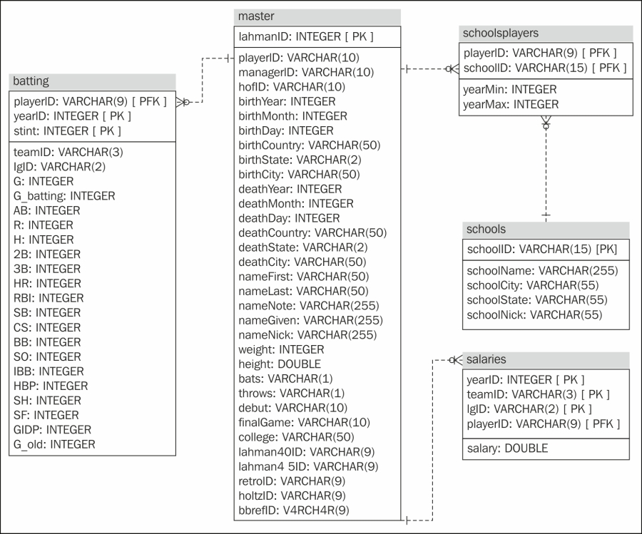

```{r,echo=FALSE,warning=FALSE,message=FALSE}
library(tidyverse)
library(haven)
options(dplyr.print_min = 5)
options(tibble.print_min = 5)
library(knitr)
opts_chunk$set(message = FALSE, cache = TRUE, warning = FALSE)
library(RSQLite)
library(methods)
```

## What is this course about?

Basic use of R for reading, manipulating, and plotting data!

<div style = "float: left;border:1px solid black;">
<a href = "https://www4.stat.ncsu.edu/~online/datasets/chemical.txt">
```{r step4a, fig.align = 'left', out.width = '205px', out.height = "249px", eval = TRUE, echo = FALSE}
knitr::include_graphics("img/rawData.png")
```
</a>
</div>
<div style = "float: left;">
```{r arrow4a, fig.align = 'left', out.width = '30px', out.height = "249px", eval = TRUE, echo = FALSE}
knitr::include_graphics("img/arrow.png")
```
</div>
<div style = "float: left;border:1px solid black;">
<a href = "https://www4.stat.ncsu.edu/~online/datasets/readChemData.r">
```{r step4b, fig.align = 'left', out.width = '205px', out.height = "249px", eval = TRUE, echo = FALSE}
knitr::include_graphics("img/ImportR.png")
```
</a>
</div>
<div style = "float: left;">
```{r arrow4b, fig.align = 'left', out.width = '30px', out.height = "249px", eval = TRUE, echo = FALSE}
knitr::include_graphics("img/arrow.png")
```
</div>
<div style = "float: left;border:1px solid black;">
<a href = "https://www4.stat.ncsu.edu/~online/datasets/summChemData.r">
```{r step4c, fig.align = 'left', out.width = '205px', out.height = "249px", eval = TRUE, echo = FALSE}
knitr::include_graphics("img/SummarizeR.png")
```
</a>
</div>
<div style = "float: left;">
```{r arrow4c, fig.align = 'left', out.width = '30px', out.height = "249px", eval = TRUE, echo = FALSE}
knitr::include_graphics("img/arrow.png")
```
</div>
<div style = "float: left;border:1px dashed black;">
```{r step4d, fig.align = 'left', out.width = '205px', out.height = "249px", eval = TRUE, echo = FALSE}
knitr::include_graphics("img/AnalysisR.png")
```
</div>


## Schedule    

**Day 1**  

- Install R/R studio  
- R Studio Interface
- Classes and Objects    
- Attributes and Basic Data Object Manipulation    
- **Reading in Data/Writing Out Data**    

<!--Next we'll take up getting data into R from external sources.  Then we'll really dive into manipulating it, creating new variables, subsetting by different conditions.  These will all help us to summarize the data nicely and make some beautiful plots.-->

## Reading in Data/Writing Out Data  
**Data comes in many formats**  

> - 'Delimited' data: Character (such as [','](https://github.com/jbpost2/DataScienceR/blob/master/datasets/scores.csv) , ['>'](https://github.com/jbpost2/DataScienceR/blob/master/datasets/umps2012.txt), or [' ']) separated data  

> - [Fixed field](https://github.com/jbpost2/DataScienceR/blob/master/datasets/cigarettes.txt) data  

> - [Excel](https://github.com/jbpost2/DataScienceR/blob/master/datasets/censusEd.xlsx?raw=true) data  

> - From other statistical software, Ex: [SPSS formatted](https://github.com/jbpost2/DataScienceR/blob/master/datasets/bodyFat.sav) data or [SAS data sets](https://github.com/jbpost2/DataScienceR/blob/master/datasets/smoke2003.sas7bdat)   

> - JSON or XML data (often from a database or API)

## Importing Delimited Data: Standard R Methods

 - When you open R a few `packages` are loaded
 
> - R package  
    <ul>
      <li> Collection of functions/datasets/etc. in one place</li>  
      <li> Packages exist to do almost anything</li>  
      <li> [List of CRAN](https://cran.r-project.org/web/packages/available_packages_by_name.html) approved packages on R's website</li>  
      <li> Plenty of other packages on places like GitHub</li>
    </ul>


## Importing Delimited Data: Standard R Methods

 - When you open R a few `packages` are loaded
 
```{r loadR, fig.align = 'center', out.width = "250px", echo = FALSE}
include_graphics("img/loadR.png")
```

 - `utils` package has *family* of `read.` functions ready for use!  
 
 
## Importing Delimited Data: Standard R Methods

Function and purpose:

Type of Delimeter           | Function   
--------------------------- | -----------------
Comma                       | `read.csv()`
Semicolon (`,` for decimal) | `read.csv2()`
Tab                         | `read.delim()`
White Space/General         | `read.table(sep = "")`  


> - Each function requires a **path** to the file  


## Reading a .csv File  

- Let's read in the '[neuralgia.csv](https://www4.stat.ncsu.edu/~online/datasets/neuralgia.csv)' file  

- How does R locate the file?  


## Path to File   

- Let's read in the '[neuralgia.csv](https://www4.stat.ncsu.edu/~online/datasets/neuralgia.csv)' file  

- How does R locate the file?  

    + Can give *full path name*  
    
        * ex: C:/repos/DataScienceR/datasets/neuralgia.csv  
        * ex: C:\\\\repos\\\\DataScienceR\\\\datasets\\\\neuralgia.csv  

```{r pathVis, fig.align = 'center', out.width = "450px", echo = FALSE}
knitr::include_graphics("img/pathVis.png")
```


## Reading a .csv File  

- Let's read in the '[neuralgia.csv](https://www4.stat.ncsu.edu/~online/datasets/neuralgia.csv)' file  

- Use full local path  

```{r readCSVhidden, echo = FALSE, eval = TRUE}
neuralgiaData <- read.csv("https://www4.stat.ncsu.edu/~online/datasets/neuralgia.csv")
```

```{r readCSV, echo = TRUE, eval = FALSE}
neuralgiaData <- read.csv(
           "C:/repos/DataScienceR/datasets/neuralgia.csv"
           )
```

```{r printCSV}
head(neuralgiaData)
```


## Working Directory  

- Let's read in the '[neuralgia.csv](https://www4.stat.ncsu.edu/~online/datasets/neuralgia.csv)' file  

- Using full local path not recommended!  

    + Can't share code without changing path...
    
    

## Working Directory  

- Let's read in the '[neuralgia.csv](https://www4.stat.ncsu.edu/~online/datasets/neuralgia.csv)' file  

- Using full local path not recommended!  

    + Can't share code without changing path...
    
- Can change *working directory*  
<ul>
    <li> Folder where R 'looks' for files</li>
    <li> Supply **relative** path </li>
</ul>


## Working Directory  

- Let's read in the '[neuralgia.csv](https://www4.stat.ncsu.edu/~online/datasets/neuralgia.csv)' file  

- Using full local path not recommended!  

    + Can't share code without changing path...
    
- Can change *working directory*  
<ul>
    <li> Folder where R 'looks' for files</li>
    <li> Supply **relative** path </li>
</ul>

```{r getwd}
getwd()
```


## Working Directory  

- Can change *working directory*  

    + Via code

```{r setwd1,eval=FALSE}
setwd("C:/repos/DataScienceR/datasets")
#or
setwd("C:\\repos\\DataScienceR\\datasets")
```
<!--Double slash needed because \ is an escape character in R so \\ is really read as \-->


## Working Directory  

- Can change *working directory*  

    + Via code
 
    + Via menus

```{r setwd2, out.width = "800px",echo=FALSE}
knitr::include_graphics("img/setwd.png")
```


## Reading a .csv File  

- Let's read in the '[neuralgia.csv](https://www4.stat.ncsu.edu/~online/datasets/neuralgia.csv)' file  

```{r readCSVrel, eval = FALSE}
neuralgiaData <- read.csv("datasets/neuralgia.csv")
```

- Note: `../` drops down a folder

> - As long others have the same folder structure, can share code with no path change needed!


## Reading a .csv File  

- Let's read in the '[neuralgia.csv](https://www4.stat.ncsu.edu/~online/datasets/neuralgia.csv)' file  

- R can pull from URLs as well!

```{r readCSV2, eval = TRUE}
neuralgiaData <- read.csv("https://www4.stat.ncsu.edu/~online/datasets/neuralgia.csv")
head(neuralgiaData)
```


## Reading a .csv File  

`read.csv()` function 

Tell R where the file lives via:  

<ul>
  <li> a full local path (not recommended)  </li>
  <li> a relative path  </li>
  <ul>
    <li> can set the working directory with `setwd()`  </li>
  </ul>
  <li> pulling from URL</li>
</ul>


## Aside: RStudio Project

- Often have many files associated with an analysis  

- With multiple analyses things get cluttered...  


## Aside: RStudio Project

- Often have many files associated with an analysis  

- With multiple analyses things get cluttered...  

- Want to associate different  
<ul>
   <li> environments </li>
   <li> histories </li>
   <li> working directories </li>
   <li> source documents </li>
</ul> 
with each analysis

> - Can use "Project" feature in R Studio  


## Aside: RStudio - Project

- Easy to create!  Use an existing folder or create one:

```{r project.png, out.width = "600px",echo=FALSE, fig.align = 'center'}
knitr::include_graphics("img/project.png")
```

- Easily switch between analyses!  

- Create one for today's lesson  

- Swap between projects using menu in top right


## Reading Delimited Data  

- Functions from `read.` family work well  

- Concerns:  

    + (formerly, prior to R 4.0) poor default function behavior
    
         * strings were read as `factors`  


## Reading Delimited Data  

- Functions from `read.` family work well  

- Concerns:  

    + poor default function behavior
    
         * (formerly, prior to R 4.0) strings are read as `factors`  
         
         * row & column names can be troublesome
    
    + Slower processing  
    
    + (Slightly) different behavior on different computers  
    


## Aside: R Packages

- R package  
    <ul>
      <li> Collection of functions in one place</li>  
      <li> Packages exist to do almost anything</li>  
      <li> [List of CRAN](https://cran.r-project.org/web/packages/available_packages_by_name.html) approved packages on R's website</li>  
      <li> Plenty of other packages on places like GitHub</li>
    </ul>
    
> - "[TidyVerse](http://tidyverse.org/)" - collection of R packages that share common philosophies and are designed to work together!  
<!--Many packages do the same thing.  Some just do it better than others.  Often hard to pick the best one.-->    


## Aside: R Packages

- First time using a package  
    + Must install package (download files)  
    + Can use code or menus 
    
```{r install1, eval=FALSE}
install.packages("readr")
#can do multiple packages at once
install.packages(c("readr", "readxl", "haven", "DBI", "httr"))
```


## Aside: R Packages

- First time using a package  
    + Must install package (download files)  
    + Can use code or menus

```{r install2, out.width = "800px",echo=FALSE, fig.align='center'}
knitr::include_graphics("img/packages.png")
```

<!--Can also install them from local sources and stuff like that but that isn't usually required unless you are behind a firewall of some kind that keeps R from accessing the internet.-->
    

## Aside: R Packages

- Only install once!  

- **Each session**: read in package using `library()` or `require()`

```{r libreq1}
library("readr")
require("haven")
```

## Aside: R Packages

- Difference - if no package  
     + `library()` throws an error
     + `require()` returns FALSE

```{r libreq2,error=TRUE,warning=TRUE}
library("notAPackage")
require("notAPackage")
```
<!--require is often used when you write functions that load in packages.  Rather than throwing an error you'd like to just return a warning to the user so they can go and download the package.

Of course, there are ways to load packages by default into your r workspace.  Go to your .Rprofile.site file (usually in C:\Program Files\R\R-***\etc\) and add in options(defaultPackages=c(getOption("defaultPackages"),
       "mypackage1","mypackage2", ... [etc.]))-->


## Aside: R Packages  

- Many packages to do things in R  

> - How to choose?  
     <ul>
       <li> Want 'fast' code</li>  
       <li> Want 'easy' syntax</li>  
       <li> Good default settings on functions</li>  
       <li> Nice set of examples and vignettes</li>  
     </ul> 
     
> - Enter: TidyVerse


## Aside: R Packages  

- Install the `tidyverse` package  

```{r tidy, eval=FALSE}
install.packages("tidyverse")
```


## Aside: R Packages  

- Install the `tidyverse` package  

```{r tidy2, eval=FALSE}
install.packages("tidyverse")
```

- Load library  

```{r loadTidy, message = TRUE}
library(tidyverse)
```

- Once library loaded, check `help(filter)`  

<!--Note: There are two conflicts.  This just means functions that are named the same thing.  R uses the most recently loaded function and "masks" the old ones.  You can access specific package functions using "::" for instance, stats::filter(...) will call the filter function that has been masked.-->


## Aside: R Packages  

- Can call functions without loading full library with `::`  

- If not specified, most recently loaded package takes precedent

```{r readCSVex, eval = TRUE}
dplyr::filter(neuralgiaData, Treatment == "P")
```


## Aside: R Packages  

Install packages first (download it)  

 - Can do more than one at a time  
 
Load package with `require()` or `library()`  

 - Call without loading using `::`  
 

## Reading Delimited Data  

We'll use the `tidyverse`!

Function and purpose:

Type of Delimeter           | `utils` Function        | `readr` Function 
--------------------------- | ----------------------- | ---------
Comma                       | `read.csv()`            | `read_csv()`
Semicolon (`,` for decimal) | `read.csv2()`           | `read_csv2()`
Tab                         | `read.delim()`          | `read_tsv()`
General                     | `read.table(sep = "")`  | `read_delim()`
White Space                 | `read.table(sep = "")`  | `read_table()` `read_table2()`


## Reading Delimited Data  

- Let's read in the '[neuralgia.csv](https://www4.stat.ncsu.edu/~online/datasets/neuralgia.csv)' file  

```{r readCSVex2, eval = TRUE, message = TRUE}
neuralgiaData2 <- readr::read_csv("https://www4.stat.ncsu.edu/~online/datasets/neuralgia.csv")
```


## Reading Delimited Data  

- Let's read in the '[neuralgia.csv](https://www4.stat.ncsu.edu/~online/datasets/neuralgia.csv)' file  

```{r viewData}
neuralgiaData2
```


## Reading Delimited Data  

- Notice: fancy printing!  

- Checking column type is a basic data validation step  

- `tidyverse` data frames are called `tibbles`  

```{r class}
class(neuralgiaData2)
```


## `tibbles`  

- Behavior slightly different than a standard `data frame`.  No simplification!  

```{r simplify}
neuralgiaData[,1]
neuralgiaData2[,1]
```


## `tibbles`  

- Behavior slightly different than a standard `data frame`.  No simplification!  

- Use either `pull()` or `$`

```{r pull}
pull(neuralgiaData2, 1) #or pull(neuralgiaData2, Treatment)
neuralgiaData2$Treatment 
```


## Reading Delimited Data  

 - How did R determine the column types?

```{r helpcsv, eval = FALSE}
help(read_csv)
```

> - Other useful inputs:  
<ul>
  <li> `skip = 0`</li>
  <li> `col_names = TRUE`</li>
  <li> `na = c("", "NA")` </li>
</ul>
<!--check the help on read_csv again.  See col_types.  Checks first 1000 rows of data and figures out character or numeric.  Notice you can read columns in using specifications.  For instance could specify week as integer and use date or date time when applicable.
--> 


## Reading Delimited Data  

- Reading *clean* delimited data pretty easy!  

- Let's read in the '[chemical.txt](https://www4.stat.ncsu.edu/~online/datasets/chemical.txt)' file (space delimited)  

> - `read_table2()` allows multiple white space characaters between entries  


## Reading Delimited Data  

- Reading *clean* delimited data pretty easy!  

- Let's read in the '[chemical.txt](https://www4.stat.ncsu.edu/~online/datasets/chemical.txt)' file (space delimited)  

- `read_table2()` allows multiple white space characaters between entries  

```{r readSpace}
read_table2("https://www4.stat.ncsu.edu/~online/datasets/chemical.txt")
```


## Reading Delimited Data  

- Reading *clean* delimited data pretty easy!  

- Let's read in the '[crabs.txt](https://www4.stat.ncsu.edu/~online/datasets/crabs.txt)' file (tab delimited)  


## Reading Delimited Data  

- Reading *clean* delimited data pretty easy!  

- Let's read in the '[crabs.txt](https://www4.stat.ncsu.edu/~online/datasets/crabs.txt)' file (tab delimited)  

```{r readTab}
read_tsv("https://www4.stat.ncsu.edu/~online/datasets/crabs.txt")
```


## Reading Delimited Data  

- Reading *clean* delimited data pretty easy!  

- Let's read in the '[umps2012.txt](https://www4.stat.ncsu.edu/~online/datasets/umps2012.txt)' file ('>' delimited)  

- Notice no column names provided  

     + Year Month Day Home Away HPUmpire  


## Reading Delimited Data  

- Reading *clean* delimited data pretty easy!  

- Let's read in the '[umps2012.txt](https://www4.stat.ncsu.edu/~online/datasets/umps2012.txt)' file ('>' delimited)  

- Notice no column names provided  

     + Year Month Day Home Away HPUmpire  

```{r readGeneral}
read_delim("https://www4.stat.ncsu.edu/~online/datasets/umps2012.txt", delim = ">",
           col_names = c("Year", "Month", "Day", "Home", "Away", "HPUmpire"))
```


## Reading Fixed Field & Tricky Non-Standard Data

- read_fwf()  
     + reads in data where entries are very structured  
     
- read_file()
     + reads an entire file into a single string

- read_lines() 
     + reads a file into a character vector with one element per line  

- Usually parse the last two with `regular expressions` :(


## Next Up!

- Read data from other sources

Type of file       | Package   | Function   
------------------ | --------- | -----------------
Delimited          | `readr`   | `read_csv()`, `read_tsv()`,`read_table()`, `read_delim()`
Excel (.xls,.xlsx) | `readxl`  | `read_excel()`
SAS (.sas7bdat)    | `haven`   | `read_sas()`
SPSS (.sav)        | `haven`   | `read_spss()`

<br> 

- Basics for JSON, databases, and APIs


## Excel Data

- Read in [censusEd.xlsx](https://www4.stat.ncsu.edu/~online/datasets/censusEd.xlsx)  

- Use `read_excel()` from `readxl` package!  


## Excel Data

- Read in [censusEd.xlsx](https://www4.stat.ncsu.edu/~online/datasets/censusEd.xlsx)  

- Use `read_excel()` from `readxl` package!  

    + Reads both xls and xlsx files  

    + Detects format from extension given  

    + Can't pull from web though!  


## Excel Data

```{r, warning = FALSE}
#install package if necessary
library(readxl)
#reads first sheet by default
edData <- read_excel("datasets/censusEd.xlsx")
edData
```


## Excel Data

- Read in [censusEd.xlsx](https://www4.stat.ncsu.edu/~online/datasets/censusEd.xlsx)  

- Use `read_excel()` from `readxl` package!    

    + Specify sheet with name or integers (or `NULL` for 1st) using `sheet =`  

    + Can look at sheets available

```{r}
excel_sheets("datasets/censusEd.xlsx")
```

```{r, eval = FALSE}
read_excel("datasets/censusEd.xlsx", sheet = "EDU01D")
```


## Excel Data

- Use `read_excel()` from `readxl` package!    

    + Specify cells with contiguous range with `range =`  
    
```{r}
edData <- read_excel("datasets/censusEd.xlsx", sheet = "EDU01A", 
                   range = cell_cols("A:D"))
edData
```


## Excel Data Recap
Using `read_excel()` from `readxl` package 

> - Reads both xls and xlsx files
> - Specify sheet with name or integers (or `NULL` for 1st)  
       <ul> <li> Use `sheet = "name"` or `sheet = #` </li></ul> 
> - Look at sheets available    
      <ul> <li>  Use `excel_sheets`</li></ul>    
> - Specify cells with continguous range  
        <ul> 
          <li> `range = cell_cols("...")` </li>  
          <li> `range = cell_rows("...")`</li>
        </ul>
> - Specify cells   
        <ul> <li> `range = "R1C2:R2C5"`</ul> </li>
      
      
## SAS Data

- SAS data has extension '.sas7bdat' 

- Read in [smoke2003.sas7bdat](https://www4.stat.ncsu.edu/~online/datasets/smoke2003.sas7bdat)  

> - Use `read_sas()` from `haven` package  

> - Not many options!


## SAS Data

- SAS data has extension '.sas7bdat' 

- Read in [smoke2003.sas7bdat](https://www4.stat.ncsu.edu/~online/datasets/smoke2003.sas7bdat)  

- Use `read_sas()` from `haven` package  

- Not many options!

```{r,eval=TRUE}
#install if necessary
library(haven)
smokeData <- read_sas("https://www4.stat.ncsu.edu/~online/datasets/smoke2003.sas7bdat")
smokeData
```


## SAS Data

- Note: Variables had SAS labels. Don't show on print!  

    + Will show on `View(smokeData)` (or click on data from environment)  
    
```{r}
str(smokeData)
```
    
    
## SAS Data

- Note: Variables had SAS labels.  Don't show on print!  

    + Will show on `View(smokeData)` (or click on data from environment)  
    + Can access via

```{r}
attr(smokeData$SDDSRVYR, "label")
```


## SPSS Data  

- SPSS data has extension ".sav"  

- Read in [bodyFat.sav](https://www4.stat.ncsu.edu/~online/datasets/bodyFat.sav)  

> - Use `read_spss()` from `haven` package  

> - Not many options!


## SPSS Data  

- SPSS data has extension ".sav"  

- Read in [bodyFat.sav](https://www4.stat.ncsu.edu/~online/datasets/bodyFat.sav)  

- Use `read_spss()` from `haven` package  

- Not many options!
```{r,eval=TRUE}
bodyFatData <- read_spss("https://www4.stat.ncsu.edu/~online/datasets/bodyFat.sav")
bodyFatData
```


## Recap

- Reading Data  

Type of file       | Package   | Function   
------------------ | --------- | -----------------
Delimited          | `readr`   | `read_csv()`, `read_tsv()`, `read_table()`, `read_delim()`
Excel (.xls,.xlsx) | `readxl`  | `read_excel()`
SAS (.sas7bdat)    | `haven`   | `read_sas()`
SPSS (.sav)        | `haven`   | `read_spss()`


## Writing Out Data
**Writing Data**

- Usually write to .csv (or other delimiter)
- Use `write_csv()` from `readr` package
- Check help!
    + Will write to path or working directory  
 
```{r,eval=FALSE}
write_csv(x = smokeData,
          path = "C:/repos/DataScienceR/datasets/smokeData.csv")
```
<!-- Note: Lose lables here... would need to write a function to grab them and then output them to the data set as an extra row. Or create a different data set to hold them.-->


## Reading in Data/Writing Out Data
**Writing Data**

- Usually write to .csv (or other delimiter)
- Use `write_csv()` from `readr` package
- Check help!
    + Will write to path or working directory    
    + `append` option won't overwrite but structures must match...

```{r,eval=FALSE}
write_csv(x = bodyFatData,
          path = "C:/repos/DataScienceR/datasets/smokeData.csv",
          append = TRUE)
```
   


## Resources for Other Data Sources  

**JSON** - JavaScript Object Notation  

- Used widely across the internet and databases  

- Can represent usual 2D data or heirarchical data


## Resources for Other Data Sources  

**JSON** - JavaScript Object Notation  

- Uses key-value pairs  

```{r, eval = FALSE}
{  
  {  
    "name": "Barry Sanders"  
    "games" : 153  
    "position": "RB"  
  },  
  {  
    "name": "Joe Montana"  
    "games": 192  
    "position": "QB"  
  }  
} 
```


## Resources for Other Data Sources  

**JSON** - JavaScript Object Notation  

Three major R packages 

1. `rjson`  

2. `RJSONIO`  

3. `jsonlite`  

    + many nice features 
    
    + a little slower implementation  


## Resources for Other Data Sources  

**JSON** - JavaScript Object Notation  

[`jsonlite`](https://www.rdocumentation.org/packages/jsonlite/versions/1.6) basic functions:

Function    | Description
----------- | --------------------------------------------------
`fromJSON`  | Reads JSON data from file path or character string. Converts and simplfies to R object  
`toJSON`    | Writes R object to JSON object  
`stream_in` | Accepts a *file connection* - can read streaming JSON data


## Resources for Other Data Sources  

**APIs** - Application Programming Interfaces

A defined method for asking for information from a computer  

- Useful for getting data  

- Useful for allowing others to run your model without a GUI (like Shiny)  

> - Many open APIs, just need key  

> - Often just need to construct proper URL


## Resources for Other Data Sources  

**APIs** - Quick Example

- Query Harry Potter database https://www.potterapi.com/

- Get key in top right (sign up for account)

```{r, fig.align = 'center', echo = FALSE, out.width="800px"}
knitr::include_graphics("img/HPAPI.png")
```


## Resources for Other Data Sources  

**APIs** - Quick Example

- Query Harry Potter database https://www.potterapi.com/

- Documentation:  

    + All routes need to be prefixed with https://www.potterapi.com/v1/  
    
    + GET request: /spells returns all spells 
    
    + Key goes on the end  

```{r}
baseURL <- "https://www.potterapi.com/v1/"
value <- "spells?"
key <- "key=$2a$10$UMvDCH.93fa2KOjKbJYkOOPMNzdzQpJ0gMnVEtcHzW5Ic04HUmcsa"
URL <- paste0(baseURL, value, key)
#spellData <- RCurl::getURL(URL) #Website currently down...
```


## Resources for Other Data Sources  

**APIs** - Quick Example

- Query Harry Potter database https://www.potterapi.com/

- Default response format is JSON 


## Resources for Other Data Sources  

**APIs** - Quick Example

- Query Harry Potter database https://www.potterapi.com/

- Default response format is JSON 

```{r, warning = FALSE, message = FALSE, eval = FALSE}
spellDataDF <- jsonlite::fromJSON(spellData)
as_tibble(spellDataDF)
```


## Resources for Other Data Sources  

**APIs** - Application Programming Interfaces

Access in R  

 - Article [here](https://www.programmableweb.com/news/how-to-access-any-restful-api-using-r-language/how-to/2017/07/21) discusses accessing APIs generically with R  

 - Same website gives a [list of APIs](https://www.programmableweb.com/category/all/apis)


## Resources for Other Data Sources  

**Databases** 

- Collection of data, usually a bunch of (related) 2D tables  


## Resources for Other Data Sources  

Example database structure

```{r, out.width = "550px", echo = FALSE, fig.align='center', fig.cap= "Source: oreilly.com"}

```


## Resources for Other Data Sources  

**Databases** 

- Collection of data, usually a bunch of (related) 2D tables  

- Relational Database Management System (RDBMS) controls how users interact  

> - Structured Query Language (SQL) - language used by RDBMS 


## Resources for Other Data Sources  

**Databases** 

- Collection of data, usually a bunch of 2D tables  

- Relational Database Management System (RDBMS) controls how users interact  

- Structured Query Language (SQL) - language used by RDBMS 

<ul>
<ul>
  <li> Used to obtain data from tables  </li>
  
  <li>  Used to combine data from separate tables ('keys' relate tables)</li>
     
  <li>  Used to manipulate and create variables, structure and edit databases, etc.</li>
</ul>
</ul>


## Resources for Other Data Sources  

**Databases** 

Many popular RDBMS, some free some proprietary (often referred to as databases...)
 
 - Oracle - most popular (cross platform)  
 
 - SQL Server - Microsoft product  
 
 - DB2 - IBM product  
 
 - MySQL (open source) - Not as many features but popular  
 
 - PostgreSQL (open source)  
 
[Basic SQL language](http://www.sqltutorial.org/sql-cheat-sheet/) constant across all - features differ  


## Resources for Other Data Sources  

**Databases** - Common flow in R  

1. Connect to the database with `DBI::dbConnect()`  
  - Need appropriate R package for database backend  
     + `RSQLite::SQLite()` for RSQLite  
     + `RMySQL::MySQL()` for RMySQL  
     + `RPostgreSQL::PostgreSQL()` for RPostgreSQL  
     + `odbc::odbc()` for Open Database Connectivity   
     + `bigrquery::bigquery()` for google's bigQuery


```{r, eval = FALSE}
con <- DBI::dbConnect(RMySQL::MySQL(), 
  host = "hostname.website",
  user = "username",
  password = rstudioapi::askForPassword("DB password")
)
```


## Resources for Other Data Sources  

**Databases** - Common flow in R  

1. Connect to the database with `DBI::dbConnect()`  
  - Need appropriate R package for database backend  
  
<ol start="2">
<li> Use `tbl()` to reference a table in the database  </li>
</ol>

```{r, eval = FALSE}
tbl(con, "name_of_table")
```


## Resources for Other Data Sources  

**Databases** - Common flow in R  

1. Connect to the database with `DBI::dbConnect()`  
  - Need appropriate R package for database backend  
  
<ol start="2">
<li> Use `tbl()` to reference a table in the database  </li>  
<li> Query the database with `SQL` or `dplyr/dbplyr` (we'll learn `dplyr` soon!) </li>  
</ol>


## Resources for Other Data Sources  

**Databases** - Common flow in R  

1. Connect to the database with `DBI::dbConnect()`  
  - Need appropriate R package for database backend  
  
<ol start="2">
<li> Use `tbl()` to reference a table in the database  </li>  
<li> Query the database with `SQL` or `dplyr/dbplyr` (we'll learn `dplyr` soon!) </li>  
<li> Disconnect from database with `dbDisconnect()`  </li>  
</ol>


## Resources for Other Data Sources  

**Databases** - Quick Example  

- Connect to Google's BigQuery database  


```{r, eval = FALSE}
#devtools::install_github("r-dbi/bigrquery")
library(DBI)
con <- dbConnect(
  bigrquery::bigquery(),
  project = "publicdata",
  dataset = "samples",
  billing = "your-project-id-here"
  )
```


## Resources for Other Data Sources  

**Databases** - Quick Example  

- Connect to Google's BigQuery database  

```{r, eval = FALSE}
dbListTables(con)
natality <- tbl(con, "natality")

natality %>%
  select(starts_with("mother"), year, cigarette_use, weight_pounds) %>% 
  collect()

dbDisconnect(con)
```

- More about [R Studio and Databases](https://db.rstudio.com/)


## Recap 

- Read data from other sources

Type of file       | Package   | Function   
------------------ | --------- | -----------------
Delimited          | `readr`   | `read_csv()`, `read_tsv()`,`read_table()`, `read_delim()`
Excel (.xls,.xlsx) | `readxl`  | `read_excel()`
SAS (.sas7bdat)    | `haven`   | `read_sas()`
SPSS (.sav)        | `haven`   | `read_spss()`

<br> 

- Resources for JSON, databases, and APIs

## Activity 
- [**Reading/Writing Data Activity** instructions](http://www4.stat.ncsu.edu/~post/DataScienceR/ReadWriteActivity.html) available on web  

- We'll send you to breakout rooms   

- One TA or instructor in each room to help out

- Feel free to ask questions about anything you didn't understand as well! 
