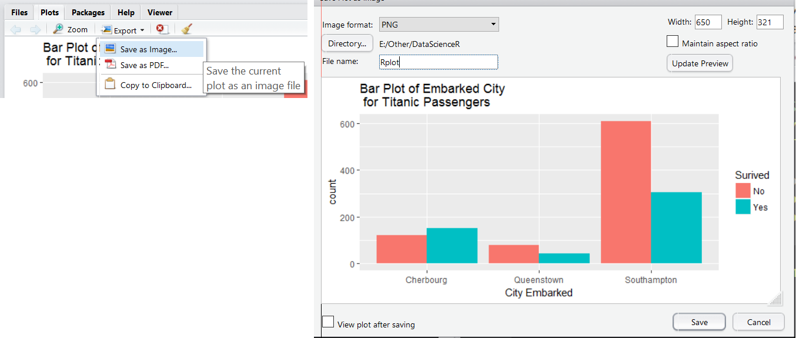

```{r,echo=FALSE,warning=FALSE,message=FALSE}
options(dplyr.print_min = 5)
library(tidyverse)
library(readxl)
library(haven)
library(knitr)
```

## What do we want to be able to do?

- Read in data 

- Manipulate data   

- **Plot data**  

- **Summarize data**  

- Analyze data  
<!--Don't want to get lost in the details.  What are our goals? what is the point of this?-->


## Schedule    

**Day 2**  

- Logical Statements and Subsetting/Manipulating Data?
- **Numerical and Graphical Summaries**
- Basic Analyses 

<!--For the rest of today and probably the start of tomorrow we will look at logical statements and subsetting/manipulating data.  Very useful!-->


## Numerical and Graphical Summaries  

- How to summarize data?  

> - Depends on data type:  
    <ul>
      <li>Categorical</li>  
      <li>Quantitative</li>
    </ul>

## Numerical and Graphical Summaries  

- How to summarize categorical data?  

> - Numerically?  
    <ul>
      <li> Tables (contingency tables)</li>
        <ul> <li> Show frequency of categories  </li></ul>
    </ul>

> - Graphically?
    <ul>
      <li> Barplots </li> 
      <li> Piecharts (not recommended)</li>  
    </ul>
    
    
## Numerical and Graphical Summaries  
**Categorical Data**

- Data on titanic passengers in `titanic.csv`

```{r,eval=FALSE}
titanicData <- read_csv("https://raw.githubusercontent.com/
                      jbpost2/DataScienceR/master/datasets/titanic.csv")
titanicData
```
```{r,echo=FALSE}
titanicData<-read_csv("https://raw.githubusercontent.com/jbpost2/DataScienceR/master/datasets/titanic.csv")
titanicData
```


## Numerical and Graphical Summaries  
**Categorical Data** - `table()` function creates counts (see help)

- Summarize embarked (where journey started), survived (survive or not), and sex (binary here, Male or Female)

<div style="float: left; width: 45%;">

```{r}
table(titanicData$embarked)
table(titanicData$survived)
```
</div>
<div style="float: right; width: 45%;">
```{r}
table(titanicData$sex)
```
</div>


## Numerical and Graphical Summaries  
**Categorical Data** - Two-Way tables  

<div style="float: left; width: 45%;">
```{r}
table(titanicData$survived,
      titanicData$sex)
```
</div>
<div style="float: right; width: 45%;">
```{r}
table(titanicData$survived,
      titanicData$embarked)
table(titanicData$sex,
      titanicData$embarked)
```
</div>


## Numerical and Graphical Summaries  
**Categorical Data** - Three way table (order matters!)

```{r}
table(titanicData$sex, titanicData$embarked, titanicData$survived)
```


## Numerical and Graphical Summaries  
**Categorical Data**

- Can obtain bivariate info from three way table

```{r}
tab <- table(titanicData$sex, titanicData$embarked, titanicData$survived)

str(tab)
```
- Example of an array!  3 dimensions `[ , , ]`


## Numerical and Graphical Summaries  
**Categorical Data**

```{r,echo=FALSE}
str(tab)
```
```{r}
#returns embarked vs survived table for females
tab[1, , ]
```

## Numerical and Graphical Summaries  
**Categorical Data**

```{r,echo=FALSE}
str(tab)
```
```{r}
#returns embarked vs survived table for males
tab[2, , ]
```

## Numerical and Graphical Summaries  
**Categorical Data**

```{r,echo=FALSE}
str(tab)
```
```{r}
#returns survived vs sex table for embarked "C"
tab[, 1, ]
```

## Numerical and Graphical Summaries  
**Categorical Data**

```{r,echo=FALSE}
str(tab)
```
```{r}
#Survived status for males that embarked at "Q"
tab[2, 2, ]
```

## Numerical and Graphical Summaries  
**Categorical Data**

- Main plot: bar plot and variations on it   

> - `barplot()` function in base R can be used  

> - We'll use `ggplot2` in tidyverse! [cheatsheet](https://www.rstudio.com/wp-content/uploads/2016/11/ggplot2-cheatsheet-2.1.pdf)


## Numerical and Graphical Summaries  
`ggplot2` needs and syntax

Needs:

> - Data Frame
> - Aesthetic (aes) - maps variables to properties of geom
      <ul>
         <li> Ex: size, color, and x, y location(s) </li>
        </ul>
> - Geom layer(s) (visualizaton type(s))  
> - Coordinate system (mostly use Cartesian plane)  
> - Optional: Stat layer, titles, etc.


## Numerical and Graphical Summaries  
`ggplot2` needs and syntax

Needs:

- Data Frame  
- Aesthetic (aes) - maps variables to properties of geom  
- Geom layer(s) (visualizaton type(s))    
- Optional: Stat layer, titles, etc.  
 
- Syntax:

```{r,eval=FALSE}
g <- ggplot(dataframe, aes(x = , y = , ...))
g + geom_type(...) +
  stat_type(...) + 
  labs(...)
```


## Numerical and Graphical Summaries  
**Categorical Data**

- Example bar plot:

```{r,eval=FALSE}
ggplot(data = titanicData, aes(x = embarked))
```

## Numerical and Graphical Summaries  

- Notice no plot is made  
- Must add geom layer!

```{r,eval=TRUE,echo=FALSE}
ggplot(data=titanicData,aes(x=embarked))
```


## Numerical and Graphical Summaries  
**Categorical Data**

- Idea: Save base object, then "add layers"  

```{r,eval=FALSE}
g <- ggplot(data = titanicData, aes(x = embarked))
g + geom_bar()
```


## Numerical and Graphical Summaries  
**Categorical Data**  

```{r,eval=TRUE, echo=FALSE}
g<-ggplot(data=titanicData,aes(x=embarked))
g + geom_bar()
```

## Numerical and Graphical Summaries  
**Categorical Data**
 
- How to improve this plot?  

- Might remove `NA` category  

```{r,eval=FALSE}
titanicData <- titanicData %>% drop_na(embarked)
g <- ggplot(data = titanicData, aes(x = embarked))
g + geom_bar()
```

## Numerical and Graphical Summaries  
**Categorical Data**
 
```{r,eval=TRUE,echo=FALSE}
#remove NA category
titanicData <- titanicData %>% drop_na(embarked)
g <- ggplot(data = titanicData, aes(x = embarked))
g + geom_bar()
```

## Numerical and Graphical Summaries  
**Categorical Data**
 
- How to improve this plot?    

- Might add better labels and a title  

```{r,eval=FALSE}
#Fix x axis, x axis label and give title
g + geom_bar() + 
  ### <b>
  labs(x = "City Embarked", title = "Bar Plot of Embarked City 
       for Titanic Passengers") + 
  ### </b>
  scale_x_discrete(labels = c("Cherbourg","Queenstown","Southampton"))
```


## Numerical and Graphical Summaries  
**Categorical Data**
 
```{r,eval=TRUE,echo=FALSE}
#Fix x axis, x axis label and give title
g + geom_bar() + labs(x="City Embarked",title="Bar Plot of Embarked City for Titanic Passengers") + scale_x_discrete(labels=c("Cherbourg","Queenstown","Southampton"))
```

## Numerical and Graphical Summaries  
**Categorical Data**

- Previous plot visualized table for one variable   

> - How to visualize table for two?  
    <ul>
      <li> Filled bar plot</li>
      <li> Side-by-side bar plot (Requires work!)</li>
    </ul>  
    
> - Process the same  
    <ul>
      <li> Create base object</li>  
      <li> Add geoms </li>  
      <li> Use aes to specify aspects of the plot</li>  
    </ul>
    
    
## Numerical and Graphical Summaries  
**Categorical Data**

- Filled bar plot

```{r,eval=FALSE}

g + geom_bar(aes(fill = as.factor(survived)))
```

## Numerical and Graphical Summaries  
**Categorical Data**

```{r,eval=TRUE,echo=FALSE}
g + geom_bar(aes(fill=as.factor(survived)))
```


## Numerical and Graphical Summaries  
**Categorical Data**

Add labels and such:

```{r,eval=FALSE}
g + geom_bar(aes(fill = as.factor(survived))) +
  labs(x = "City Embarked", 
       title = "Bar Plot of Embarked City for Titanic Passengers") + 
  scale_x_discrete(labels = c("Cherbourg", "Queenstown", "Southampton")) + 
  ###<b>
  scale_fill_discrete(name = "Surived", labels = c("No","Yes"))
  ###</b>
```


## Numerical and Graphical Summaries  
**Categorical Data**

```{r,eval=TRUE,echo=FALSE}
g + geom_bar(aes(fill=as.factor(survived))) +
  labs(x="City Embarked", title="Bar Plot of Embarked City for Titanic Passengers") + 
  scale_x_discrete(labels=c("Cherbourg","Queenstown","Southampton")) + 
  scale_fill_discrete(name="Surived",labels=c("No","Yes"))
```

## Numerical and Graphical Summaries  
**Categorical Data**

- Can rotate it 

```{r,eval=FALSE}
g + geom_bar(aes(fill = as.factor(survived))) +
  labs(x = "City Embarked", 
       title = "Bar Plot of Embarked City for Titanic Passengers") +
  scale_x_discrete(labels = c("Cherbourg", "Queenstown", "Southampton")) + 
  scale_fill_discrete(name = "Surived",labels = c("No","Yes")) +
  ### <b>
  coord_flip()
  ### </b>
```


## Numerical and Graphical Summaries  
**Categorical Data**

```{r,eval=TRUE,echo=FALSE}
g + geom_bar(aes(fill=as.factor(survived))) +
  labs(x="City Embarked", title="Bar Plot of Embarked City \n for Titanic Passengers") + 
  scale_x_discrete(labels=c("Cherbourg","Queenstown","Southampton")) + 
  scale_fill_discrete(name="Surived",labels=c("No","Yes")) +
  coord_flip()
```

## Numerical and Graphical Summaries  
**Categorical Data**

- Side-by-side bar plot  
- First, create data frame with summary info
```{r}
twoWayData <- titanicData %>% drop_na(embarked) %>% group_by(embarked, survived) %>%
  summarise(count = n())
```
```{r,echo=FALSE}
twoWayData
```

## Numerical and Graphical Summaries  
**Categorical Data**

- Side-by-side bar plot  
```{r,eval=FALSE}
g <- ggplot(data = twoWayData, 
      aes(x = embarked, ###<b>
y = count ###</b>
, fill = as.factor(survived)))
```

## Numerical and Graphical Summaries  
**Categorical Data**

- Side-by-side bar plot  
```{r,eval=FALSE}
g <- ggplot(data = twoWayData, 
      aes(x = embarked, 
y = count 
, fill = as.factor(survived)))

g + geom_bar(###<b>
stat = "identity", position = "dodge"###</b>
) +
    labs(x = "City Embarked", 
         title = "Bar Plot of Embarked City for Titanic Passengers") + 
  scale_x_discrete(labels = c("Cherbourg", "Queenstown", "Southampton")) + 
  scale_fill_discrete(name = "Surived", labels = c("No", "Yes"))
```


## Numerical and Graphical Summaries  
**Categorical Data**

```{r,echo=FALSE,eval=TRUE}
g <- ggplot(data = twoWayData, 
            aes(x = embarked, y = count, fill = as.factor(survived)))
g + geom_bar(stat = "identity", position = "dodge") +
  labs(x = "City Embarked", 
       title = "Bar Plot of Embarked City for Titanic Passengers") + 
  scale_fill_discrete(name = "Surived", labels = c("No", "Yes"))
```

## Numerical and Graphical Summaries  
**Categorical Data**

- How to save tables and graphs?  
    + Save tables with write_csv!
 
```{r,eval=FALSE}
tab <- tbl_df(table(titanicData$embarked, titanicData$survived))

names(tab) <- c("Embarked", "Survived", "Count")

write_csv(x = tab, path = "titanicTable.csv", col_names = TRUE)
```


## Numerical and Graphical Summaries  
**Categorical Data**

- How to save tables and graphs?  
    + Save graphs with 
        * ggsave()  
        * 'Export' button  

```{r,eval=FALSE}
#by default ggsave saves last plot
#guesses file type by extension
ggsave(filename = "output/titanicBarPlot.png")
ggsave(filename = "output/titanicBarPlot.pdf")
```


## Numerical and Graphical Summaries  
**Categorical Data**

- 'Export' button  

```{r, out.width = "800px",echo=FALSE}

```

##Recap!  

- How to summarize categorical data?  

- Numerically?  
    + Tables (contingency tables)  
        * Show frequency of categories  

- Graphically?
    + Barplots  

- ggplot (create object, add layers)
    + Data Frame
    + Geoms (Vis type)
    + Aesthetic (aes) 
    + Coordinate system, stat, labels, etc.


## Activity 
- [**Categorical Plots Activity** instructions](http://www4.stat.ncsu.edu/~post/DataScienceR/CatPlotsActivity.html) available on web  

- Work in small groups  

- Ask questions!  TAs and I will float about the room  

- Feel free to ask questions about anything you didn't understand as well!  


## Numerical and Graphical Summaries  

- How to summarize data?  

- Depends on data type:  

    + Categorical  

    + Quantitative  


## Numerical and Graphical Summaries  
- How to summarize quantitative data?  

- Numerically?    

> - One Variable:
    <ul>
       <li> Measures of center</li>  
         <ul>
           <li> Mean, Median</li>
         </ul>
       <li> Measures of spread</li>  
      <ul>
        <li> Variance, Standard Deviation, Quartiles, IQR</li>
      </ul>
    </ul>

> - Two Variables:
    <ul> 
      <li> Measures of linear relationship</li>  
        <ul>
          <li> Covariance, Correlation </li>  
        </ul>
      <li> Can do any of above for subgroups of data!</li>
    </ul>


## Numerical and Graphical Summaries  

- Graphically?  

> - One Variable:
    <ul>
      <li> Dot Plot, Histogram, or Kernel Smoother</li>  
      <li> Empirical Cumulative Distribution Function</li>  
    </ul>

> - Two Variables:
    <ul>
      <li> Scatter Plot (with trend lines/smoothers, rug)</li> 
      <li> Side-by-side boxplots/violin plots</li> 
      <li> Line plot</li>
    </ul>

> - Three Variables: 
    <ul> <li> 3D scatter plot</li></ul>  
- Can do any of above for subgroups of data!


## Numerical and Graphical Summaries  
**Quantitative Data**

- Look at CO2 uptake data set  
    + Carbon Dioxide Uptake in Grass Plants  
```{r}
CO2 <- tbl_df(CO2)
CO2
```


## Numerical and Graphical Summaries  
**Quantitative Data** - One Variable: measures of center

```{r}
mean(CO2$uptake)
#note you can easily get a trimmed mean
mean(CO2$uptake, trim = 0.05) #5% trimmed mean
median(CO2$uptake)
```

## Numerical and Graphical Summaries  
**Quantitative Data** - One Variable: measures of spread

```{r}
#quartiles and mean
summary(CO2$uptake)
```

<div style="float: left; width: 40%;">
```{r}
var(CO2$uptake)
sd(CO2$uptake)
```
</div>
<div style="float: right; width: 55%;">
```{r}
IQR(CO2$uptake)
quantile(CO2$uptake, probs = c(0.1, 0.2))
```
</div>


## Numerical and Graphical Summaries  
**Quantitative Data** - Two Variables: Covariance/Correlation  
```{r}
cov(CO2$conc, CO2$uptake)
cor(CO2$conc, CO2$uptake)
```

## Numerical and Graphical Summaries  
**Quantitative Data** - Summaries on subgroups of data 

- Get same uptake stats for uptake **by Treatment**

> - `aggregate()` function pretty good  

> - We'll use `dplyr` (not as flexible)

> - Combine
    <ul>
      <li> group_by</li>  
      <li> summarise</li>
    </ul>
    
    
## Numerical and Graphical Summaries  
**Quantitative Data** - Summaries on subgroups of data 

```{r}
CO2 %>% group_by(Treatment) %>% summarise(avg = mean(uptake))
CO2 %>% group_by(Treatment) %>% summarise(med = median(uptake))
CO2 %>% group_by(Treatment) %>% summarise(var = var(uptake))
```

## Numerical and Graphical Summaries  
**Quantitative Data** - Summaries on subgroups of data 

- Can refine by more than one variable grouping

```{r}
CO2 %>% group_by(Treatment, Type) %>% summarise(avg = mean(uptake))
```

    
## Numerical and Graphical Summaries  
**Quantitative Data** - One Variable: Dot Plot

- Dot shown to represent each data point

```{r,eval=FALSE}
g <- ggplot(CO2, aes(x = uptake)) 
g + geom_dotplot()
```

## Numerical and Graphical Summaries  
**Quantitative Data** - One Variable: Dot Plot

```{r,eval=TRUE,echo=FALSE,message=FALSE}
g <- ggplot(CO2,aes(x=uptake))
g + geom_dotplot()
```

## Numerical and Graphical Summaries  
**Quantitative Data** - One Variable: Dot Plot

- Color dots:  
    + **Any attribute that depends on the data must go into aes**  
    + If consistent can go outside aes (no legend needed)

```{r,eval=FALSE,echo=TRUE}
g + geom_dotplot(col = "Red")

#vs

g + geom_dotplot(aes(col = Treatment))
```

## Numerical and Graphical Summaries  
**Quantitative Data** - One Variable: Dot Plot 

```{r,eval=TRUE,echo=FALSE,message=FALSE}
g + geom_dotplot(col="Blue")
```

## Numerical and Graphical Summaries  
**Quantitative Data** - One Variable: Dot Plot

```{r,eval=TRUE,echo=FALSE,message=FALSE}
g + geom_dotplot(aes(col=Treatment))
```

## Numerical and Graphical Summaries  
**Quantitative Data** - One Variable: Dot Plot

- Lots of options!  
```{r,eval=FALSE,echo=TRUE}
g + geom_dotplot(aes(col = Treatment),
               stackgroups = TRUE, method = "histodot",
               binpositions = "all",stackdir = "down")
```

## Numerical and Graphical Summaries  
**Quantitative Data** - One Variable: Dot Plot

```{r,eval=TRUE,echo=FALSE,message=FALSE}
g + geom_dotplot(aes(col=Treatment),
               stackgroups = TRUE, method="histodot",
               binpositions = "all",stackdir="down")
```

## Numerical and Graphical Summaries  
**Quantitative Data** - One Variable: Histogram

- Bins data to show distribution of observations

```{r,eval=FALSE}
g + geom_histogram()
```

## Numerical and Graphical Summaries  
**Quantitative Data** - One Variable: Histogram

```{r,eval=TRUE,echo=FALSE,message=FALSE}
g + geom_histogram()
g
```

## Numerical and Graphical Summaries  
**Quantitative Data** - One Variable: Histogram

- Can improve the look  

```{r,eval=FALSE,echo=TRUE}
g + geom_histogram(color = "blue", fill = "red", linetype = "dashed",
                 size = 2, binwidth = 3)
```

## Numerical and Graphical Summaries  
**Quantitative Data** Hideous!

```{r,eval=TRUE,echo=FALSE,message=FALSE}
g + geom_histogram(color="blue",fill="red",linetype="dashed",size=2,binwidth=3)
```

## Numerical and Graphical Summaries  
**Quantitative Data** - One Variable: Kernel Smoother

- Smoothed version of a histogram  
- Kernel determines weight given to nearby points    
    + Many options (see `help(density)`)
    
```{r,eval=FALSE}
g + geom_density()
```


## Numerical and Graphical Summaries  
**Quantitative Data** - One Variable: Kernel Smoother

```{r,eval=TRUE,echo=FALSE,message=FALSE}
g + geom_density()
```

## Numerical and Graphical Summaries  
**Quantitative Data** - One Variable: Kernel Smoother

- Improve it with options!  
```{r,eval=FALSE,echo=TRUE}
g + geom_density(adjust = 0.25, alpha = 0.5, aes(fill = Treatment))
```

## Numerical and Graphical Summaries  
**Quantitative Data** - One Variable: Kernel Smoother

```{r,eval=TRUE,echo=FALSE,message=FALSE}
g + geom_density(adjust = 0.25, alpha = 0.5, aes(fill = Treatment))
```

## Numerical and Graphical Summaries  
**Quantitative Data** - One Variable: Histogram and Kernel Smoother

```{r,eval=FALSE,echo=TRUE}
g + geom_histogram(aes(y = ..density.., fill = Treatment)) +
  geom_density(adjust = 0.25, alpha = 0.5, aes(fill = Treatment)) 
```

## Numerical and Graphical Summaries  
**Quantitative Data** - One Variable: Histogram and Kernel Smoother

```{r,eval=TRUE,echo=FALSE,message=FALSE}
g + geom_histogram(aes(y = ..density.., fill = Treatment)) +
  geom_density(adjust = 0.25, alpha = 0.5, aes(fill = Treatment))
```

## Numerical and Graphical Summaries  
**Quantitative Data** - One Variable: ECDF

- Empirical Cumulative Distribution Function (ECDF)  
- At each point x, gives the proportion of points at or below x

```{r,eval=FALSE}
g + stat_ecdf(geom = "step")
```

## Numerical and Graphical Summaries  
**Quantitative Data** - One Variable: ECDF

```{r,echo=FALSE,message=FALSE}
g + stat_ecdf(geom="step")
```


## Numerical and Graphical Summaries  
**Quantitative Data** - One Variable: ECDF

- Empirical Cumulative Distribution Function (ECDF)  
- At each point x, gives the proportion of points at or below x
- For each treatment
```{r,eval=FALSE}
g + stat_ecdf(geom = "step", aes(color = Treatment)) +
  ylab("ECDF")
```

## Numerical and Graphical Summaries  
**Quantitative Data** - One Variable: ECDF

```{r,echo=FALSE,message=FALSE}
g + stat_ecdf(geom = "step", aes(color = Treatment)) +
  ylab("ECDF")
```


## Numerical and Graphical Summaries  
**Quantitative Data** - Two Variables: Scatter Plot

- Probably most used graph!  
- Shows a point corresponding to each observation

```{r,eval=FALSE}
scoresFull<-read_csv("https://raw.githubusercontent.com/
                     jbpost2/DataScienceR/master/datasets/scoresFull.csv")
scoresFull
```
```{r,echo=FALSE}
scoresFull<-read_csv("https://raw.githubusercontent.com/jbpost2/DataScienceR/master/datasets/scoresFull.csv")
scoresFull
```


## Numerical and Graphical Summaries  
**Quantitative Data** - Two Variables: Scatter Plot

- Probably most used graph!  
- Shows a point corresponding to each observation
```{r,eval=FALSE}
g <- ggplot(scoresFull, aes(x = homeRushYds, y = HFinal)) 
g + geom_point()
```


## Numerical and Graphical Summaries  
**Quantitative Data** - Two Variables: Scatter Plot

```{r,echo=FALSE,message=FALSE}
g<-ggplot(scoresFull,aes(x=homeRushYds,y=HFinal))
g + geom_point()
```


## Numerical and Graphical Summaries  
**Quantitative Data** - Two Variables: Scatter Plot

- Add trend lines (linear and gam - a fancy smoother) 

```{r,echo=TRUE,eval=FALSE}
g + geom_point() +
    geom_smooth() +
    geom_smooth(method = lm, col = "Red") 
```


## Numerical and Graphical Summaries  
**Quantitative Data** - Two Variables: Scatter Plot

```{r,echo=FALSE,message=FALSE}
g + geom_point() +
    geom_smooth() +
    geom_smooth(method = lm, col = "Red") 
```


## Numerical and Graphical Summaries  
**Quantitative Data** - Two Variables: Scatter Plot

- May want to add text to plot
- Ex: Add value of correlation to plot


## Numerical and Graphical Summaries  
**Quantitative Data** - Two Variables: Scatter Plot

- May want to add text to plot
- Ex: Add value of correlation to plot
- `paste()` and `paste0()` very useful! (see help)

```{r}
paste("Hi", "What", "Is", "Going", "On", "?", sep = " ")
paste("Hi", "What", "Is", "Going", "On", "?", sep = ".")
```


## Numerical and Graphical Summaries  
**Quantitative Data** - Two Variables: Scatter Plot

- Ex: Add value of correlation to plot
```{r,eval=FALSE}
correlation <- cor(scoresFull$homeRushYds,scoresFull$HFinal)

g + geom_point() +
    geom_smooth() +
    geom_smooth(method = lm, col = "Red") + 
    geom_text(x = 315, y = 10, size = 5, label = paste0("Correlation = ", 
                                             round(correlation, 2)))
```

## Numerical and Graphical Summaries  
**Quantitative Data** - Two Variables: Scatter Plot

```{r,eval=TRUE,echo=FALSE,message=FALSE}
correlation <- cor(scoresFull$homeRushYds,scoresFull$HFinal)

g + geom_point() +
    geom_smooth() +
    geom_smooth(method = lm, col = "Red") + 
    geom_text(x = 315, y = 10, size = 5, label = paste0("Correlation = ", 
                                             round(correlation, 2)))
```

## Numerical and Graphical Summaries  
**Quantitative Data** - Two Variables: Scatter Plot

- Can add "rug"  
- Gives idea about density of just x or just y variable 

```{r,eval=FALSE}
g + geom_point() +
    geom_smooth() +
    geom_smooth(method = lm, col = "Red") + 
    geom_rug()
```

## Numerical and Graphical Summaries  
**Quantitative Data** - Two Variables: Scatter Plot

```{r,eval=TRUE,echo=FALSE,message=FALSE}
g + geom_point() +
    geom_smooth() +
    geom_smooth(method = lm, col = "Red") + 
    geom_rug()
```

## Numerical and Graphical Summaries  
**Quantitative Data** - Two Variables: Scatter Plot

- Look at graphs broken down by other variables
- Use `facet_grid()`

```{r,eval=FALSE}
g + geom_point() +
    facet_grid(. ~ surface)
```

## Numerical and Graphical Summaries  
**Quantitative Data** - Two Variables: Scatter Plot

```{r,eval=TRUE,echo=FALSE,message=FALSE}
g + geom_point() +
    facet_grid(. ~ surface)
```

## Numerical and Graphical Summaries  
**Quantitative Data** - Two Variables: Scatter Plot

- Look at graphs broken down by other variables
- Use `facet_grid()`

```{r,eval=FALSE}
g + geom_point() +  
    facet_grid(roof ~ surface)
```

## Numerical and Graphical Summaries  
**Quantitative Data** - Two Variables: Scatter Plot

```{r,eval=TRUE,echo=FALSE,message=FALSE}
g + geom_point() +  
    facet_grid(roof ~ surface)
```


## Numerical and Graphical Summaries  
**Quantitative Data** - Two Variables: Scatter Plot

- Can still do all the fancy stuff to each plot!

```{r,eval=FALSE}
g + geom_point(aes(col = homeSpread), alpha = 0.3, size = 0.5) +  
    facet_grid(roof ~ surface)
```

## Numerical and Graphical Summaries  
**Quantitative Data** - Two Variables: Scatter Plot

```{r,eval=TRUE,echo=FALSE,message=FALSE}
g + geom_point(aes(col = homeSpread), alpha = 0.3, size = 0.5) +  
    facet_grid(roof ~ surface)
```

## Numerical and Graphical Summaries  
**Quantitative Data** - Many Variables: Scatter Plot

- Often want to look at relationships of all continuous variables

- `pairs()` gives all pairwise scatter plots

```{r,eval=FALSE}
pairs(select(scoresFull, Hturnovers, homeRushYds,
             homePassYds, HFinal), cex = 0.3)
```


## Numerical and Graphical Summaries  
**Quantitative Data** - Many Variables: Scatter Plot

```{r,eval=TRUE,echo=FALSE}
pairs(select(scoresFull,Hturnovers,homeRushYds,homePassYds,HFinal),cex=0.3)
```

## Numerical and Graphical Summaries  
**Quantitative Data** - Many Variables: Correlation

- Create a visual of the correlations  

```{r}
Correlation <- cor(select(scoresFull, Hturnovers, homeRushYds,
                        homePassYds, HFinal), method = "spearman")
#install corrplot library
library(corrplot)
```
```{r,eval=FALSE}
corrplot(Correlation, type = "upper",
         tl.pos = "lt")
corrplot(Correlation, type = "lower", method = "number",
         add = TRUE, diag = FALSE, tl.pos = "n")
```

## Numerical and Graphical Summaries  

```{r,eval=TRUE,echo=FALSE}
corrplot(Correlation,type="upper",tl.pos="lt")
corrplot(Correlation,type="lower",method="number",add=TRUE,diag=FALSE,tl.pos="n")
```

## Numerical and Graphical Summaries  
**Quantitative Data** - Many Variables: Correlation

- Really nice for many variables  

```{r, out.width = "400px",echo=FALSE}
knitr::include_graphics("img/corr.png")
```

## Numerical and Graphical Summaries  
**Quantitative Data** - Many variables

- Even better, use `ggpairs()` from `GGally` package  

- Allows for auto creation with both quantitative and categorical data  

```{r,message=FALSE}
#install GGally
library(GGally)
```
```{r,eval=FALSE}
ggpairs(iris, aes(colour = Species, alpha = 0.4))
```

## Numerical and Graphical Summaries  

```{r,eval=TRUE,echo=FALSE,message=FALSE}
ggpairs(iris, aes(colour = Species, alpha = 0.4))
```

## Numerical and Graphical Summaries  
**Quantitative Data** - Two Variables: Box/Violin Plot

- Boxplots provide the five number summary in a graph
    + min, Q1, median, Q3, max  
    + Often show possible outliers as well  

<br>

> - Violin plots are fancy versions  
    <ul><li> Rotated kernel densities for sides</li></ul>  
    

## Numerical and Graphical Summaries  
**Quantitative Data** - Two Variables: Box/Violin Plot
    
```{r,eval=FALSE,echo=TRUE,message=FALSE}
g <- ggplot(scoresFull, aes(x = surface, y = homePassYds))
g + geom_boxplot(fill = "grey")
```

## Numerical and Graphical Summaries  
**Quantitative Data** - Two Variables: Box/Violin Plot
    
```{r,eval=TRUE,echo=FALSE,message=FALSE}
g <- ggplot(scoresFull, aes(x = surface, y = homePassYds))
g + geom_boxplot(fill="grey")
```

## Numerical and Graphical Summaries  
**Quantitative Data** - Two Variables: Box/Violin Plot

- Get very fancy
- Add in points, lines connecting means for each group

```{r,eval=FALSE,echo=TRUE,message=FALSE}
g + geom_boxplot(fill = "grey") +
    ###<b>
    geom_jitter(aes(col = roof), alpha = 0.3, size = 0.3) +
    ###</b>
    stat_summary(fun.y = mean, geom = "line", 
                 lwd = 1.5, aes(group = roof, col = roof))
```

## Numerical and Graphical Summaries  
**Quantitative Data** - Two Variables: Box/Violin Plot
    
```{r,eval=TRUE,echo=FALSE,message=FALSE}
g +
  geom_boxplot(fill="grey")+
  geom_jitter(aes(col=roof),alpha=0.3,size=0.3)+
  stat_summary(fun.y=mean,geom="line",lwd=1.5,aes(group=roof,col=roof))
```


## Numerical and Graphical Summaries  
**Quantitative Data** - Two Variables: Box/Violin Plot

- Check how violin plots look

```{r,eval=FALSE,echo=TRUE,message=FALSE}
g + geom_violin(fill = "grey")
```


## Numerical and Graphical Summaries  
**Quantitative Data** - Two Variables: Box/Violin Plot

```{r,eval=TRUE,echo=FALSE,message=FALSE}
g + geom_violin(fill = "grey")
```


## Numerical and Graphical Summaries  
**Quantitative Data** - Two Variables: Line Plot

- Connects dots  
- Most useful with a time type variable


## Numerical and Graphical Summaries  
**Quantitative Data** - Two Variables: Line Plot

- Connects dots  
- Most useful with a time type variable
- We'll just use season, but...
- Could combine date and season

```{r}
oneDate<-paste(scoresFull$date[1], scoresFull$season[1], sep = "-")
oneDate
```


## Numerical and Graphical Summaries  
**Aside: Working with Dates**

- `lubridate` package great for dates!  (part of `tidyverse`)
- Dates can be added and subtracted
- Are \# of days since Jan 1, 1970

```{r,message=FALSE}
library(lubridate)
as.Date(oneDate,"%d-%b-%Y")
as.Date(oneDate,"%d-%b-%Y") + 1
```


## Numerical and Graphical Summaries  
**Quantitative Data** - Two Variables: Line Plot

- Create full date variable for fun
- Summarise total yards for AFC North team home games for each year

```{r}
scoresFull$date <- paste(scoresFull$date, scoresFull$season, sep = "-") %>% 
                   as.Date("%d-%b-%Y")

subScores <- scoresFull %>% 
  filter(homeTeam %in% c("Pittsburgh Steelers", "Cleveland Browns",
                         "Baltimore Ravens", "Cincinnati Bengals")) %>% 
  group_by(season, homeTeam) %>%
  summarise(homeAvgYds = mean(homePassYds + homeRushYds))
```

## Numerical and Graphical Summaries  
**Quantitative Data** - Two Variables: Line Plot

```{r}
subScores
```


## Numerical and Graphical Summaries  
**Quantitative Data** - Two Variables: Line Plot

```{r,eval=FALSE,echo=TRUE,message=FALSE}
g <- ggplot(subScores, aes(x = season, y = homeAvgYds, color = homeTeam))
g + geom_line(lwd = 2)
```

## Numerical and Graphical Summaries  
**Quantitative Data** - Two Variables: Line Plot

```{r,eval=TRUE,echo=FALSE,message=FALSE}
g <- ggplot(subScores, aes(x = season, y = homeAvgYds, color = homeTeam))
g + geom_line(lwd = 2)
```


## Numerical and Graphical Summaries  
**Quantitative Data** - Three Variables: 3D Scatter Plot

- A few packages can do this:  
    + `scatterplot3d`  
    + `plotly`  
    + `plot3Drgl`

```{r,eval=FALSE}
install.packages("plot3Drgl")
```
```{r,message=FALSE}
library(plot3Drgl)
```

## Numerical and Graphical Summaries  

```{r}
scatter3D(x = scoresFull$homeRushYds, y = scoresFull$awayRushYds,
          z = scoresFull$HFinal)
```

## Numerical and Graphical Summaries  
**Quantitative Data** - Three Variables: 3D Scatter Plot

- Run the previous `scatter3D` code in your console

- Then run `plotrgl()`


##Recap!  

- How to summarize quantitative data?  

- Numerically?  
    + Many summary stats.  Focus often on  
         * Center, Spread, Linear Relationship  

- Graphically?
    + One variable: Kernel Density/Histogram  
    + Two variables: Scatter plots
    
- Important to view your data together **and** broken down into subsets!


## Activity 
- [**Quantitative Plots Activity** instructions](http://www4.stat.ncsu.edu/~post/DataScienceR/QuantPlotsActivity.html) available on web  

- Work in small groups  

- Ask questions!  TAs and I will float about the room  

- Feel free to ask questions about anything you didn't understand as well!  


## What do we want to be able to do?

- Read in data 

- Manipulate data   

- Plot data

- Summarize data

- **Analyze data** 
<!--Don't want to get lost in the details.  What are our goals? what is the point of this?-->


## Schedule    

**Day 2**  

- Logical Statements and Subsetting/Manipulating Data?
- Numerical and Graphical Summaries
- **Basic Analyses**

## Basic Analysis (Linear Regression)

- With multiple quantitative varibles can look at many types of relationships  

> - Investigated linear relationship between two with correlation  

> - Scatter Plot gives useful visualization    

> - Consider data on voting preferences by county  
    <ul><li> Inspect relationship with pct with college degree and income </li></ul>
    

## Basic Analysis (Linear Regression)

- With multiple quantitative varibles can look at many types of relationships  

- Investigated linear relationship between two with correlation  

- Scatter Plot gives useful visualization    

- Consider data on voting preferences by county  
    <ul><li> Inspect relationship with pct with college degree and income </li></ul>
    
```{r}
voting <- tbl_df(read.csv("datasets/counties.csv", header = TRUE))
```


## Basic Analysis (Linear Regression)

```{r}
voting
```


## Basic Analysis (Linear Regression)

- Create a scatter plot, add correlation

```{r}
votePlot <- ggplot(voting, aes(x = college, y = income))
```
```{r,eval=FALSE}
votePlot + 
  geom_point()+
  geom_text(x = 40, y = 15000,
            label = round(cor(voting$college, voting$income), 2))
```

## Basic Analysis (Linear Regression)

```{r,eval=TRUE,echo=FALSE}
votePlot+geom_point()+
  geom_text(x=40,y=15000,
            label=round(cor(voting$college,voting$income),2))
```

## Basic Analysis (Linear Regression)

- Often want to predict y variable using a value of x 
- **Simple Linear Regression** allows for this  

> - Linear model for predicting income based on college:

> cty_income = int + slope * (% college in county) + random_error

> - Generally, response (Y) = function of predictors (features, X's) + error  
\$\$Y_i=\\beta_0+\\beta_1 x_{1i}+...+\\beta_p x_{pi}+E_i\$\$

## Basic Analysis (Linear Regression)

- Fit simple linear regression model using `lm()`

```{r}
lm(income ~ college, data = voting)
```

## Basic Analysis (Linear Regression)

- Save as object, check attributes
```{r}
fit <- lm(income ~ college, data = voting)
attributes(fit)
```

## Basic Analysis (Linear Regression)

- Three main ways to get at *many* of these attributes
```{r}
fit[[1]]
coefficients(fit)
fit$coefficients
```

## Basic Analysis (Linear Regression)

- Three main ways to get at *many* of these attributes
```{r,eval=FALSE}
fit[[2]]
residuals(fit)
fit$residuals
```

## Basic Analysis (Linear Regression)

- Three main ways to get at *many* of these attributes
```{r,error=TRUE}
#no generic function for some things
rank(fit)
y(fit)
fit$rank
```

## Basic Analysis (Linear Regression)

- Statistical analysis found using `anova()` or `summary()`
```{r}
#ANOVA table (F tests)
anova(fit)
```

## Basic Analysis (Linear Regression)

- Statistical analysis found using `anova()` or `summary()`
```{r}
#coefficient type III tests
summary(fit)
```

## Basic Analysis (Linear Regression)

- Diagnostic plots easily found using `plot()` 
- Run this code in console

```{r,eval=FALSE}
plot(fit)
```

## Basic Analysis (Linear Regression)

- Add fit to our scatter plot
- Compare to a smoothed fit
```{r,eval=FALSE}
votePlot +
  geom_point() +
  geom_smooth(method = "lm") + 
  geom_smooth()
```

## Basic Analysis (Linear Regression)

```{r,echo=FALSE,message=FALSE}
votePlot+geom_point()+geom_smooth(method="lm")+geom_smooth()
```


## Basic Analysis (Linear Regression)

- Now can predict y for a given x
- Check `help(predict)`, particularly `predict.lm()`

```{r}
predict(fit, newdata = data.frame(college = c(40, 10)))
```

## Basic Analysis (Linear Regression)

- Get SE for prediction

```{r}
predict(fit, newdata = data.frame(college = c(40, 10)), se.fit = TRUE)
```

## Basic Analysis (Linear Regression)

- Get confidence interval for mean response

```{r}
predict(fit, newdata = data.frame(college = c(40, 10)),
        se.fit = TRUE, interval = "confidence")
```

## Basic Analysis (Linear Regression)

- Get prediction interval for new response

```{r}
predict(fit, newdata = data.frame(college = c(40, 10)),
        se.fit = TRUE, interval = "prediction")
```

## Basic Analysis (Linear Regression)

- May want separate fits by a variable
- Do separate SLR for each region setting

```{r,eval=FALSE}
votePlot +
  geom_point(aes(col = region)) +
  geom_smooth(method = "lm", aes(col = region))
```

## Basic Analysis (Linear Regression)

```{r,eval=TRUE,echo=FALSE}
votePlot+geom_point(aes(col=region))+
  geom_smooth(method="lm",aes(col=region))
```

## Basic Analysis (Linear Regression)

- Obtain fits for each grouping

```{r}
fits <- voting %>% group_by(region) %>% 
  do(model = lm(income ~ college, data = .))
names(fits)
```

- Probably easier to just subset and then fit each model separately!  

## Basic Analysis (Linear Regression)
```{r}
fits$model[[1]]
fits$model[[2]]
```

## Basic Analysis (Linear Regression)

- Multiple Linear Regression (more than one x)
- In `lm()`  
     + add "main effect" terms with `+ name`
     + interactions with `+ name1:name2`
     + all possible combinations with `+ name1*name2` 

```{r}
fit2<-lm(income ~ college + Perot, data = voting)
```

## Basic Analysis (Linear Regression)

- Multiple Linear Regression (more than one x)

```{r}
anova(fit2)
```

## Basic Analysis (Linear Regression)

```{r}
summary(fit2)
```

## Basic Analysis (Linear Regression)

- Access elements of object just as before

```{r}
coef(fit2)
fit2$rank
```


## Basic Analysis (Linear Regression)

- Basic diagnostic plots (run in console)

```{r,eval=FALSE}
plot(fit2)
```


## Basic Analysis (Linear Regression)

- Predict new for new values

```{r}
predict(fit2, newdata = data.frame(college = 40, Perot = 20))
```

##Recap!  

- Basic linear regression  
    + Use `lm()`

- Statistical analysis  
    + `anova()`
    + `summary()`
    
- Predict using `predict()`    

- Add fits to scatter plot with `geom_smooth(method = "lm")`


## What do we want to be able to do?

- Read in data 

- Manipulate data   

- Plot data 

- Summarize data  

- Analyze data  


## Activity 
- [**Basic Analysis Activity** instructions](http://www4.stat.ncsu.edu/~post/DataScienceR/AnalysisActivity.html) available on web  

- Work in small groups  

- Ask questions!  TAs and I will float about the room  

- Feel free to ask questions about anything you didn't understand as well!  

- Thanks for coming!!
