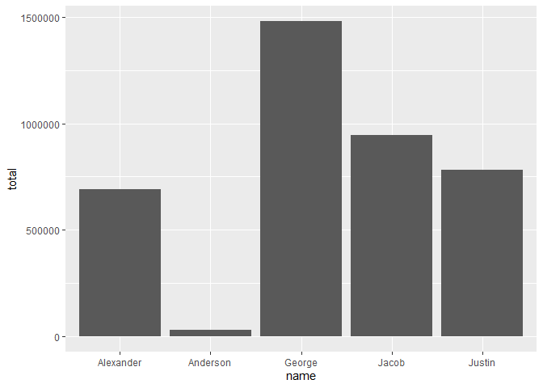
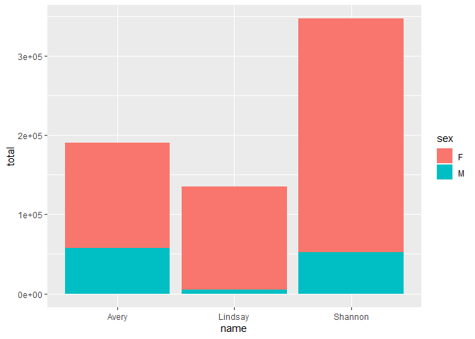

Exercises 11 - ggplot
================

We’ll continue to work on the same .Rmd file from the previous exercise.

<hr>

1.  Filter the data by the names of interest we have, group the data by
    name, and find the total counts using the code below:

``` r
names <- c("Justin", "George", "Alexander", "Jacob", "Anderson")
barData <- BabyNamesFull %>%
  filter(name %in% names) %>% 
  group_by(name) %>%
  summarise(total = sum(count))
```

2.  Use the data object created to create a bar plot with names on the
    x-axis and the total count on the y-axis. You’ll need to specify
    both the x and y variables and change the statistic to “identity” in
    the `geom_bar()` function.

``` r
ggplot(barData) +
  geom_bar(stat = "identity", aes(x = name, y = total)) 
```

<!-- -->

3.  Use the data object created by the code below to create a filled bar
    plot with the sex variable denoting the coloring of columns.

``` r
barDataSex <- BabyNamesFull %>%
  filter(name %in% c("Shannon", "Lindsay", "Avery")) %>% 
  group_by(name, sex) %>%
  summarise(total = sum(count))
```

    ## `summarise()` has grouped output by 'name'. You can override using the `.groups` argument.

``` r
ggplot(barDataSex) +
 geom_bar(stat = "identity", aes(x = name, y = total, fill = sex)) 
```

<!-- -->
<hr>

<br>

<a href = "https://jbpost2.github.io/Basics-of-R-for-Data-Science-and-Statistics/CourseFiles.html"><button type="button">Course
Files Page</button></a>
