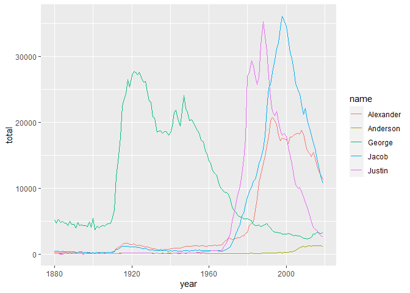

Exercises 11 - ggplot Solutions
================

We’ll continue to work on the same .Rmd file from the previous exercise.

<hr>

# 11.1

1.  Use the data object created by the code below to create a line plot
    (via `geom_line()`) that looks like the one below.

``` r
names <- c("Justin", "George", "Alexander", "Jacob", "Anderson")
lineData <- BabyNamesFull %>%
  filter(name %in% names) %>% 
  group_by(name, year) %>%
  summarise(total = sum(count))
```

    ## `summarise()` has grouped output by 'name'. You can override using the `.groups` argument.

``` r
ggplot(lineData) +
 geom_line(aes(x = year, y = total, color = name)) 
```

<!-- -->

<hr>

<br>

<a href = "https://jbpost2.github.io/Basics-of-R-for-Data-Science-and-Statistics/CourseFiles.html"><button type="button">Course
Files Page</button></a>
