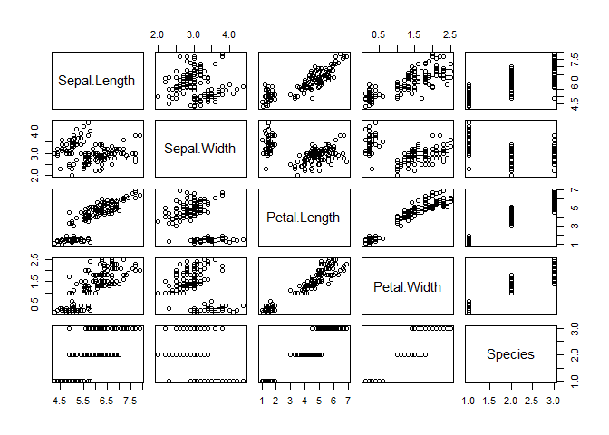

Exercises 2 - Objects Solutions
================

## 2.1 Creating R Objects

1.  The code below creates a vector of three character strings (more on
    vectors shortly). Use this code and the ‘storage arrow’ to create an
    object names `adj`.

`c("scary","intelligent","new")`

Solution:

``` r
adj <- c("scary","intelligent","new")
adj
```

    ## [1] "scary"       "intelligent" "new"

2.  Similarly, create an object called `nouns` using the storage arrow
    and code below.

`c("bugs", "beings", "houses")`

Solution:

``` r
nouns <- c("bugs", "beings", "houses")
nouns
```

    ## [1] "bugs"   "beings" "houses"

3.  The `paste()` function is useful for combining character strings.
    After completing the above parts, run the following:

``` r
paste(adj, nouns)
```

    ## [1] "scary bugs"         "intelligent beings" "new houses"

<hr>

## 2.2 Investigating Objects

1.  `iris` is a built-in R object (that means you have it in your
    environment even if it doesn’t show it). Determine the `class` and
    structure (`str`) of the `iris` object.

Solution:

``` r
class(iris)
```

    ## [1] "data.frame"

``` r
str(iris)
```

    ## 'data.frame':    150 obs. of  5 variables:
    ##  $ Sepal.Length: num  5.1 4.9 4.7 4.6 5 5.4 4.6 5 4.4 4.9 ...
    ##  $ Sepal.Width : num  3.5 3 3.2 3.1 3.6 3.9 3.4 3.4 2.9 3.1 ...
    ##  $ Petal.Length: num  1.4 1.4 1.3 1.5 1.4 1.7 1.4 1.5 1.4 1.5 ...
    ##  $ Petal.Width : num  0.2 0.2 0.2 0.2 0.2 0.4 0.3 0.2 0.2 0.1 ...
    ##  $ Species     : Factor w/ 3 levels "setosa","versicolor",..: 1 1 1 1 1 1 1 1 1 1 ...

2.  Run the code below to create a quick visual of this dataset. Note
    that R is determining what to do with the `plot()` function based on
    the object given to it!

``` r
plot(iris)
```

<!-- -->

<hr>

<br>

<a href = "https://jbpost2.github.io/Basics-of-R-for-Data-Science-and-Statistics/CourseFiles.html"><button type="button">Course
Files Page</button></a>
