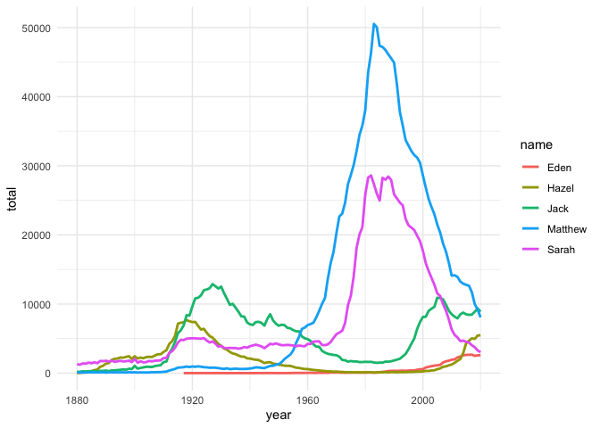
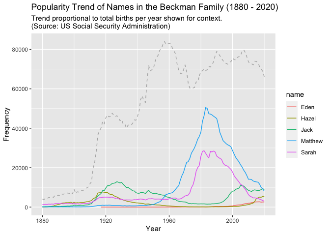
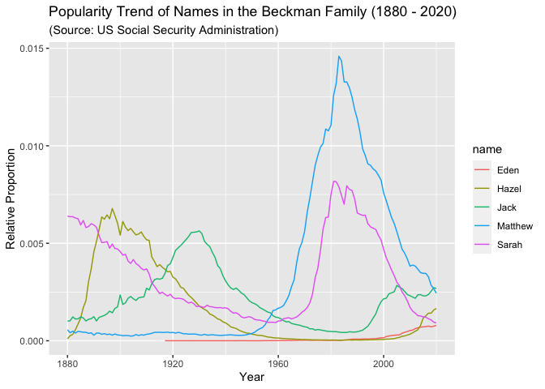

What’s in a Name?? (Part 5 Solutions)
================
Matthew Beckman & Justin Post
June 25, 2021

<hr>

Here, we join an analysis already in progress…

-   Part 1 (RStudio IDE Scavenger Hunt) has been omitted from the
    following analysis.
-   Part 2 (Import Data), Part 3 (R Markdown), and Part 4 (Data
    Wrangling) have been blended for the purposes of our investigation
-   **Part 5 Exercises Follow**

<hr>

# Names to be investigated

<hr>

We’re investigating the popularity of names in the US each year. Matt
has chosen to investigate the names of each person in his immediate
family: Matthew, Sarah, Eden, Jack, and Hazel. They’re his favorite
people, and also his favorite names! He’s feeling torn about how to
include his son Jack in the analysis. Jack’s legal name is “Jon” but he
is nearly always called “Jack”–the spelling of “Jon” honors Scandinavian
heritage on both sides of the family, and the nickname “Jack”
specifically honors his great-grandfather.

Some famous persons by each name of the family include:

-   Sarah Jessica Parker
-   Eden Hazard
-   Jack (Jackie) Robinson
-   Hazel Findlay
-   Richard Stallman. Seriously, the first hit of an Internet search for
    “famous Matthew” was Richard Stallman (!) whose given name is…
    Matthew. “Matthew the Apostle” (Matt’s namesake) was third on that
    particular list: <https://playback.fm/people/first-name/matthew>

This document was last modified 2021-06-25 10:30:13.

<hr>

# Summaries of Name Popularity

<hr>

According to US Social Security data from 1880 through 2020, “Matthew”
was the most frequently occurring name in the family.

``` r
# vector of names
beckmans <- c("Matthew", "Sarah", "Eden", "Jack", "Hazel")

BabyNamesFull %>%
    filter(name %in% beckmans) %>%                   
    group_by(name) %>%                               
    summarise(total = sum(count, na.rm = TRUE)) %>%  
    arrange(desc(total))
```

    ## `summarise()` ungrouping output (override with `.groups` argument)

<div data-pagedtable="false">

<script data-pagedtable-source type="application/json">
{"columns":[{"label":["name"],"name":[1],"type":["chr"],"align":["left"]},{"label":["total"],"name":[2],"type":["dbl"],"align":["right"]}],"data":[{"1":"Matthew","2":"1622951"},{"1":"Sarah","2":"1086935"},{"1":"Jack","2":"714762"},{"1":"Hazel","2":"273991"},{"1":"Eden","2":"45777"}],"options":{"columns":{"min":{},"max":[10]},"rows":{"min":[10],"max":[10]},"pages":{}}}
  </script>

</div>

We also learned that “Eden” was more balanced between the two sexes when
compared to the other names in the family.

``` r
BabyNamesFull %>%
    filter(name %in% beckmans) %>%
    group_by(name, sex) %>%                          # Task 4.2.3
    summarise(total = sum(count, na.rm = TRUE)) %>%  # Task 4.2.3
    arrange(name)
```

    ## `summarise()` regrouping output by 'name' (override with `.groups` argument)

<div data-pagedtable="false">

<script data-pagedtable-source type="application/json">
{"columns":[{"label":["name"],"name":[1],"type":["chr"],"align":["left"]},{"label":["sex"],"name":[2],"type":["chr"],"align":["left"]},{"label":["total"],"name":[3],"type":["dbl"],"align":["right"]}],"data":[{"1":"Eden","2":"F","3":"38138"},{"1":"Eden","2":"M","3":"7639"},{"1":"Hazel","2":"F","3":"271254"},{"1":"Hazel","2":"M","3":"2737"},{"1":"Jack","2":"F","3":"2682"},{"1":"Jack","2":"M","3":"712080"},{"1":"Matthew","2":"F","3":"5539"},{"1":"Matthew","2":"M","3":"1617412"},{"1":"Sarah","2":"F","3":"1083601"},{"1":"Sarah","2":"M","3":"3334"}],"options":{"columns":{"min":{},"max":[10]},"rows":{"min":[10],"max":[10]},"pages":{}}}
  </script>

</div>

Matt joined Penn State University in 2015, and coincidentally his son
Jack was born earlier that year. Interestingly, the name “Jack” was more
popular than “Sarah” in 2015, despite the fact that “Sarah” had been far
more common when all years had been combined. Perhaps more surprisingly,
the name “Hazel” was nearly as common as “Sarah” in that year!

``` r
BabyNamesFull %>%
    filter(name %in% beckmans, year == 2015) %>%
    group_by(name) %>%
    summarise(total = sum(count, na.rm = TRUE)) %>% 
    arrange(desc(total))
```

    ## `summarise()` ungrouping output (override with `.groups` argument)

<div data-pagedtable="false">

<script data-pagedtable-source type="application/json">
{"columns":[{"label":["name"],"name":[1],"type":["chr"],"align":["left"]},{"label":["total"],"name":[2],"type":["dbl"],"align":["right"]}],"data":[{"1":"Matthew","2":"12775"},{"1":"Jack","2":"8511"},{"1":"Sarah","2":"4536"},{"1":"Hazel","2":"4311"},{"1":"Eden","2":"2638"}],"options":{"columns":{"min":{},"max":[10]},"rows":{"min":[10],"max":[10]},"pages":{}}}
  </script>

</div>

``` r
BabyNamesFull %>%
    filter(name %in% beckmans, year == 2015) %>%
    group_by(name, sex) %>%
    summarise(total = sum(count, na.rm = TRUE)) %>% 
    arrange(name)
```

    ## `summarise()` regrouping output by 'name' (override with `.groups` argument)

<div data-pagedtable="false">

<script data-pagedtable-source type="application/json">
{"columns":[{"label":["name"],"name":[1],"type":["chr"],"align":["left"]},{"label":["sex"],"name":[2],"type":["chr"],"align":["left"]},{"label":["total"],"name":[3],"type":["dbl"],"align":["right"]}],"data":[{"1":"Eden","2":"F","3":"2065"},{"1":"Eden","2":"M","3":"573"},{"1":"Hazel","2":"F","3":"4299"},{"1":"Hazel","2":"M","3":"12"},{"1":"Jack","2":"F","3":"6"},{"1":"Jack","2":"M","3":"8505"},{"1":"Matthew","2":"F","3":"15"},{"1":"Matthew","2":"M","3":"12760"},{"1":"Sarah","2":"F","3":"4526"},{"1":"Sarah","2":"M","3":"10"}],"options":{"columns":{"min":{},"max":[10]},"rows":{"min":[10],"max":[10]},"pages":{}}}
  </script>

</div>

<hr>

# Part 5. Graph it

<hr>

We want to create a graph that highlights the change in popularity among
the names you have chosen over the years.

-   **Task 1:** sketch (by hand) the plot you plan to make

    -   note which variables are aligned to various aesthetics of your
        plot
    -   does your plot include multiple layers?

-   **Task 2:** is your data set aligned to the intended features of
    this plot?

    -   do you need to summarise or mutate the data before creating the
        plot you have in mind?
    -   do you need to filter the data to show a desired subset, or will
        all rows of the data be included?
    -   when data are aligned to the needs of your plot, we sometimes
        call this a “glyph-ready” data set

-   **Task 3:** run `esquisse::esquisser(GlyphReadyDataSet)` to draft a
    plot

    -   `esquisser( )` allows you to prototype various plot features,
        and then view the corresponding `ggplot2` code for your plot
    -   When you are satisfied, copy the R code and paste into Rmd code
        chunk
    -   run the R code chunk to reproduce your plot in R Markdown
    -   modifiy the plot code as needed to better align with the plot
        you intend (i.e., the one you sketched by hand).
    -   ideally, you’ll soon skip the `esquisser( )` step as you get
        moer comfortable with the `ggplot2` framework

-   **Task 4:** clean up axis labels, add a title, etc if you have not
    already done so.

-   **Task 5** (Challenge): add a layer to somehow display overall birth
    trend for context

-   **Task 6** (Challenge): plot the trend for each name as a relative
    frequency, rather than raw counts

<hr>

### Solution

``` r
#library(esquisse)

# Task 5.1 My sketch was a line chart of name popularity over time 
# variable mapping:
#    x-position: year
#    y-position: frequency
#    line color: name

# Task 5.2
BeckmanNamesLine <- 
    BabyNamesFull %>%
    filter(name %in% beckmans) %>%
    group_by(name, year) %>%
    summarise(total = sum(count))
```

    ## `summarise()` regrouping output by 'name' (override with `.groups` argument)

``` r
# Task 5.3 
# esquisse::esquisser(BeckmanNamesLine)
ggplot(BeckmanNamesLine) +
 aes(x = year, y = total, colour = name) +
 geom_line(size = 1L) +
 scale_color_hue() +
 theme_minimal() 
```

<!-- -->

``` r
# Task 5.4
TotalBabies <- 
    BabyNamesFull %>%
    group_by(year) %>%
    summarise(totalBorn = sum(count, na.rm = TRUE))
```

    ## `summarise()` ungrouping output (override with `.groups` argument)

``` r
# Task 5.5 (Challenge)
# add context propotional to total births each year to the plot
ggplot(BeckmanNamesLine) +
    geom_line(aes(x = year, y = total, colour = name)) +
    geom_line(data = TotalBabies, aes(x = year, y = totalBorn * 0.02), 
              linetype = "dashed", alpha = 0.3, ) + 
    ggtitle(label = "Popularity Trend of Names in the Beckman Family (1880 - 2020)", 
            subtitle = "Trend proportional to total births per year shown for context.\n(Source: US Social Security Administration)") + 
    ylab("Frequency") + 
    xlab("Year")
```

<!-- -->

``` r
# Task 5.6 (Challenge) 
BeckmanNamesRF <- 
    BabyNamesFull %>%
    group_by(year) %>%                    # groups for subsequent mutate()
    mutate(annualTotal = sum(count)) %>%  # new column for yearly totals
    ungroup() %>%                         
    filter(name %in% beckmans) %>%
    group_by(name, year) %>%              # new groups for subsequent summarise()
    summarise(prop = sum(count) / annualTotal)
```

    ## `summarise()` regrouping output by 'name', 'year' (override with `.groups` argument)

``` r
ggplot(BeckmanNamesRF) +
    geom_line(aes(x = year, y = prop, colour = name)) +
    ggtitle(label = "Popularity Trend of Names in the Beckman Family (1880 - 2020)", 
            subtitle = "(Source: US Social Security Administration)") + 
    ylab("Relative Proportion") + 
    xlab("Year")
```

<!-- -->

<hr>

<br>

<a href = "https://jbpost2.github.io/TeachingWithR/CourseFiles.html"><button type="button">Course
Files Page</button></a>
