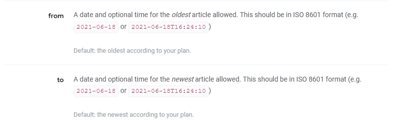

```{r setup, echo = FALSE, message = FALSE, warning = FALSE}
library(tidyverse)
library(haven)
library(knitr)
library(RSQLite)
library(methods)
options(dplyr.print_min = 5)
options(tibble.print_min = 5)
options(dplyr.print_min = 5)
knitr::opts_chunk$set(echo = TRUE, eval = TRUE, message = FALSE, warning = FALSE)
```


## What is this course about?

Basic use of R for reading, manipulating, and plotting data!

<div style = "float: left;border:1px solid black;">
<a href = "https://www4.stat.ncsu.edu/~online/datasets/chemical.txt">
```{r , fig.align = 'left', out.width = '205px', out.height = "249px", echo = FALSE}
knitr::include_graphics("../img/rawData.png")
```
</a>
</div>
<div style = "float: left;">
```{r , fig.align = 'left', out.width = '30px', out.height = "249px", echo = FALSE}
knitr::include_graphics("../img/arrow.png")
```
</div>
<div style = "float: left;border:1px solid black;">
<a href = "https://www4.stat.ncsu.edu/~online/datasets/readChemData.r">
```{r , fig.align = 'left', out.width = '205px', out.height = "249px", echo = FALSE}
knitr::include_graphics("../img/ImportR.png")
```
</a>
</div>
<div style = "float: left;">
```{r , fig.align = 'left', out.width = '30px', out.height = "249px", echo = FALSE}
knitr::include_graphics("../img/arrow.png")
```
</div>
<div style = "float: left;border:1px solid black;">
<a href = "https://www4.stat.ncsu.edu/~online/datasets/summChemData.r">
```{r , fig.align = 'left', out.width = '205px', out.height = "249px", echo = FALSE}
knitr::include_graphics("../img/SummarizeR.png")
```
</a>
</div>
<div style = "float: left;">
```{r , fig.align = 'left', out.width = '30px', out.height = "249px", echo = FALSE}
knitr::include_graphics("../img/arrow.png")
```
</div>
<div style = "float: left;border:1px dashed black;">
```{r , fig.align = 'left', out.width = '205px', out.height = "249px", echo = FALSE}
knitr::include_graphics("../img/AnalysisR.png")
```
</div>


## Where do we start?  

- R & RStudio installed

- Explore the RStudio IDE (Integrated Development Environment)  

- Investigate common R objects and classes  

- Read in raw data


## RStudio IDE 

In RStudio, four main 'areas'   

- Console (& Terminal)  

- Scripting and Viewing Window  
    
- Plots/Help (& Files/Packages)  

- Environment (& Connections/Git)  
    


## Console  

- Type code directly into the **console** for evaluation  

<div  style = "float: left; width = 45%;">
```{r calc2, echo=TRUE}
#simple math operations
# <-- is a comment - code not evaluated
3 + 7
10 * exp(3) #exp is exponential function
log(pi^2) #log is natural log by default
```
</div>

<div  style = "float: right; width = 45%;">
```{r basic, echo = TRUE, out.width = "400px", fig.align='center'}
mean(cars$speed)
hist(cars$speed)
```
</div>
<!--Output of each of these is actually a vector of length 1!-->

## Scripting and Viewing Window 

- Usually want to keep code for later use!  

> - Write code in a 'script' and save script (or use markdown - covered later)

> - From script can send code to console via: 
    <ul>
      <li> "Run" button (runs current line)  </li>
      <li> CTRL+Enter (PC) or Command+Enter (MAC)  </li>
      <li> Highlight section and do above</li>
    </ul>


## Plots/Help 

- Created plots stored in `Plots` tab  

    - Cycle through past plots  
    - Easily save  
 
- Type `help(...)` into the console for documentation  

    + `help(seq)`  
    + `help(data.frame)`  

## Environment   

- Store **data/info/function/etc.** in R objects  

- Create an R object via `<-` (recommended) or `=`  

```{r save,echo=TRUE}
#save for later
avg <- (5 + 7 + 6) / 3
#call avg object
avg
#strings (text) can be saved as well
words <- c("Hello there!", "How are you?")
words
```


## Environment   

- Look at all current objects with `ls()`

```{r ls, echo = TRUE}
ls()
```

- `rm()` to remove  

```{r rm, echo = TRUE}
rm(avg)
ls()
```

- `rm(list=ls())` to remove all stored objects  


## Environment   

- Built-in objects exist like `letters` and `cars`  

```{r builtin, echo = TRUE}
letters
head(cars, n = 3)
```

- `data()` shows available built-in datasets


## RStudio IDE 

Four main 'areas'   

- Console (& Terminal)  

- Scripting and Viewing Window  
    
- Plots/Help (& Files/Packages)  

- Environment (& Connections/Git)  
    

## Quick Example  

- Go to the <a href = "https://jbpost2.github.io/Basics-of-R-for-Data-Science-and-Statistics/CourseFiles.html">course files page</a> and try Exercise 1 - RStudio

    
## R Objects and Classes  

- R has strong **O**bject **O**riented **P**rogramming (OOP) tools  

- Object: data structure with attributes (class)  

- Method: procedures (functions) act on object based on attributes  


## R Objects and Classes  

- R has strong **O**bject **O**riented **P**rogramming (OOP) tools  

- Object: data structure with attributes (class)  

- Method: procedures (functions) act on object based on attributes  

- R functions like `plot()` act differently depending on object class 

<div style = "float: left; width = 45%;">
```{r str1, echo = TRUE}
class(cars)
```
</div>
<div style = "float: left; width = 10%;">
&nbsp;&nbsp;&nbsp;&nbsp;&nbsp;&nbsp;&nbsp;&nbsp;&nbsp;&nbsp;&nbsp;
</div>
<div style = "float: left; width = 45%;">
```{r str2, echo = TRUE}
class(exp)
```
</div>


## R Objects and Classes  

- R has strong **O**bject **O**riented **P**rogramming (OOP) tools  

- Object: data structure with attributes (often a 'class')  

- Method: procedures (often 'functions') act on object based on attributes  

- R functions like `plot()` act differently depending on object class 

<div style = "float: left; width = 45%;">
```{r plot1, echo = TRUE, fig.align = 'center', out.width = '350px'}
plot(cars)
```
</div>
<div style = "float: left; width = 10%;">
&nbsp;&nbsp;&nbsp;&nbsp;&nbsp;&nbsp;&nbsp;&nbsp;&nbsp;&nbsp;&nbsp;&nbsp;&nbsp;&nbsp;&nbsp;&nbsp;&nbsp;&nbsp;&nbsp;&nbsp;&nbsp;&nbsp;

</div>
<div style = "float: left; width = 45%;">
```{r plot2, echo = TRUE, fig.align = 'center', out.width = '350px'}
plot(exp)
```
</div>


## R Objects and Classes  

- Create an R object via `<-` (recommended) or `=`  

    + allocates memory to object  
    
```{r , echo = TRUE}
vec <- c(1, 4, 10)
vec
```

## R Objects and Classes  

- Create an R object via `<-` (recommended) or `=`  

    + allocates memory to object  
    
```{r , echo = TRUE}
fit <- lm(dist ~ speed, data = cars)
fit
```

## R Objects and Classes  

- The function used to create objects determines the type of object

```{r , echo = TRUE}
class(vec)
summary(vec)
```


## R Objects and Classes  

- The function used to create objects determines the type of object

```{r , echo = TRUE}
class(fit)
summary(fit)
```


## Investigating Objects  

Many functions to help understand an R Object  

 - `class()`  
 
 - describes the `class` attribute of an R object  
 
```{r obj2, echo = TRUE}
class(cars)
```


## Investigating Objects  

Many functions to help understand an R Object  

 - `typeof()`  
 
 - determines the (R internal) type or storage mode of any object  
 
```{r obj3, echo = TRUE}
typeof(cars)
```
 
## Investigating Objects  

Many functions to help understand an R Object  

 - `str()`  
 
 - compactly displays the internal structure of an R object  
 
```{r obj1, echo = TRUE}
str(cars)
```


## Where we are  

- RStudio provides a nice environment for coding  

- R has functions that can be used to create objects  

- Create an R Object with `<-`  

- Objects have attributes that determine how functions act 

- `class()`, `typeof()`, and `str()` help understand your object


## Quick Example  

- Go to the <a href = "https://jbpost2.github.io/Basics-of-R-for-Data-Science-and-Statistics/CourseFiles.html">course files page</a> and try Exercise 2 - Objects
    
    
## Data Objects   

- Understand data structures first: Five major types  

     1. Atomic Vector (1d)  
     2. Matrix (2d)  
     3. ~~Array (nd)~~  
     4. Data Frame (2d)  
     5. List (1d)  


Dimension | Homogeneous   | Heterogeneous
--------- | ------------- | -------------
1d        | Atomic Vector | List
2d        | Matrix        | Data Frame


## Vector   

1. Atomic Vector (1D group of elements with an ordering)   

```{r vectorVis, echo = FALSE, fig.align='center', out.width = '650px', echo = FALSE}
knitr::include_graphics("../img/vectorVisualF.png")
```

- Elements must be same 'type'  

    + numeric (integer or double), character, or logical
    

## Vector   

1. Atomic Vector (1D group of elements with an ordering)   
  - Create with `c()` function ('combine')  
```{r vecs}
#vectors (1 dimensional) objects
x <- c(17, 22, 1, 3, -3)
y <- c("cat", "dog", "bird", "frog")
x
y
```


## Vector   

- Many 'functions' output a numeric vector

- Ex: `seq()` 

    + Inputs = from, to, by (among others)  

    + Output = a sequence of numbers

```{r functionVis2, echo = FALSE, out.width = "800px", fig.align= 'center', echo = FALSE}
knitr::include_graphics("../img/funVisual2F.png")
```


## From `help(seq)`  

`seq(from = 1, to = 1, by = ((to - from)/(length.out - 1)),`
`     length.out = NULL, along.with = NULL, ...)`

```{r seq2}
v <- seq(from = 1, to = 5, by = 1)
v
str(v)
```

- `num` says it is numeric  

- `[1:5]` implies one dimensional with length 5


## `:` to Create a Sequence

```{r seq3}
1:20 
```

- R generally does elementwise math

```{r seq5}
1:20/20
1:20 + 1
```


## Vector   

1. Atomic Vector (1D group of elements with an ordering)   

- Vectors useful to know about  

- Not usually useful for a dataset 

- Often consider as 'building blocks' for other data types


## Matrix   

<ol start="2">
  <li> Matrix (2D data structure) </li>
</ol>
- (think) columns are vectors of the same **type and length**  
  
```{r matrixVis, echo = FALSE, out.width = "500px", fig.align= 'center', echo = FALSE}
knitr::include_graphics("../img/matrixVisualF.png")
```

## Matrix   

<ol start="2">
  <li> Matrix (2D data structure)</li>
</ol>
- (think) columns are vectors of the same **type and length**

<div style = "float: left; width = 45%;">
```{r popvec,echo=TRUE}
#populate vectors
x <- c(17, 3, 13, 11)
y <- rep(-3, times = 4)
z <- 1:4
```
</div>
<div style = "float: left; width = 5%;">
&nbsp;&nbsp;&nbsp;&nbsp;&nbsp;&nbsp;&nbsp;&nbsp;&nbsp;
</div>

## Matrix   

<ol start="2">
  <li> Matrix (2D data structure) </li>
</ol>
- (think) columns are vectors of the same **type and length**

<div style = "float: left; width = 45%;">
```{r popvec2,echo=TRUE}
#populate vectors
x <- c(17, 3, 13, 11)
y <- rep(-3, times = 4)
z <- 1:4
```
</div>
<div style = "float: left; width = 5%;">
&nbsp;&nbsp;&nbsp;&nbsp;&nbsp;&nbsp;&nbsp;&nbsp;&nbsp;
</div>
<div style = "float: left; width = 45%;">
```{r checktype, echo = TRUE}
#check 'type'
is.numeric(x)
is.numeric(y)
is.numeric(z)
```
</div>


## Matrix   

<ol start="2">
  <li> Matrix (2D data structure) </li>
</ol>
- (think) columns are vectors of the same **type and length**

<div style = "float: left; width = 45%;">
```{r popvec3,echo=TRUE}
#populate vectors
x <- c(17, 3, 13, 11)
y <- rep(-3, times = 4)
z <- 1:4
```
</div>
<div style = "float: left; width = 5%;">
&nbsp;&nbsp;&nbsp;&nbsp;&nbsp;&nbsp;&nbsp;&nbsp;&nbsp;
</div>
<div style = "float: left; width = 25%;">
```{r checktype2, echo = TRUE}
#check 'type'
is.numeric(x)
is.numeric(y)
is.numeric(z)
```
</div>
<div style = "float: left; width = 5%;">
&nbsp;&nbsp;&nbsp;&nbsp;&nbsp;&nbsp;&nbsp;&nbsp;&nbsp;
</div>
<div style = "float: left; width = 20%;">
```{r checklength, echo = TRUE}
#check 'length'
length(x)
length(y)
length(z)
```
</div>

## Matrix   

<ol start="2">
  <li> Matrix (2D data structure) </li>
</ol> 
- (think) columns are vectors of the same **type and length**

- Create with `matrix()` function (see help)

## Matrix   

<ol start="2">
  <li> Matrix (2D data structure) </li>
</ol> 
- (think) columns are vectors of the same **type and length**

- Create with `matrix()` function (see help)

```{r mat1,echo=TRUE}
#populate vectors
x <- c(17, 3, 13, 11)
y <- rep(-3, times = 4)
z <- 1:4
#combine in a matrix
matrix(c(x, y, z), ncol = 3)
```
<!--Can have as many columns and/or rows as needed-->


## Matrix   

<ol start="2">
  <li> Matrix (2D data structure) </li>
</ol>  
- (think) columns are vectors of the same **type and length**

- Create with `matrix()` function

<div style = "float: left; width = 45%;">
```{r mat2,echo=TRUE}
x <- c("Hi", "There", "Friend", "!")
y <- c("a", "b", "c", "d")
z <- c("One", "Two", "Three", "Four")
is.character(x)
```
</div>
<div style = "float: left; width = 5%;">
&nbsp;&nbsp;&nbsp;&nbsp;&nbsp;&nbsp;&nbsp;&nbsp;&nbsp;
</div>
<div style = "float: left; width = 45%;">
```{r mat3, echo = TRUE}
matrix(c(x, y, z), nrow = 6)
```
</div>


## Matrix   

<ol start="2">
  <li> Matrix (2D data structure) </li>
</ol>  
- (think) columns are vectors of the same **type and length**

- Useful for some data but often some numeric and some character variables:

```{r dataset, out.width = "600px",echo=FALSE, fig.align='center', echo = FALSE}
knitr::include_graphics("../img/dataset.png")
```


## Data Frame    

<ol start="4">
  <li> Data Frame (2D data structure) </li>
</ol>  
- collection (list) of *vectors* of the same **length**  

```{r dfVis, echo = FALSE, out.width = "500px", fig.align= 'center', echo = FALSE}
knitr::include_graphics("../img/dfVisualF.png")
```


## Data Frame    

<ol start="4">
  <li> Data Frame (2D data structure) </li>
</ol>  
- collection (list) of *vectors* of the same **length**  

- Create with `data.frame()` function  

```{r df1,echo=TRUE}
x <- c("a", "b", "c", "d", "e", "f")
y <- c(1, 3, 4, -1, 5, 6)
z <- 10:15
data.frame(x, y, z)
```
<!--Like a more flexible matrix-->


## Data Frame    

<ol start="4">
  <li> Data Frame (2D data structure) </li>
</ol> 
- collection (list) of *vectors* of the same **length**  

- Create with `data.frame()` function

```{r df2,echo=TRUE,eval=TRUE}
data.frame(char = x, data1 = y, data2 = z)
```
- char, data1, and data2 become the variable names for the data frame
<!--Valid Name:  A syntactically valid name consists of letters, numbers and the dot or underline characters and starts with a letter or the dot not followed by a number. Names such as ".2way" are not valid and neither are the reserved words. "n1" is valid.

Reserved words: if else repeat while function for in next break TRUE FALSE NULL Inf NaN NA NA_integer_ NA_real_ NA_complex_ NA_character_

see ?make.names for more details-->


## Data Frame    

<ol start="4">
  <li> Data Frame (2D data structure) </li>
</ol> 
- collection (list) of *vectors* of the same **length**

- Create with `data.frame()` function

- Perfect for most data sets!  

- Most functions that read 2D data store it as a data frame  


## List

<ol start="5">
  <li> List (1D group of objects with ordering) </li>
</ol> 
- a vector that can have differing elements  

```{r listVis, echo = FALSE, out.width = "600px", fig.align= 'center', echo = FALSE}
knitr::include_graphics("../img/listVisualF.png")
```


## List

<ol start="5">
  <li> List (1D group of objects with ordering) </li>
</ol> 
- a vector that can have differing elements

- Create with `list()`

```{r list1,echo=TRUE}
list(1:3, rnorm(2), c("!", "?"))
```


## List

<ol start="5">
  <li> List (1D group of objects with ordering) </li>
</ol> 

- Add names to the list elements

```{r list2,echo=TRUE}
list(seq = 1:3, normVals = rnorm(2), punctuation = c("!", "?"))
```


## List

<ol start="5">
  <li> List (1D group of objects with ordering) </li>
</ol> 
- a vector that can have differing elements

- Create with `list()`

- More flexible than a Data Frame!

- Useful for more complex types of data  


## Recap!


Dimension | Homogeneous   | Heterogeneous
--------- | ------------- | -------------
1d        | Atomic Vector | List
2d        | Matrix        | Data Frame

&nbsp;\n

- For most data analysis you'll use data frames!  

- Next up:  How do we access/change parts of our objects?  


## Accessing Parts of a Data Object

- For data may want    
    + One element  
    + Certain columns  
    + Certain rows  

 
## Accessing Parts of an Atomic Vector (1D)

- Return elements using square brackets `[]`   

```{r indexVec}
letters #built-in vector
```
<div style="float: left; width: 45%;">
```{r}
letters[1] #R starts counting at 1!
```
</div>
<div style = "float:left; width = 5%">
&nbsp;&nbsp;&nbsp;&nbsp;&nbsp;&nbsp;&nbsp;
</div>
<div style = "float:left; width = 45%">
```{r}
letters[26]
```
</div>

 
## Accessing Parts of an Atomic Vector (1D)

- Return elements using square brackets `[]`   

- Can 'feed' in a vector of indices to `[]`  

```{r indexVec2}
letters[1:4]
letters[c(5, 10, 15, 20, 25)]
x <- c(1, 2, 5); letters[x]
```


 
## Accessing Parts of an Atomic Vector (1D)

- Return elements using square brackets `[]`   

- Can 'feed' in a vector of indices to `[]`  

- Use negative indices to return without  

```{r indexVec3}
letters[-(1:4)]
x <- c(1, 2, 5); letters[-x]
```

<!-- note we aren't overwriting anything!-->


## Accessing Parts of a Matrix (2D) 

- Use square brackets with a comma `[ , ]`

- Notice default row and column names!  

```{r matindex}
mat <- matrix(c(1:4, 20:17), ncol = 2)
mat
```


## Accessing Parts of a Matrix (2D) 

- Use square brackets with a comma `[ , ]`

<div style="float: left; width: 45%;">
```{r matindex2}
mat
mat[c(2, 4), ]
```
</div>
<div style="float: right; width: 45%;">
```{r matindex3}
mat[, 1]
mat[2, ]
mat[2, 1]
```
</div>
<!--Note that R simplifies the result where possible.  That is, returns an atomic vector if you have only 1 dimension and a matrix if two.  Also, if you only give a single value in the [] then R uses the count of the value in the matrix.  Counts go down columns first.-->

## Accessing Parts of a Data Frame (2D) 

- Consider 'built-in' `iris` data frame

```{r irisstr}
str(iris)
```


## Accessing Parts of a Data Frame (2D) 

- Data Frame is 2D similar to a matrix - access similarly!

- Use square brackets with a comma `[ , ]`

```{r dfindex}
iris[1:4, 2:4]
```


## Accessing Parts of a Data Frame (2D) 

- Data Frame is 2D similar toa matrix - access similarly!

- Use square brackets with a comma `[ , ]`

```{r dfindex1b}
iris[1, ]
```
<!--Notice iris[1,] returns a data frame not a vector.  iris[,1] returns a vector.  This is due to that attributes associated with the columns but having none with the rows.  [  is actually a function call in R (everything is really) and the default argument on [ is drop=TRUE telling R to coerce whatever is left to the lowest possible dimension.  The attributes on the columns keep R from coercing to 1d.   iris[,1,drop=FALSE] returns a data frame with one column.  (Think of [,] as simplifying by default and [,,drop=F] as preserving.)--> 


## Accessing Parts of a Data Frame (2D) 

- Can use columns names to subset  

```{r dfindex2}
iris[ , c("Sepal.Length", "Species")]
```


## Accessing Parts of a Data Frame (2D) 

- Dollar sign allows easy access to a single column!  

```{r dfindex3}
iris$Sepal.Length
```


## Accessing Parts of a Data Frame (2D) 

- Dollar sign allows easy access to a single column!  

- Most used method for accessing a single variable  

- RStudio fills in options.  
    + Type `iris$`  
    + If no choices - hit tab
    + Hit tab again to choose  


## Accessing Parts of a List (1D) 

- Use single square brackets `[ ]` for multiple list elements  

```{r listindex1}
x <- list("HI", c(10:20), 1)
x
```


## Accessing Parts of a List (1D) 

- Use single square brackets `[ ]` for multiple list elements  

```{r listindex1b}
x <- list("HI", c(10:20), 1)
x[2:3]
```


## Accessing Parts of a List (1D) 

- Use double square brackets `[[ ]]` (or `[ ]`) for single list element

<div style="float: left; width:40%;">
```{r listindex2}
x <- list("HI", c(10:20), 1)
x[1]
x[[1]]
```
</div>
<div style="float: right; width:50%;">
```{r listindex3}
x[[2]]
x[[2]][4:5]
```
</div>
<!--Can use single square brackets to access a list as well but [] can only return a single value and so it returns a list.  That is x[1] returns a list of the vector "Hi".  x[2] returns a list containing the vector 10:20 and x[1:2] returns a list with two components corresponding to "Hi" and 10:20.  x[[1:2]] returns an error because it is trying to access the elements of the list 1:2 which isn't a valid way to access the list elements so it doens't work. -->


## Accessing Parts of a List (1D)  

- If named list elements, can use $  

```{r listindex4}
x <- list("HI", c(10:20), 1)
str(x)
x <- list(First = "Hi", Second = c(10:20), Third = 1)
x$Second
```

## Lists & Data Frames  

- Connection:  Data Frame = *List* of equal length vectors 
```{r dflist}
str(x)
str(iris)
```
<!--Note that iris[2] will give you back the second column but returns a list of that column that retains its attributes. That is, you get back a data frame with that column.  (Think of [] as preserving structure and [[]] as simplifying structure if possible.)-->


## Lists & Data Frames  

- Connection:  Data Frame = *List* of equal length vectors 

```{r dflist2}
typeof(x)
typeof(iris)
```


## Lists & Data Frames  

- Connection:  Data Frame = *List* of equal length vectors 

<div style="float: left; width:30%;">
```{r }
iris[2]
```
</div>
<div style="float: right; width:60%;">
```{r }
iris[[2]]
```
</div>


## Recap!

Dimension | Homogeneous   | Heterogeneous
--------- | ------------- | -------------
1d        | Atomic Vector | List
2d        | Matrix        | Data Frame

<br> 

Basic access via
    <ul>
        <li> Atomic vectors - `x[ ]`</li>
        <li> Matrices - `x[ , ]`</li>  
        <li> Data Frames - `x[ , ]` or `x$name`</li>  
        <li> Lists - `x[ ]`, `x[[ ]]`, or `x$name`</li>
    </ul>


## Quick Examples  

- Go to the <a href = "https://jbpost2.github.io/Basics-of-R-for-Data-Science-and-Statistics/CourseFiles.html">course files page</a> and try Exercise 3 - Common Data Objects


## Reading Raw Data Into R

Plan:  

- Common raw data formats  

> - Comma Separated Value (CSV) files

> - Asides: R projects and R packages

> - Read 'clean' delimited data

> - Excel, SAS, & SPSS data  

> - Resources for JSON, databases, and APIs


## Importing Data  
**How to read in data depends on raw/external data type!**  

- Delimited data  

     + Delimiter - Character (such as a `,`) that separates data entries

<div style = "float: left;border:1px solid black;">
<a href = "https://www4.stat.ncsu.edu/~online/datasets/neuralgia.csv">
```{r csv, fig.align = 'left', out.width = '205px', out.height = "249px", eval = TRUE, echo = FALSE}
knitr::include_graphics("../img/commaDelim.png")
```
</a>
</div>
<div style = "float: left;">
&nbsp;&nbsp;
</div>
<div style = "float: left;border:1px solid black;">
<a href = "https://www4.stat.ncsu.edu/~online/datasets/chemical.txt">
```{r space, fig.align = 'left', out.width = '205px', out.height = "249px", eval = TRUE, echo = FALSE}
knitr::include_graphics("../img/spaceDelim.png")
```
</a>
</div>
<div style = "float: left;">
&nbsp;&nbsp;
</div>
<div style = "float: left;border:1px solid black;">
<a href = "https://www4.stat.ncsu.edu/~online/datasets/crabs.txt">
```{r tab, fig.align = 'left', out.width = '205px', out.height = "249px", eval = TRUE, echo = FALSE}
knitr::include_graphics("../img/tabDelim.png")
```
</a>
</div>
<div style = "float: left;">
&nbsp;&nbsp;
</div>
<div style = "float: left;border:1px solid black;">
<a href = "https://www4.stat.ncsu.edu/~online/datasets/umps2012.txt">
```{r general, fig.align = 'left', out.width = '205px', out.height = "249px", eval = TRUE, echo = FALSE}
knitr::include_graphics("../img/generalDelim.png")
```
</a>
</div>
<div style = "clear:both; font-size: 10pt;">
&nbsp;&nbsp;&nbsp;&nbsp;&nbsp;&nbsp;&nbsp;**Comma:** usually .csv &nbsp;&nbsp;&nbsp;&nbsp;&nbsp;&nbsp;&nbsp;&nbsp;&nbsp;&nbsp;&nbsp;&nbsp;&nbsp;&nbsp;&nbsp;&nbsp;&nbsp;&nbsp;&nbsp;&nbsp;&nbsp;&nbsp;&nbsp;&nbsp;&nbsp;&nbsp;&nbsp;&nbsp;
**Space:** usually .txt or .dat &nbsp;&nbsp;&nbsp;&nbsp;&nbsp;&nbsp;&nbsp;&nbsp;&nbsp;&nbsp;&nbsp;&nbsp;&nbsp;&nbsp;&nbsp;&nbsp;&nbsp;&nbsp;&nbsp;&nbsp;
**Tab:** usually .tsv or .txt  &nbsp;&nbsp;&nbsp;&nbsp;&nbsp;&nbsp;&nbsp;&nbsp;&nbsp;&nbsp;&nbsp;&nbsp;&nbsp;&nbsp;&nbsp;&nbsp;&nbsp;&nbsp;&nbsp;&nbsp;&nbsp;&nbsp;&nbsp;
**General:** usually .txt or .dat
</div>


## Importing Delimited Data: Standard R Methods

 - When you open R a few `packages` are loaded
 
> - R package  
    <ul>
      <li> Collection of functions/datasets/etc. in one place</li>  
      <li> Packages exist to do almost anything</li>  
      <li> [List of CRAN](https://cran.r-project.org/web/packages/available_packages_by_name.html) approved packages on R's website</li>  
      <li> Plenty of other packages on places like GitHub</li>
    </ul>


## Importing Delimited Data: Standard R Methods

 - When you open R a few `packages` are loaded
 
```{r loadR, fig.align = 'center', out.width = "250px", echo = FALSE}
include_graphics("../img/loadR.png")
```

 - `utils` package has *family* of `read.` functions ready for use!  
 
 
## Reading Delimited Data  

- Functions from `read.` family work well  

- Concerns:  

    + poor default function behavior
    
         * (formerly, prior to R 4.0) strings are read as `factors`  
         
         * row & column names can be troublesome
    
    + (Slightly) different behavior on different computers  
    
    + Want to have most of our functions we use 'feel' the same...
    


## Aside: R Packages

- R package  
    <ul>
      <li> Collection of functions in one place</li>  
      <li> Packages exist to do almost anything</li>  
      <li> [List of CRAN](https://cran.r-project.org/web/packages/available_packages_by_name.html) approved packages on R's website</li>  
      <li> Plenty of other packages on places like GitHub</li>
    </ul>
    
> - "[TidyVerse](http://tidyverse.org/)" - collection of R packages that share common philosophies and are designed to work together!  
<!--Many packages do the same thing.  Some just do it better than others.  Often hard to pick the best one.-->    

## Aside: R Packages

- First time using a package  
    + Must install package (download files)  
    + Can use code or menus

```{r, eval = FALSE}
install.packages("readr")
```

```{r install2, out.width = "700px",echo=FALSE, fig.align='center'}
knitr::include_graphics("../img/packages.png")
```

<!--Can also install them from local sources and stuff like that but that isn't usually required unless you are behind a firewall of some kind that keeps R from accessing the internet.-->
    

## Aside: R Packages

- Only install once!  

- **Each session**: read in package using `library()` or `require()`

```{r libreq1}
library("tidyverse")
```


## Aside: R Packages  

- Can call functions without loading full library with `::`  

- If not specified, most recently loaded package takes precedent

```{r readCSVex, eval = TRUE}
#stats::filter(...) calls time-series function from stats package
dplyr::filter(iris, Species == "virginica")
```


## Reading Delimited Data  

`baseR` and `tidyverse` (`readr` package does the heavy lifting) function and purpose:

Type of Delimeter           | `utils` Function        | `readr` Function 
--------------------------- | ----------------------- | ---------
Comma                       | `read.csv()`            | `read_csv()`
Semicolon (`,` for decimal) | `read.csv2()`           | `read_csv2()`
Tab                         | `read.delim()`          | `read_tsv()`
General                     | `read.table(sep = "")`  | `read_delim()`
White Space                 | `read.table(sep = "")`  | `read_table()` `read_table2()`


## Working Directory  

- Let's read in the '[neuralgia.csv](https://www4.stat.ncsu.edu/~online/datasets/neuralgia.csv)' file  

- By default, R looks in the `working directory` for the file

```{r}
getwd()
```


## Working Directory  

- Can change *working directory* via code or menus

```{r, out.width = "800px",echo=FALSE}
knitr::include_graphics("../img/setwd.png")
```

```{r setwd1,eval=FALSE}
setwd("C:/Users/jbpost2/repos/Basics-of-R-for-Data-Science-and-Statistics/datasets")
#or
setwd("C:\\Users\\jbpost2\\repos\\camp\\Basics-of-R-for-Data-Science-and-Statistics\\datasets")
#better to use R projects!
```
<!--Double slash needed because \ is an escape character in R so \\ is really read as \-->


## Reading a .csv File  

With `neuralgia.csv` file in the working directory:

```{r , eval = TRUE}
neuralgiaData <- read_csv("neuralgia.csv")
neuralgiaData
```


## Reading a .csv File  

- Use full local path  

```{r , echo = TRUE, eval = FALSE}
neuralgiaData <- read_csv(
"C:/Users/jbpost2/repos/Basics-of-R-for-Data-Science-and-Statistics/datasets/neuralgia.csv"
           )
```


## Reading a .csv File  

- Use relative path (`../` drops down a folder)

```{r , eval = FALSE}
neuralgiaData <- read_csv("../datasets/neuralgia.csv")
```

- Working directory: ".../Basics-of-R-for-Data-Science-and-Statistics/slides"

- File location: ".../Basics-of-R-for-Data-Science-and-Statistics/datasets/neuralgia.csv"

- As long others have the same folder structure, can share code with no path change needed!


## Aside: RStudio Project

- Often have many files associated with an analysis  

- With multiple analyses things get cluttered...  


## Aside: RStudio Project

- Often have many files associated with an analysis  

- With multiple analyses things get cluttered...  

- Want to associate different  
<ul>
   <li> environments </li>
   <li> histories </li>
   <li> working directories </li>
   <li> source documents </li>
</ul> 
with each analysis

> - Can use "Project" feature in R Studio  


## Aside: RStudio - Project

- Easy to create!  Use an existing folder or create one:

```{r project.png, out.width = "600px",echo=FALSE, fig.align = 'center'}
knitr::include_graphics("../img/project.png")
```

- Place all files for that analysis in that directory  

- Swap between projects using menu in top right


## Reading a .csv File  

- Back to reading in data!  

- R can pull from URLs as well!  

```{r , eval = TRUE}
neuralgiaData <- read_csv("https://www4.stat.ncsu.edu/~online/datasets/neuralgia.csv")
neuralgiaData
```


## `tibbles`  

- Notice: fancy printing!  

- Checking column type is a basic data validation step  

- `tidyverse` data frames are called `tibbles`  

```{r class}
class(neuralgiaData)
```


## `tibbles`  

- Behavior slightly different than a standard `data frame`.  No simplification!  

```{r simplify}
neuralgiaData2 <- as.data.frame(neuralgiaData)
neuralgiaData2[,1]
neuralgiaData[,1]
```


## `tibbles`  

- Behavior slightly different than a standard `data frame`.  No simplification!  

- Use either `dplyr::pull()` or `$`

```{r pull}
pull(neuralgiaData, Treatment) #or pull(neuralgiaData, 1)
neuralgiaData$Treatment 
```


## Reading Space Delimited Data  

- Reading *clean* delimited data pretty easy with the tidyverse!  

- Let's read in the '[chemical.txt](https://www4.stat.ncsu.edu/~online/datasets/chemical.txt)' file (space delimited)  

- `read_table2()` allows multiple white space characaters between entries  


## Reading Space Delimited Dtaa 

- Reading *clean* delimited data pretty easy with the tidyverse!  

- Let's read in the '[chemical.txt](https://www4.stat.ncsu.edu/~online/datasets/chemical.txt)' file (space delimited)  

- `read_table2()` allows multiple white space characaters between entries  

```{r readSpace}
read_table2("https://www4.stat.ncsu.edu/~online/datasets/chemical.txt")
```


## Reading Tab Delimited Data  

- Reading *clean* delimited data pretty easy with the tidyverse!  

- Let's read in the '[crabs.txt](https://www4.stat.ncsu.edu/~online/datasets/crabs.txt)' file (tab delimited)  


## Reading Tab Delimited Data  

- Reading *clean* delimited data pretty easy with the tidyverse!  

- Let's read in the '[crabs.txt](https://www4.stat.ncsu.edu/~online/datasets/crabs.txt)' file (tab delimited)  

```{r readTab}
read_tsv("https://www4.stat.ncsu.edu/~online/datasets/crabs.txt")
```


## Reading Generic Delimited Data  

- Reading *clean* delimited data pretty easy with the tidyverse!  

- Let's read in the '[umps2012.txt](https://www4.stat.ncsu.edu/~online/datasets/umps2012.txt)' file ('>' delimited)  

- In raw data, no column names provided  


## Reading Generic Delimted Data 

`read_delim(`
`  file,`
`  delim,`
`  col_names = TRUE,`
`  col_types = NULL,`
`  na = c("", "NA"),`
`  skip = 0,`
`  guess_max = min(1000, n_max), ...`
`)`

```{r readGeneral}
read_delim("https://www4.stat.ncsu.edu/~online/datasets/umps2012.txt", 
           delim = ">",
           col_names = c("Year", "Month", "Day", "Home", "Away", "HPUmpire"))
```


## Reading Delimited Data  

 - How do `readr` functions determine the column types? From the help:

`col_types`  	
`One of NULL, a cols() specification, or a string. See vignette("readr") for more details.`

`If NULL, all column types will be imputed from the first 1000 rows on the input. This is convenient (and fast), but not robust. If the imputation fails, you'll need to supply the correct types yourself.`

> - Other useful inputs:  
<ul>
  <li> `skip = 0`</li>
  <li> `col_names = TRUE`</li>
  <li> `na = c("", "NA")` </li>
</ul>
<!--check the help on read_csv again.  See col_types.  Checks first 1000 rows of data and figures out character or numeric.  Notice you can read columns in using specifications.  For instance could specify week as integer and use date or date time when applicable.
--> 

## Reading Fixed Field & Tricky Non-Standard Data

- read_fwf()  
     + reads in data where entries are very structured  
     
- read_file()
     + reads an entire file into a single string

- read_lines() 
     + reads a file into a character vector with one element per line  

- Usually parse the last two with `regular expressions` :(


## Reading Data From Other Sources

Type of file       | Package   | Function   
------------------ | --------- | -----------------
Delimited          | `readr`   | `read_csv()`, `read_tsv()`,`read_table()`, `read_delim()`
Excel (.xls,.xlsx) | `readxl`  | `read_excel()`
SAS (.sas7bdat)    | `haven`   | `read_sas()`
SPSS (.sav)        | `haven`   | `read_spss()`

<br> 

- Look at resources for JSON, databases, and APIs


## Excel Data

- Read in [censusEd.xlsx](https://www4.stat.ncsu.edu/~online/datasets/censusEd.xlsx)  

- Use `read_excel()` from `readxl` package!  

    + Reads both xls and xlsx files  

    + Detects format from extension given  

    + Can't pull from web though!  


## `read_excel`

```{r, warning = FALSE}
#install package if necessary
library(readxl)
#reads first sheet by default
edData <- read_excel("../datasets/censusEd.xlsx")
edData
```


## Dealing with Excel Sheets

- Can look at sheets available

```{r}
excel_sheets("../datasets/censusEd.xlsx")
```

- Specify sheet with name or integers (or `NULL` for 1st) using `sheet =`  

```{r, eval = FALSE}
read_excel("../datasets/censusEd.xlsx", sheet = "EDU01D")
```


## SAS Data

- SAS data has extension '.sas7bdat' 

- Read in [smoke2003.sas7bdat](https://www4.stat.ncsu.edu/~online/datasets/smoke2003.sas7bdat)  

> - Use `read_sas()` from `haven` package  

> - Not many options!


## SAS Data

- SAS data has extension '.sas7bdat' 

- Read in [smoke2003.sas7bdat](https://www4.stat.ncsu.edu/~online/datasets/smoke2003.sas7bdat)  

- Use `read_sas()` from `haven` package  

- Not many options!

```{r,eval=TRUE}
#install if necessary
library(haven)
smokeData <- read_sas("https://www4.stat.ncsu.edu/~online/datasets/smoke2003.sas7bdat")
smokeData
```


## SPSS Data  

- SPSS data has extension ".sav"  

- Read in [bodyFat.sav](https://www4.stat.ncsu.edu/~online/datasets/bodyFat.sav)  

> - Use `read_spss()` from `haven` package  

> - Not many options!


## SPSS Data  

- SPSS data has extension ".sav"  

- Read in [bodyFat.sav](https://www4.stat.ncsu.edu/~online/datasets/bodyFat.sav)  

- Use `read_spss()` from `haven` package  

- Not many options!
```{r,eval=TRUE}
bodyFatData <- read_spss("https://www4.stat.ncsu.edu/~online/datasets/bodyFat.sav")
bodyFatData
```

## `tidyverse`  

Notice the ease of use of the functions across the tidyverse so far:

- `function_name('path-to-file', options)`  

- All functions read the data into a tibble  

- Good defaults that do the work for you  

```{r, fig.align='center', out.width="75%", echo = FALSE}
knitr::include_graphics("../img/tidyverse.png")
```

## Quick Examples  

- Go to the <a href = "https://jbpost2.github.io/Basics-of-R-for-Data-Science-and-Statistics/CourseFiles.html">course files page</a> and try Exercise 4 - Reading Data


## Resources for Other Data Sources  

**JSON** - JavaScript Object Notation  

- Used widely across the internet and databases  

- Can represent usual 2D data or heirarchical data


## **JSON** - JavaScript Object Notation  

- Uses key-value pairs  

```{r, eval = FALSE}
{  
  {  
    "name": "Barry Sanders"  
    "games" : 153  
    "position": "RB"  
  },  
  {  
    "name": "Joe Montana"  
    "games": 192  
    "position": "QB"  
  }  
} 
```


## **JSON** - JavaScript Object Notation  

Three major R packages 

1. `rjson`  

2. `RJSONIO`  

3. `jsonlite`  

    + many nice features 
    
    + a little slower implementation  
    
4. `tidyjson` - new `tidyverse` package


## `jsonlite` Package

[`jsonlite`](https://www.rdocumentation.org/packages/jsonlite/versions/1.6) basic functions:

Function    | Description
----------- | --------------------------------------------------
`fromJSON`  | Reads JSON data from file path or character string. Converts and simplfies to R object  
`toJSON`    | Writes R object to JSON object  
`stream_in` | Accepts a *file connection* - can read streaming JSON data


## **APIs** - Application Programming Interfaces

A defined method for asking for information from a computer  

- Useful for getting data  

- Useful for allowing others to run your model without a GUI (like Shiny)  

> - Many open APIs, just need key  

> - Often just need to construct proper URL


## **APIs** - Quick Example

Registered for a key at [newsapi.org](https://newsapi.org/). An API for looking at news articles  

- Look at documentation for API (most have this!)  

- Example URL to obtain data is given  

`https://newsapi.org/v2/everything?q=bitcoin&apiKey=myKeyGoesHere`


## Example https://newsapi.org/ 

- Can add in date for instance:

```{r, fig.align='center', out.width="75%", echo = FALSE}

```

`https://newsapi.org/v2/everything?q=bitcoin&from=2021-06-01&apiKey=myKeyGoesHere`


## Using R to Obtain the Data

- Use `GET` from `httr` package (make sure to load package!)  

- Modify for what you have interest in!  

```{r, echo = TRUE, eval = FALSE}
library(httr)
GET("http://newsapi.org/v2/everything?qlnTitle=Juneteenth&from=2021-06-01&language=en&
    apiKey=myKeyGoesHere")
```

```{r, echo = FALSE}
library(httr)
myData <- GET("http://newsapi.org/v2/everything?qInTitle=tesla&from=2021-06-01&language=en&pageSize=100&apiKey=aa4b545bfbd64d4bb22ba0cb9f78189c")
```

## Returned data 

- Usually what you want is stored in something like `content`

```{r, echo = TRUE}
str(myData, max.level = 1)
```

## Parse with `jsonlite`

Common steps:

- Grab the list element we want  
- Convert it to characters (it will have a JSON structure)  
- Convert it to a data frame with `fromJSON` from the `jsonlite` package  

```{r, echo = TRUE, message = FALSE}
library(dplyr)
library(jsonlite)
parsed <- fromJSON(rawToChar(myData$content))
str(parsed, max.level = 1)
```


## **APIs** - Application Programming Interfaces

Access in R  

 - Article [here](https://www.programmableweb.com/news/how-to-access-any-restful-api-using-r-language/how-to/2017/07/21) discusses accessing APIs generically with R  

 - Same website gives a [list of APIs](https://www.programmableweb.com/category/all/apis)


## Resources for Other Data Sources  

**Databases** 

- Collection of data, usually a bunch of related 2D tables  

Many common database management systems
 
 - Oracle 
 
 - SQL Server - Microsoft product  
 
 - DB2 - IBM product  
 
 - MySQL (open source) - Not as many features but popular  
 
 - PostgreSQL (open source)  
 
[Basic SQL language](http://www.sqltutorial.org/sql-cheat-sheet/) constant across all - features differ  


## Example database structure

```{r, out.width = "650px", echo = FALSE, fig.align='center', fig.cap= "Source: oreilly.com"}
knitr::include_graphics("../img/lahman.jpg")
```


## **Databases** - Common flow in R  

1. Connect to the database with `DBI::dbConnect()`  
  - Need appropriate R package for database backend  
     + `RSQLite::SQLite()` for RSQLite  
     + `RMySQL::MySQL()` for RMySQL  
     + `RPostgreSQL::PostgreSQL()` for RPostgreSQL  
     + `odbc::odbc()` for Open Database Connectivity   
     + `bigrquery::bigquery()` for google's bigQuery


```{r, eval = FALSE}
con <- DBI::dbConnect(RMySQL::MySQL(), 
  host = "hostname.website",
  user = "username",
  password = rstudioapi::askForPassword("DB password")
)
```


## **Databases** - Common flow in R  

1. Connect to the database with `DBI::dbConnect()`  
  - Need appropriate R package for database backend  
  
<ol start="2">
<li> Use `tbl()` to reference a table in the database  </li>
</ol>

```{r, eval = FALSE}
tbl(con, "name_of_table")
```


## **Databases** - Common flow in R  

1. Connect to the database with `DBI::dbConnect()`  
  - Need appropriate R package for database backend  
  
<ol start="2">
<li> Use `tbl()` to reference a table in the database  </li>  
<li> Query the database with `SQL` or `dplyr/dbplyr` (we'll learn `dplyr` soon!) </li>  
</ol>


## **Databases** - Common flow in R  

1. Connect to the database with `DBI::dbConnect()`  
  - Need appropriate R package for database backend  
  
<ol start="2">
<li> Use `tbl()` to reference a table in the database  </li>  
<li> Query the database with `SQL` or `dplyr/dbplyr` (we'll learn `dplyr` soon!) </li>  
<li> Disconnect from database with `dbDisconnect()`  </li>  
</ol>

- More about [R Studio and Databases](https://db.rstudio.com/)


## Recap 

- Read data from other sources

Type of file       | Package   | Function   
------------------ | --------- | -----------------
Delimited          | `readr`   | `read_csv()`, `read_tsv()`,`read_table()`, `read_delim()`
Excel (.xls,.xlsx) | `readxl`  | `read_excel()`
SAS (.sas7bdat)    | `haven`   | `read_sas()`
SPSS (.sav)        | `haven`   | `read_spss()`

<br> 

- Resources for JSON, databases, and APIs

> - Quick break!


