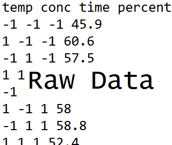
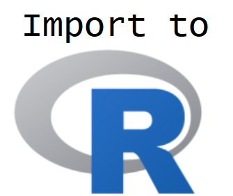
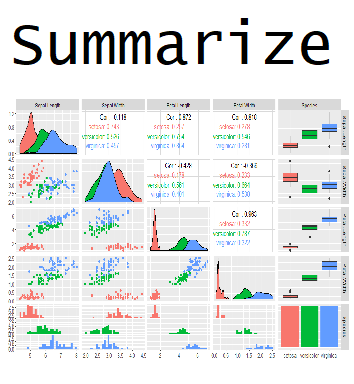
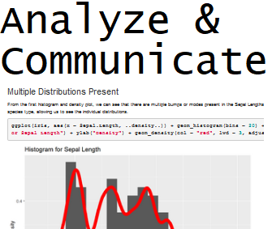
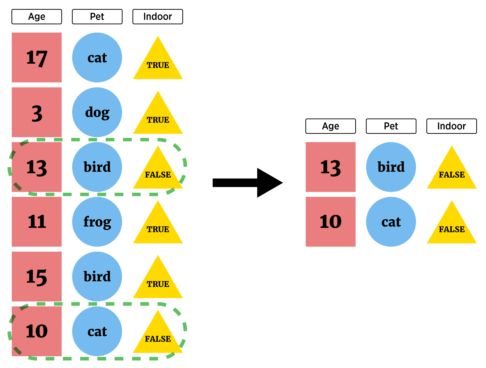
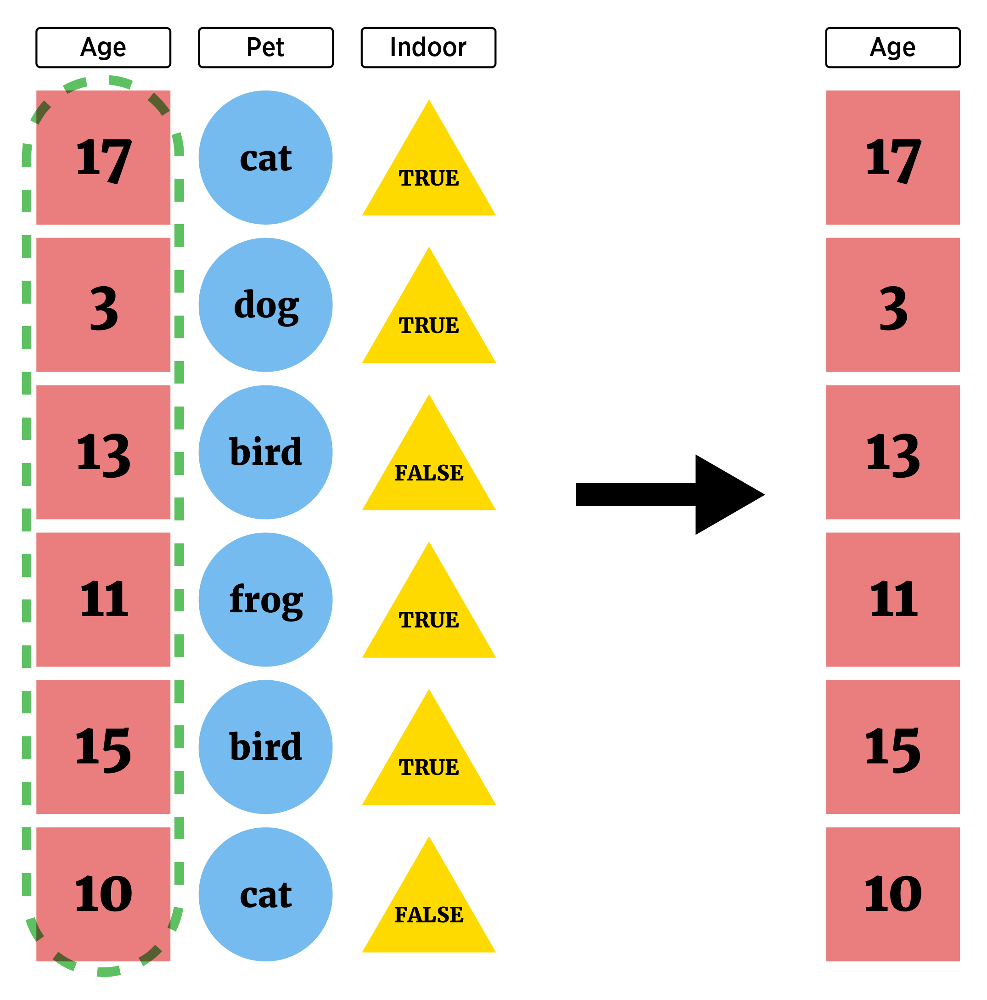
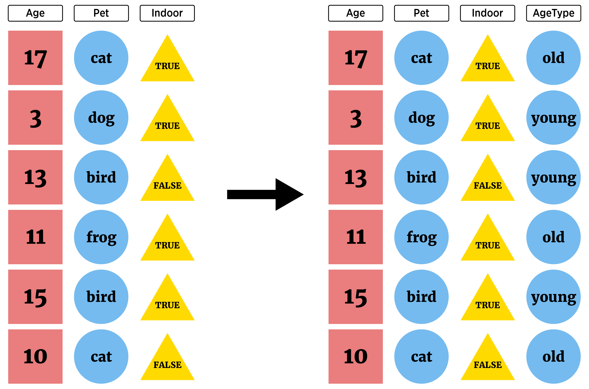
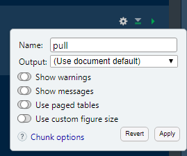
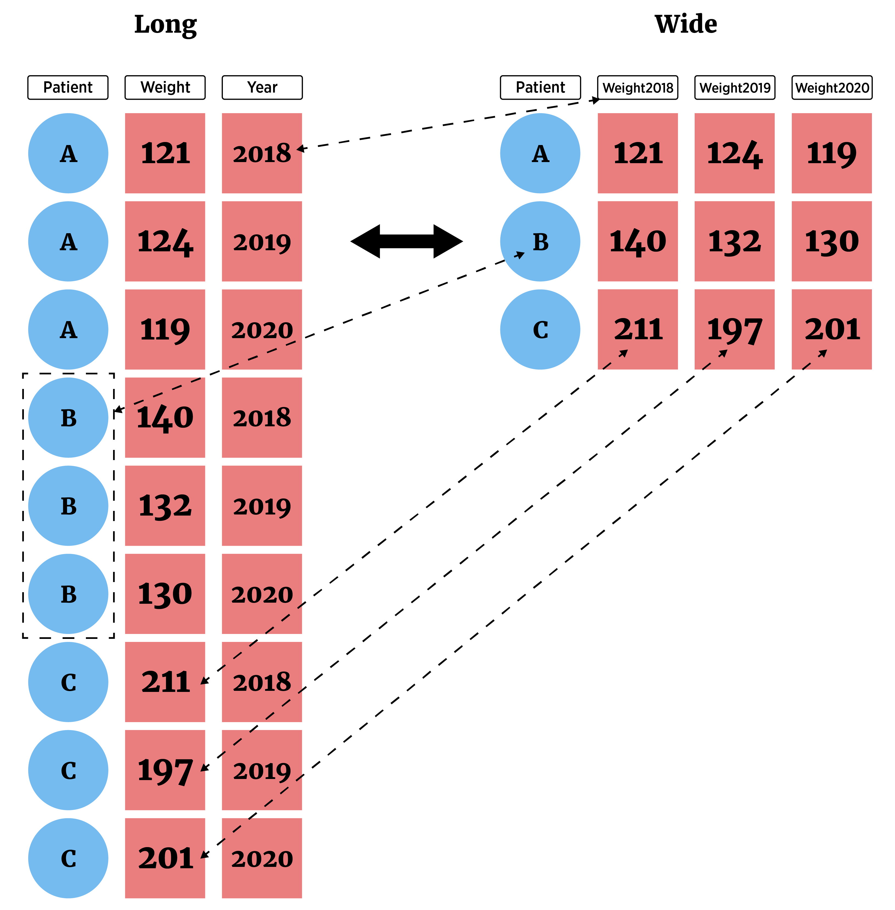
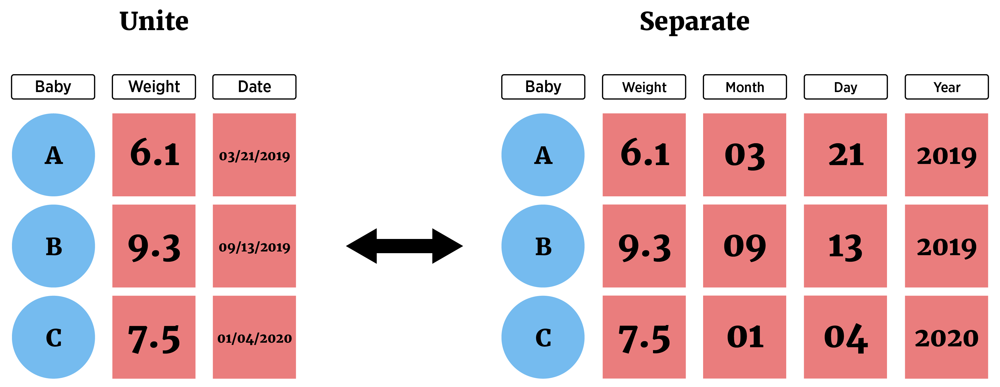

```{r setup, echo = FALSE, message = FALSE, warning = FALSE}
library(tidyverse)
library(haven)
options(dplyr.print_min = 5)
options(tibble.print_min = 5)
library(knitr)
library(htmlwidgets)
opts_chunk$set(message = FALSE, cache = TRUE, warning = FALSE)
```


## What is this course about?

Basic use of R for reading, manipulating, and plotting data!

<div style = "float: left;border:1px solid black;">
<a href = "https://www4.stat.ncsu.edu/~online/datasets/chemical.txt">
```{r step4a, fig.align = 'left', out.width = '205px', out.height = "249px", eval = TRUE, echo = FALSE}

```
</a>
</div>
<div style = "float: left;">
```{r arrow4a, fig.align = 'left', out.width = '30px', out.height = "249px", eval = TRUE, echo = FALSE}

```
</div>
<div style = "float: left;border:1px solid black;">
<a href = "https://www4.stat.ncsu.edu/~online/datasets/readChemData.r">
```{r step4b, fig.align = 'left', out.width = '205px', out.height = "249px", eval = TRUE, echo = FALSE}

```
</a>
</div>
<div style = "float: left;">
```{r arrow4b, fig.align = 'left', out.width = '30px', out.height = "249px", eval = TRUE, echo = FALSE}

```
</div>
<div style = "float: left;border:1px solid black;">
<a href = "https://www4.stat.ncsu.edu/~online/datasets/summChemData.r">
```{r step4c, fig.align = 'left', out.width = '205px', out.height = "249px", eval = TRUE, echo = FALSE}

```
</a>
</div>
<div style = "float: left;">
```{r arrow4c, fig.align = 'left', out.width = '30px', out.height = "249px", eval = TRUE, echo = FALSE}

```
</div>
<div style = "float: left;border:1px dashed black;">
```{r step4d, fig.align = 'left', out.width = '205px', out.height = "249px", eval = TRUE, echo = FALSE}

```
</div>


## Where do we start?  

- Data manipulation idea  

- Documenting with Markdown

- Logical statements 

- `dplyr`, `tidyr`, and creating new variables  


## Data manipulation idea  

We may want to subset our full data set or create new data   

- Grab only certain types of observations (**filter rows**)

```{r, echo = FALSE, fig.align='center', out.width = "500px"}

```


## Data manipulation idea  

We may want to subset our full data set or create new data   

- Look at only certain variables (**select columns**)  
    
```{r, echo = FALSE, fig.align='center', out.width = "400px"}

```


## Data manipulation idea  

We may want to subset our full data set or create new data   

- Create new variables

```{r, echo = FALSE, fig.align='center', out.width = "520px"}

```


## Data manipulation idea  

We may want to subset our full data set or create new data   

- Vital to make your work reproducible!  

> - Traditional documentation through comments (`#` in R) in script

> - May have heard of [JUPYTER](http://jupyter.org/) notebooks  

> - R Markdown - built in notebook for R studio  


## Documenting with Markdown  

- R Markdown = Digital "Notebook":  Program that weaves word processing and code.  

- Designed to be used in three ways (R for Data Science)  


## Documenting with Markdown  


- R Markdown = Digital "Notebook":  Program that weaves word processing and code.  

- Designed to be used in three ways (R for Data Science)  
<ul>
  <li>Communicating to decision makers (focus on conclusions not code)</li>
  <li>Collaborating with other data scientists (including future you!)  </li>
  <li> As environment to do data science (documents what you did and what you were thinking)</li>
</ul>


## Markdown **Verbage**

- May have heard of HTML (HyperText Mark-up Language)  
    + Write plain text that the browser interprets and renders  
    
    
## Markdown **Verbage**

- May have heard of HTML (HyperText Mark-up Language)  
    + Write plain text that the browser interprets and renders  
    
- Markdown is a specific markup language  
    + Easier syntax  
    + Not as powerful  
    
- Any plain text file can be used (.Rmd extension associates it with R Studio)


## R Markdown  

R Markdown file contains three important types of content:

1. (Optional) YAML header surrounded by `---`s  

2. Chunks of R code   

3. Text mixed with simple text formatting instructions 


## Creating an R Markdown Document

- R Studio makes it easy!  

```{r startMD.png, out.width = "700px",echo=FALSE, fig.align='center'}
knitr::include_graphics("../img/startMD.png")
```


## Creating an R Markdown Document

- Commonly used document types can be created 

<div style="float: center;">
```{r startMDDoc.png, out.width = "500px",echo=FALSE, fig.align='center'}
knitr::include_graphics("../img/startMDDoc.png")
```
</div>


## Creating an R Markdown Document

- Slide presentations 

```{r startMDPres.png, out.width = "500px",echo=FALSE, fig.align='center'}
knitr::include_graphics("../img/startMDPres.png")
```


## Creating an R Markdown Document

- Truly Interactive Documents/Pages (require R backend)

```{r startMDShiny.png, out.width = "500px",echo=FALSE, fig.align='center'}
knitr::include_graphics("../img/startMDShiny.png")
```


## R Markdown - **YAML Header**  

 - Define settings for document  

```
---
title: "Untitled"
author: "First Last"
date: "xxxx"
output: html_document
---
```  

- CTRL/CMD + Shift + k **knits** (creates the output document) via this info 


## R Markdown - **Code Chunks**  

 - Below YAML header: 'r chunk'  

```{r chunk_png, out.width = "500px",echo=FALSE, fig.align='center'}
knitr::include_graphics("../img/chunk.png")
```  

> - Start code chunk by typing ```{r} out or with CTRL/CMD + Alt/Option + I

> - Code will be executed when document is created    

> - Can specify options on individual code chunks  


## R Markdown - **Syntax**
     
- Below code chunk is plain text with markdown sytnax  

```
## R Markdown

This is an R Markdown document. Markdown is a simple formatting syntax
for authoring HTML, PDF, and MS Word documents. For more details on
using R Markdown see <http://rmarkdown.rstudio.com>.

When you click the **Knit** button a document will be generated that
includes both content as well as the output of any embedded R code
chunks within the document. 
```

- When file created, "##" becomes a header, "<...>" a link, and ```**Knit**``` bold font


## R Markdown - **Syntax**

### R Markdown

This is an R Markdown document. Markdown is a simple formatting syntax
for authoring HTML, PDF, and MS Word documents. For more details on
using R Markdown see <http://rmarkdown.rstudio.com>.

When you click the **Knit** button a document will be generated that
includes both content as well as the output of any embedded R code
chunks within the document. 


## Where do we go from here?  

[Cheat sheet](https://www.rstudio.com/wp-content/uploads/2015/03/rmarkdown-reference.pdf) gives everything you need!  We'll briefly investigate:  

- Markdown syntax  

- Code chunks and their options  

- Changing type of output  


## **R Markdown syntax**  

- ```# Header 1``` becomes a large font header  

- ```## Header 2``` becomes a slightly smaller font header  

- Goes to 6 headers  

    + Use of headers can automatically create a Table of Contents!

> - ```**bold**``` **and** ```__bold__```

> - \`code\` becomes `code`  


## **R Markdown syntax**  

- Can do lists: be sure to end each line with two spaces!  

    + Indent sub lists four spaces  

<div style = "float: left; width: 50%">
```
* unordered list  
* item 2  
    + sub-item 1  
    + sub-item 2  

1. ordered list  
2. item 2  
    + sub-item 1  
    + sub-item 2  
```  
</div>
<div style = "float: right; width: 50%">
* unordered list  
* item 2  
    + sub-item 1  
    + sub-item 2  

1. ordered list  
2. item 2  
    + sub-item 1  
    + sub-item 2  
</div>


## **Code chunks and their options**  

- Any R code can go into the chunk  

- Chunks evaluate sequentially (can use output from prior chunk)

> - Code can be added in line:  Ex: The Iris dataset has `r length(iris$Sepal.Length)` observations  

> - Added by beginning with back-tick `r` and ending with a back-tick: Iris has \`r `length(iris$Sepal.Length)`\`  


## **Code chunks and their options**  

- Many options depending on chunk purpose!    

- Can hide/show code with `echo = FALSE/TRUE`  

- Can choose if code is evaluated with `eval = TRUE/FALSE`   

- `message = TRUE/FALSE` and `warning = TRUE/FALSE` can turn on/off displaying messages/warnings   

```{r, fig.align='center', message = FALSE, out.width=275, echo = FALSE}

```


## **Changing type of output**  

R Markdown really flexible!  

```{r, echo = FALSE, fig.align='center'}
knitr::include_graphics("../img/compile.png")
```


## **Changing type of output**  

Change output type in the YAML header:  

- Use CTRL/CMD + Shift + k or the Knit menu:

```{r knit, echo=FALSE, fig.align='center', out.width='150px'}
knitr::include_graphics("../img/knit.png")
```

> - Use code explicity:  
    `rmarkdown::render("file.Rmd", output_format = "html_document")`

> - We'll just output to HTML for simplicity!


## Quick Examples  


## `tidyverse` for data manipulations

Now we can document everything: let's manipulate some data!  

**Overview of dplyr and tidyr packages**

- `dplyr` package made for most standard data manipulation tasks    

- `tidyr` package reshapes data  

- Both part of `tidyverse`  

- Make sure `library(tidyverse)` has been run!  


## Tidyverse Syntax

- Reason to prefer `dplyr` and packages from the `tidyverse` 

> - Good defaults

> - All packages have similar syntax!  All work on `tibbles` (data frames)

> - Syntax:
`function(tibble, actions, ...)`


## `dplyr` 

- Basic commands 
    + `as_tibble()` - convert data frame to one with better printing  
    + `filter()` - subset **rows**  
    + `arrange()` - reorder **rows**  
    + `select()` - subset **columns**  
    + `rename()` - rename **columns**  
    + `mutate()` - add newly created **column**  
    + `transmute()` - create new variable  
    + `group_by()` - group **rows** by a variable   
    + `summarise()` - apply basic function to data  


## `as_tibble()` - tidy data frame 

`as_tibble()` - convert data frame to one with better printing and no simplification

```{r,eval=TRUE}
#install.packages("Lahman")
library(Lahman)
head(Batting, n = 4) #look at just first 4 observations
```

## `as_tibble()` - tidy data frame 

- Just 'wrap' a standard R data frame

```{r,eval=TRUE}
myBatting <- as_tibble(Batting); myBatting
```


## `filter()` - subset rows or columns  

- Grab only certain types of observations (**filter rows**)

```{r, echo = FALSE, fig.align='center', out.width = "500px"}

```


## Filtering Rows Requires Logical Conditions  

- **logical statement** - comparison that resolves as `TRUE` or `FALSE`  

<div style="float: left; width: 45%;">
```{r}
"hi" == " hi" #== is comparison
"hi" == "hi"
4 >= 1
```
</div>
<div style="float: right; width: 45%;">
```{r}
4 != 1
sqrt(3)^2  == 3
dplyr::near(sqrt(3)^2, 3)
```
</div>


## Filtering Rows Requires Logical Conditions  

- **logical statement** - comparison that resolves as `TRUE` or `FALSE`  

<div style="float: left; width: 45%;">
```{r}
#use of is. functions
is.numeric("Word")
is.numeric(10)
```
</div>
<div style="float: right; width: 45%;">
```{r}
is.character("10")
is.na(c(1:2, NA, 3))
is.matrix(c("hello", "world"))
```
</div>


## Logical statements 

Goal: Subset rows or columns  

- **logical statement** - useful for indexing an R object

- Concept:
    + Feed index a vector of `TRUE`/`FALSE`   
    + R returns elements where `TRUE` 

```{r}
myBatting$G > 20 #vector indicating Games > 20
```


## `filter()` - subset rows or columns  

- **logical statement** - useful for indexing an R object

```{r}
filter(myBatting, G > 20)
```


## Logical statements 

Compound logicals via **Logical Operators**

- `&` 'and'
- `|` 'or'

Operator | A,B true       | A true, B false   | A,B false
---------|----------------|-------------------|--------------
`&`      | `A & B = TRUE` | `A & B = FALSE`   | `A & B = FALSE`
`|`      | `A | B = TRUE` | `A | B = TRUE`    | `A | B = FALSE`


## Logical statements 

- Pull out those that played more than 20 games and played in 2015

```{r}
(myBatting$G > 20) & (myBatting$yearID == 2015)
```


## `filter()` - subset rows or columns  

- Pull out those that played more than 20 games and played in 2015

```{r}
filter(myBatting, (G > 20) & (yearID == 2015))
```


## `arrange()` - reorder **rows**

```{r}
#reorder by teamID
arrange(myBatting, teamID)
```


## `arrange()` - reorder **rows**

```{r}
#get secondary arrangement as well
arrange(myBatting, teamID, G)
```


## `arrange()` - reorder **rows**

```{r}
#descending instead
arrange(myBatting, teamID, desc(G))
```


## Data manipulation idea  

We may want to subset our full data set or create new data   

- Look at only certain variables (**select columns**)  
    
```{r, echo = FALSE, fig.align='center', out.width = "400px"}

```


## `select()` - subset **columns**

- May only want certain variables (saw `dplyr::pull()`, `$` and `[ , ]`)  
- `select()` function has same syntax as other `dplyr` functions!

```{r}
#Choose a single column by name
select(Batting, X2B)
```


## `select()` - subset **columns**

- May only want certain variables (saw `dplyr::pull()`, `$` and `[ , ]`)  
- `select()` function has same syntax as other `dplyr` functions!

```{r}
#Choose a single column by name
select(Batting, playerID, X2B)
```


## Aside: Piping or Chaining

- Applying multiple functions: nesting hard to parse!
- Piping or Chaining with `%>%` operator helps

```{r}
arrange(select(filter(Batting, teamID == "PIT"), playerID, G, X2B), desc(X2B))
```


## Aside: Piping or Chaining

- Applying multiple functions: nesting hard to parse!
- Piping or Chaining with `%>%` operator helps

```{r}
Batting %>% 
  filter(teamID == "PIT") %>% 
  select(playerID, G, X2B) %>% 
  arrange(desc(X2B)) 
```


## Aside: Piping or Chaining

- Generically, pipe does the following

`x %>% f(y)` turns into `f(x,y)`  

`x %>% f(y) %>% g(z)` turns into `g(f(x, y), z)`  

- Can be used with functions outside the tidyverse if this structure works!    


## `select()` - subset **columns**

- Great functionality for choosing variables  

```{r}
#all columns between
myBatting %>% 
  select(X2B:HR)
```


## `select()` - subset **columns**

- Great functionality for choosing variables  

```{r}
#all columns containing
myBatting %>% 
  select(contains("X"))
```


## `select()` - subset **columns**

- Great functionality for choosing variables  

```{r}
#all columns starting with
myBatting %>% 
  select(starts_with("X"))
```


## `select()` - subset **columns**

- Great functionality for choosing variables  

```{r}
#multiple selections
myBatting %>% 
  select(starts_with("X"), ends_with("ID"), G)
```


## `select()` - subset **columns**

- Can reorder variables

```{r}
#reorder
myBatting %>% 
  select(playerID, HR, everything())
```


## `rename()` - rename variables

```{r}
#rename our previous
myBatting %>% 
  select(starts_with("X"), ends_with("ID"), G) %>% 
  rename("Doubles" = X2B, "Triples" = X3B)
```


## `dplyr`

[Cheat sheet](https://www.rstudio.com/wp-content/uploads/2015/02/data-wrangling-cheatsheet.pdf)

- Basic commands 
    + `as_tibble()` - convert data frame to one with better printing
    + `filter()` - subset **rows**
    + `arrange()` - reorder **rows**
    + `select()` - subset **columns**

- Many `joins` to combine tibbles too! (Similar to SQL)


## Quick Examples  


## Data manipulation idea  

- Create new variables

```{r, echo = FALSE, fig.align='center', out.width = "500px"}

```

 
## Creating New Variables  

Given a data frame and an appropriate length vector (a new variable), you can use `cbind` (column bind) to add the variable to the dataframe 

```{r}
temp <- cbind(iris, extra = rep("a", 150))
str(temp)
```


 
## Creating New Variables  

Or simply add as a named (list) element!  

```{r}
iris$extra <- rep("a", 150)
str(iris)
```


## Creating New Variables  

Better method - use `dplyr`  

- `mutate()` - add newly created **column(s)** to current data frame (doesn't overwrite the data frame)  

- `transmute()` - create new data frame with created variable(s) only  

- Syntax:  

`mutate(data, newVarName = functionOfData, newVarName2 = functionOfData, ...)`  


## Creating New Variables  

- Consider a data set on movie ratings  

```{r,eval=TRUE}
library(fivethirtyeight)
fandango
```


## `mutate()` - create new column(s)

```{r}
##Create an average rottentomatoes score variable
fandango %>% 
  mutate(avgRotten = (rottentomatoes + rottentomatoes_user)/2)
```


## `mutate()` - create new column(s)

```{r}
#can't see it!
fandango %>% 
  mutate(avgRotten = (rottentomatoes + rottentomatoes_user)/2) %>% 
  select(film, year, avgRotten, everything())
```


## `mutate()` - create new column(s)

- Add more than one variable

```{r}
fandango %>% 
  mutate(avgRotten = (rottentomatoes + rottentomatoes_user)/2, 
         avgMeta = (metacritic_norm + metacritic_user_nom)/2) %>%
  select(film, year, avgRotten, avgMeta, everything())
```


## Creating New Variables  

`mutate()` and `transmute()` can also use some statistical functions
 
```{r}
fandango %>% 
  select(rottentomatoes) %>% 
  mutate(avg = mean(rottentomatoes), sd = sd(rottentomatoes))
```


## Creating New Variables  

`mutate()` and `transmute()` can also use some statistical functions
 
- `group_by` to create summaries for groups  
 
```{r}
fandango %>% 
  select(year, rottentomatoes) %>% 
  group_by(year) %>% 
  mutate(avg = mean(rottentomatoes), sd = sd(rottentomatoes))
```


## Creating New Variables  

`mutate` and `transmute` can use any 'window' functions  

 - Functions that take a vector of values and return another vector of values (see [Cheat sheet](https://www.rstudio.com/wp-content/uploads/2015/02/data-wrangling-cheatsheet.pdf))
 
```{r}
fandango %>% 
  select(rottentomatoes) %>% 
  mutate(cumulativeSum = cumsum(rottentomatoes))
```


## Conditional Execution 

- Often want to execute statements conditionally to create a variable

- `if` `then` `else` syntax

<div style="float: left; width: 45%;">
```{r,eval=FALSE}
if (condition) {
  then execute code
} 

#if then else
if (condition) {
  execute this code  
} else {
  execute this code
}
```
</div>


<div style="float: right; width: 45%;">
```{r,eval=FALSE}
#Or more if statements
if (condition) {
  execute this code  
} else if (condition2) {
  execute this code
} else if (condition3) {
  execute this code
} else {
  #if no conditions met
  execute this code
}
```
</div>


## Conditional Execution

- Consider built-in data set `airquality`  

    + daily air quality measurements in New York  
    
    + from May (Day 1) to September (Day 153) in 1973  

```{r}
myAirquality <- as_tibble(airquality)
myAirquality
```


## Conditional Execution 

Want to code a wind category variable    

 + high wind days (wind $\geq$ 15mph)  
 + windy days     (10mph $\leq$ wind < 15mph)  
 + lightwind days (6mph $\leq$ wind < 10mph)  
 + calm days      (wind $\leq$ 6mph)


## Conditional Execution 

Want to code a wind category variable    

 + high wind days (15mph $\leq$ wind)  
 + windy days     (10mph $\leq$ wind < 15mph)  
 + lightwind days (6mph $\leq$ wind < 10mph)  
 + calm days      (wind $\leq$ 6mph)
 
Issue: `if(condition)` can only take in a single comparison  

```{r, error = TRUE, message = TRUE, warning = TRUE}
if(airquality$Wind >= 15) { 
  "High Wind"
  }
```


## Conditional Execution 

Want to code a wind category variable    

 + high wind days (15mph $\leq$ wind)  
 + windy days     (10mph $\leq$ wind < 15mph)  
 + lightwind days (6mph $\leq$ wind < 10mph)  
 + calm days      (wind $\leq$ 6mph)  

Could try to `loop` through observations  

Instead, use `if_else()` which works on an entire vector


## `if_else()` - conditional execution 

`if_else()` syntax:

+ `if_else(condition, true, false)`  
+ `condition` is a vector of TRUE/FALSE  
+ `true` is what to do when TRUE occurs  
+ `false` is what to do when FALSE occurs

> - A vector is then returned  


## `if_else()` with `mutate()`

```{r}
myAirquality <- myAirquality %>% 
  mutate(Status = if_else(Wind >= 15, "HighWind",
                          if_else(Wind >= 10, "Windy",
                                  if_else(Wind >= 6, "LightWind", "Calm"))))
myAirquality
```


## Creating New Variables Recap!

- `mutate()` - add newly created **column(s)** to current data frame 

- `transmute()` - create new data frame with created variable(s)  

    + Use `if_else()` to do conditional creation
    
    + Note: `cut()` can be used to categorize a numeric variable!

## Quick Examples  


## Reshaping Data  

Long vs Wide format data

```{r, out.width="450px", echo = FALSE, fig.align='center'}

```


## Reshaping Data  
**`tidyr` package**

Easily allows for two very important actions

> - `pivot_longer()` - lengthens data by increasing the number of rows and decreasing the number of columns    
    <ul>  
        <li> Most important as analysis methods often prefer this form</li>  
    </ul>  
         
> - `pivot_wider()` - widens data by increasing the number of columns and decreasing the number of rows  


## `tidyr` Package

- Data in 'Wide' form

```{r, eval = FALSE}
tempsData <- read_table2(file = "https://www4.stat.ncsu.edu/~online/datasets/cityTemps.txt") 
tempsData
```
```{r, echo = FALSE}
tempsData <- read_table2(file = "../datasets/cityTemps.txt")
tempsData
```


## Reshaping Data  

```{r, echo = FALSE}
tempsData
```

- Switch to 'Long' form with `pivot_longer()`  
    + `cols` = columns to pivot to longer format (`cols = 2:8`)  
    + `names_to` = new name(s) for columns created (`names_to = "day"`)  
    + `values_to` = new name(s) for data values (`values_to = "temp"`)  


## Reshaping Data  

- Switch to 'Long' form with `pivot_longer()`  
    + `cols` = columns to pivot to longer format (`cols = 2:8`)  
    + `names_to` = new name(s) for columns created (`names_to = "day"`)  
    + `values_to` = new name(s) for data values (`values_to = "temp"`)  

```{r}
tempsData %>% pivot_longer(cols = 2:8, names_to = "day", values_to = "temp")
```


## Reshaping Data  

- Switch to 'Long' form with `pivot_longer()`  
- Can provide columns in many ways!
```{r}
newTempsData <- tempsData %>% 
  pivot_longer(cols = sun:sat, names_to = "day", values_to = "temp")
newTempsData
```

## Reshaping Data  

- Switch to 'Wide' form with `pivot_wider()`  
    + `names_from` = column(s) to get the names used in the output columns (`names_from = "day"`)
    + `values_from` = column(s) to get the cell values from (`values_from = "temp"`) 

```{r}
newTempsData %>% 
  pivot_wider(names_from = "day", values_from = "temp")
```


## Reshaping Data  

- Separate a column (or combine two columns) using `separate()` and `unite()`

```{r, out.width="650px", echo = FALSE, fig.align='center'}

```


## Reshaping Data  

- Separate a column (or combine two columns) using `separate()` and `unite()`

- Consider data set on air pollution in Chicago  


```{r, eval = FALSE}
chicagoData <- read_csv("https://www4.stat.ncsu.edu/~online/datasets/Chicago.csv")
chicagoData
```
```{r, echo = FALSE}
chicagoData <- read_csv("../datasets/Chicago.csv")
chicagoData
```


## `separate`

- Can split columns with `separate`:

```{r}
chicagoData %>% 
  separate(date, c("Month", "Day", "Year"), sep = "/", convert = TRUE, remove = FALSE)
```


## `unite`

- Can combine two columns with `unite`:

```{r}
chicagoData %>% 
  separate(date, c("Month", "Day", "Year"), sep = "/", convert = TRUE, remove = FALSE) %>% 
  unite(MonthDay, Month, Day, sep = "-")
```


## Recap!

- Data manipulation idea  

- Documenting with Markdown

- Logical statements 

- `dplyr`, `tidyr`, and creating new variables  

## Quick Examples  


